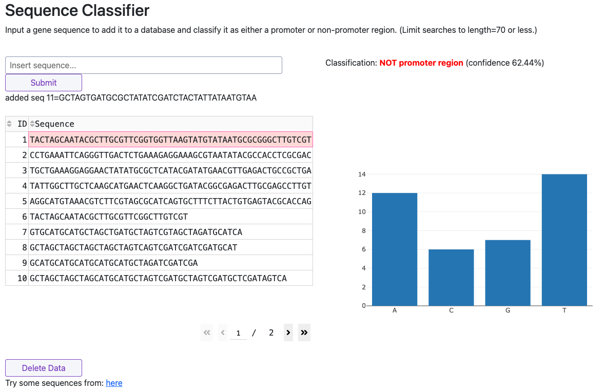

Midterm
=======

**Due Date: Thursday, March 12 by 11:00am CDT**

Overall Objective
-------------------

The objective of the midterm is to plan out and begin working on a larger project
that exercises many of the concepts used during the semester. 
For example, consider the DNA Sequence Classifier dashboard we showed in class:

   Sample dashboard

This dashboard brings together many topics we covered (or will cover) in this class:

* Backend code written in Python using best practices
* Using ML model trained with scikit-learn
* Front end dashboard build with Dash
* Front end dashboard supports some graphing / vis
* Sequence data stored in Redis database
* Dashbard makes API calls to database to exchange data
* Dashboard, database, and ML code all containerized
* Containers orchestrated together using docker compose
* Deployed to a cloud machine and public on the web
* All code stored in git repo on GitHub
* Continuous integration between GitHub and Docker Hub

Bringing together all these concepts resulted in: a **useful tool**  that is
**accessible to others**, and **performs some scientific function** that would
generally fall under the description of **research computing in biology**.

Midterm Requirements
--------------------

For the midterm, your goal is to plan out a similar project and begin some of the
work. For the final, you will complete the same project and make it available to others.

We are very flexible on exactly what it is you propose to build as long as it generally 
exercises the topics covered in class and culminates in: a **useful tool**  that is
**accessible to others**, and **performs some scientific function** that would
generally fall under the description of **research computing in biology**.

We strongly encourage you to build something that you are interested in or will be 
useful to your ongoing work. Are you doing protein-small molecule docking? Perhaps make
dashboard for viewing docked poses. Interested in image analysis? Make a dashboard for image
classification. Interested in genomics? Make a dashboard for visualizing some
interesting feature of gene sequences. If you are having any trouble formulating an
idea to work on, let us know and we will happily brainstorm with you and help you in
this process!

What to Turn In
---------------

1. Decide whether to work independently or in a group of maximum two people
2. Write a short, <1-page pitch describing what you plan to build
3. Draw out (e.g. on paper or in tool like powerpoint) a diagram showing
   the components of what you plan to build, highlighting how it fits with
   topics covered in this class
4. Set up a new repo on GitHub to store this project (highly recommend naming
   it after the project, e.g. "dna-squence-classifier" and not something like
   "mbs-337-midterm")
5. Begin working on, at a minimum, the README.md, the backend code (e.g. you
   may just start with a Python script that reads in some data and transforms
   it into a useful object), and a Dockerfile for containerizing the code.

Please send the instructors an email with a link to the repository, and attach
the 1-page pitch plus the diagram illustrating the project. If working in a group
of two, only one person needs to send that email, but be sure to mention both
group members names.
   

Note on Using AI
----------------

The use of AI to complete this assignment is not recommended, but it is permitted
with the following restrictions:

The use of LLMs (like ChatGPT, Copilot, etc) or any other AI must be rigorously
cited. Any code blocks or text that are generated by an AI model should be
clearly marked as such with in-code comments describing what was generated, how
it was generated, and why you chose to use AI in that instance. The homework
README must also contain a section that summarizes where AI was used in the assignment.

Additional Resources
--------------------

* `Sequence Classifier <http://129.114.39.70:8050/>`_ (if link is not live, ask the instructors)
* Having trouble thinking of an idea? Let the instructors know and we will work with you

