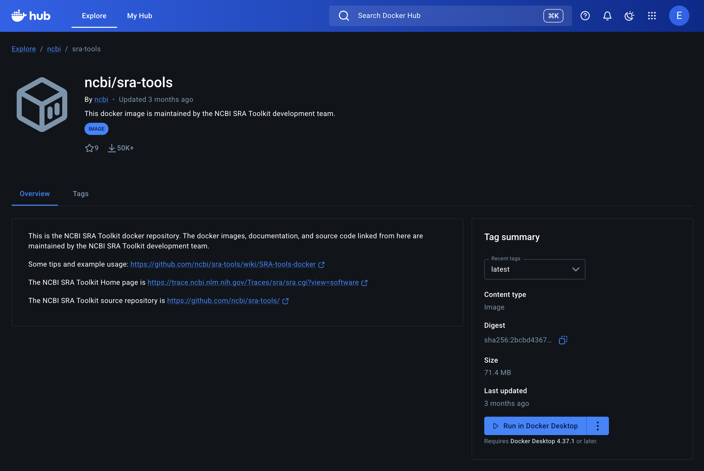
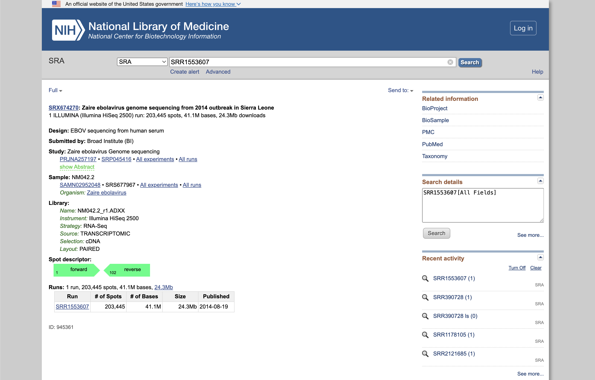

Docker Compose
==============

Up to this point, we have been looking at single-container applications - small
units of code that are containerized, executed *ad hoc* to read and summarize a
FASTQ file, then exit on completion. But what if we want to do something more
complex? For example, what if our goal is to orchestrate a multi-container
application consisting of, e.g., a Flask app, a database, a message queue, an
authentication service, and more.

**Docker compose** is a tool for managing multi-container applications. A YAML
file is used to define all of the application services, and a few simple commands
can be used to spin up or tear down all of the services.

In this module, we will get a first look at Docker compose. After going
through this module, students should be able to:

* Translate Docker run commands into YAML files for Docker compose
* Run commands inside *ad hoc* containers using Docker compose
* Manage small software systems composed of more than one script, and more than
  one container
* Copy data into and out of containers as needed

Another Tool, Another Container
-------------------------------

We have been working a lot with a script for reading in and summarizing a
FASTQ file and outputting a summary JSON file. The input to that file has been a small
sample FASTQ file. Instead, let's create a container that actually downloads FASTQ files from the
`NCBI Sequence Read Archive (SRA) <https://www.ncbi.nlm.nih.gov/sra/>`_. Fortunately for us,
there is a set of command line tools created by NCBI called
`sra-tools <https://github.com/ncbi/sra-tools/wiki/01.-Downloading-SRA-Toolkit>`_ that can be used
to download FASTQ files from the SRA and they have already created a container that is published on
`Docker Hub <https://hub.docker.com/r/ncbi/sra-tools>`_!

   NCBI sra-tools container at Docker hub.

So, let's pull that container and use it to download a FASTQ file.

.. code-block:: console

   [mbs337-vm]$ docker pull ncbi/sra-tools:3.3.0
   3.3.0: Pulling from ncbi/sra-tools
   2d35ebdb57d9: Pull complete
   9c0db82dbf54: Pull complete
   a0e62295a7bb: Pull complete
   192a2de187a1: Pull complete
   Digest: sha256:2bcbd43672de26d93b11eef713241a61bd60fd74bb9775a2511972f0467677f2
   Status: Downloaded newer image for ncbi/sra-tools:3.3.0
   docker.io/ncbi/sra-tools:3.3.0
   [mbs337-vm]$ docker images
   REPOSITORY                                                      TAG       IMAGE ID       CREATED         SIZE
   eriksf/fastq_summary                                            1.0       9ccdd4b5eaf2   3 hours ago     1.24GB
   python                                                          3.12      ac67f52b7509   13 days ago     1.11GB
   python                                                          latest    9a7c5808942d   13 days ago     1.12GB
   ncbi/sra-tools                                                  3.3.0     2e0e3109402b   2 months ago    174MB
   registry.gitlab.com/exosphere/exosphere/guacamole/guacd         latest    b87c151e82aa   12 months ago   241MB
   registry.gitlab.com/exosphere/exosphere/guacamole/guacamole     latest    37a59d9ff144   12 months ago   511MB
   registry.gitlab.com/exosphere/exosphere/containrrr/watchtower   latest    e7dd50d07b86   2 years ago     14.7MB

The standard way to use sra-tools to download and convert data from SRA is to first use the ``prefetch``
command to download the SRA file into NCBI's native format, ``.sra``, and then use the ``fasterq-dump`` or
``fastq-dump`` command to convert the SRA file into FASTQ format. So, let's make sure that those tools are
available in the container.

.. code-block:: console

   [mbs337-vm]$ docker run --rm ncbi/sra-tools:3.3.0 which prefetch
   /usr/local/bin/prefetch
   [mbs337-vm]$ docker run --rm ncbi/sra-tools:3.3.0 which fasterq-dump
   /usr/local/bin/fasterq-dump
   [mbs337-vm]$ docker run --rm ncbi/sra-tools:3.3.0 which fastq-dump
   /usr/local/bin/fastq-dump

We'll use SRA accession number, `SRR1553607 <https://www.ncbi.nlm.nih.gov/sra/?term=SRR1553607>`_, which is a run
from a genome sequencing experiment on Zaire ebolavirus from a 2014 outbreak in Sierra Leone on the
Illumina HiSeq 2500 and will generate a small FASTQ file that we can use for testing.

   Run SRR1553607 from the SRA.

Now let's do a test download of this data using the sra-tools container. Instead of using the ``prefetch``
and ``fasterq-dump`` commands separately, we're going to use just the ``fastq-dump`` command with the
``--split-files`` flag to separate the paired-end reads into separate FASTQ files and the ``-X`` flag
to limit the number of reads. For example:

.. code-block:: console

   [mbs337-vm]$ docker run --rm -v $PWD:/data -u $(id -u):$(id -g) ncbi/sra-tools:3.3.0 fastq-dump --split-files -X 1000 -O /data SRR1553607
   Read 1000 spots for SRR1553607
   Written 1000 spots for SRR1553607
   [mbs337-vm]$ ls -l
   total 568
   -rw-rw-r-- 1 ubuntu ubuntu    155 Feb 17 18:11 Dockerfile
   -rw-r--r-- 1 ubuntu ubuntu 265572 Feb 17 22:13 SRR1553607_1.fastq
   -rw-r--r-- 1 ubuntu ubuntu 265572 Feb 17 22:13 SRR1553607_2.fastq
   drwxr-xr-x 2 root   root     4096 Feb 17 18:00 __pycache__
   -rw-r--r-- 1 ubuntu ubuntu  10801 Feb 17 21:15 fastq_summary.json
   -rwxrwxr-x 1 ubuntu ubuntu   4241 Feb 17 17:50 fastq_summary.py
   -rw-rw-r-- 1 ubuntu ubuntu    199 Feb 17 17:50 models.py
   -rw-rw-r-- 1 ubuntu ubuntu  14443 Feb 17 17:50 raw_reads.fastq

.. note::

   To reiterate, because we mounted our current location as a folder called "/data"
   (``-v $PWD:/data``), and we made sure to write the output file to that location in
   the container (``fastq-dump -O /data``), then we get to keep the file
   after the container exits, and it shows up in our current location (``$PWD``). Also,
   because we used the ``-u`` flag to specify our user and group ID namespace, the new
   files are owned by us instead of root.

Now we have a new tool and a new container that we can use to generate FASTQ files downloaded from the SRA.
We can use this container to generate FASTQ files, and then use our existing container to read in
and summarize those FASTQ files. Let's first make sure that our existing ``fastq_summary`` container can
read in and process the new FASTQ files.

.. code-block:: console

   [mbs337-vm]$ pwd
   /home/ubuntu/mbs-337/docker-exercise
   [mbs337-vm]$ ls -l
   total 576
   drwxrwxr-x 3 ubuntu ubuntu   4096 Feb 18 00:17 ./
   drwxrwxr-x 4 ubuntu ubuntu   4096 Feb 17 17:48 ../
   -rw-rw-r-- 1 ubuntu ubuntu    155 Feb 17 18:11 Dockerfile
   -rw-r--r-- 1 ubuntu ubuntu 265572 Feb 17 22:13 SRR1553607_1.fastq
   -rw-r--r-- 1 ubuntu ubuntu 265572 Feb 17 22:13 SRR1553607_2.fastq
   drwxr-xr-x 2 root   root     4096 Feb 17 18:00 __pycache__/
   -rw-r--r-- 1 ubuntu ubuntu  10801 Feb 17 21:15 fastq_summary.json
   -rwxrwxr-x 1 ubuntu ubuntu   4241 Feb 17 17:50 fastq_summary.py*
   -rw-rw-r-- 1 ubuntu ubuntu    199 Feb 17 17:50 models.py
   -rw-rw-r-- 1 ubuntu ubuntu  14443 Feb 17 17:50 raw_reads.fastq
   [mbs337-vm]$ docker run --rm \
                         -v $PWD:/data \
                         -u $(id -u):$(id -g) \
                         username/fastq_summary:1.0 \
                         fastq_summary.py -l INFO -f /data/SRR1553607_1.fastq -o /data/SRR1553607_1_summary.json
   [2026-02-18 00:23:26,252 f053422acd67] fastq_summary.main:122 - INFO - Starting FASTQ summary workflow
   [2026-02-18 00:23:26,252 f053422acd67] fastq_summary.summarize_fastq_file:95 - INFO - Reading FASTQ file '/data/SRR1553607_1.fastq'
   [2026-02-18 00:23:26,265 f053422acd67] fastq_summary.summarize_fastq_file:102 - INFO - Finished reading 1000 reads
   [2026-02-18 00:23:26,265 f053422acd67] fastq_summary.write_summary_to_json:116 - INFO - Writing summary to '/data/SRR1553607_1_summary.json'
   [2026-02-18 00:23:26,272 f053422acd67] fastq_summary.write_summary_to_json:119 - INFO - Finished writing '/data/SRR1553607_1_summary.json'
   [2026-02-18 00:23:26,272 f053422acd67] fastq_summary.main:131 - INFO - FASTQ summary workflow complete
   [mbs337-vm]$ ls -l
   total 784
   -rw-rw-r-- 1 ubuntu ubuntu    155 Feb 17 18:11 Dockerfile
   -rw-r--r-- 1 ubuntu ubuntu 265572 Feb 17 22:13 SRR1553607_1.fastq
   -rw-r--r-- 1 ubuntu ubuntu 220792 Feb 18 00:23 SRR1553607_1_summary.json
   -rw-r--r-- 1 ubuntu ubuntu 265572 Feb 17 22:13 SRR1553607_2.fastq
   drwxr-xr-x 2 root   root     4096 Feb 17 18:00 __pycache__
   -rw-r--r-- 1 ubuntu ubuntu  10801 Feb 17 21:15 fastq_summary.json
   -rwxrwxr-x 1 ubuntu ubuntu   4241 Feb 17 17:50 fastq_summary.py
   -rw-rw-r-- 1 ubuntu ubuntu    199 Feb 17 17:50 models.py
   -rw-rw-r-- 1 ubuntu ubuntu  14443 Feb 17 17:50 raw_reads.fastq

Great! We have generated a summary of the forward reads in the ``SRR1553607_1.fastq`` file. The output is a
JSON file called ``SRR1553607_1_summary.json``. Remember from previous sections that it has the following structure:

.. code-block:: text

    {
        "reads": [
            {
                "id": "SRR1553607.1",
                "sequence": "GTTAGCGTTGTTGATCGCGACGCAACAACTGGTAAAGAATCTGGAAGAAGGATATCAGTTCAAACGCTCAAGCGAGATGATGGATATTTTTGAACGACTCA",
                "total_bases": 101,
                "average_phred": 37.44
            },
            ...
        ]
    }

But how can we check the output of this JSON file? We could manually inspect the file, but that is not very
efficient. Fortunately, there is a tool called `jq <https://jqlang.org/>`_ installed on your VMs that can be
used to query and manipulate JSON files from the command line. Let's use the ``jq`` tool to read in and analyze
the summary JSON file we just generated.

.. code-block:: console

   [mbs337-vm]$ jq . SRR1553607_1_summary.json
   {
     "reads": [
       {
         "id": "SRR1553607.1",
         "sequence": "GTTAGCGTTGTTGATCGCGACGCAACAACTGGTAAAGAATCTGGAAGAAGGATATCAGTTCAAACGCTCAAGCGAGATGATGGATATTTTTGAACGACTCA",
         "total_bases": 101,
         "average_phred": 37.44
       },
       {
         "id": "SRR1553607.2",
         "sequence": "GGTGTAAGCACAGTACTCGGCCCACATCGCCTTTGTGTTAATGAAGTTTGGGTATCAACTTTCATCCCCAATCTTCCGTGGAAGGAGTATGTTCCGTCAAT",
         "total_bases": 101,
         "average_phred": 36.62
       },
       {
         "id": "SRR1553607.3",
         "sequence": "GGTCATCGGCGGTCTCTGGGTCGCCGGGACCGTTGGAGAAGAAGACTCCGTCCACGCCGAGTGCCTGGATCTCCTCGAAGGTGACCGTCGCGGGCAGCACG",
         "total_bases": 101,
         "average_phred": 31.74
       },
       ...
     ]
   }

So, the ``.`` in the above command is a `jq` filter that means "take the whole JSON file and print it out".
The output is a nicely formatted version of the JSON file (that is also colorized in the terminal). We can also
use filters to count the number of records in our JSON file. For example, the following command counts the number
of reads in our summary JSON file:

.. code-block:: console

   [mbs337-vm]$ jq '.reads | length' SRR1553607_1_summary.json
   1000

Sure enough, there are 1000 reads in our summary JSON file, which matches the number of reads we specified with the
``-X`` flag when we ran the ``fastq-dump`` command. There are other things you can do with filters in ``jq`` like
extracting just the read IDs.

.. code-block:: console

   [mbs337-vm]$ jq '.reads[].id' SRR1553607_1_summary.json
   "SRR1553607.1"
   "SRR1553607.2"
   "SRR1553607.3"
   "SRR1553607.4"
   "SRR1553607.5"
   ...

``jq`` is a powerful tool for working with JSON files from the command line. It is worth spending some time
learning how to use it. You can find more information about it in the `jq manual <https://jqlang.org/manual/>`_.

Finally, let's make sure that we can also read in the reverse reads in the ``SRR1553607_2.fastq`` file
and generate a summary JSON file for those as well.

.. code-block:: console

   [mbs337-vm]$ docker run --rm \
                         -v $PWD:/data \
                         -u $(id -u):$(id -g) \
                         username/fastq_summary:1.0 \
                         fastq_summary.py -l INFO -f /data/SRR1553607_2.fastq -o /data/SRR1553607_2_summary.json
   [2026-02-18 00:56:32,835 ebbf878ee8d7] fastq_summary.main:122 - INFO - Starting FASTQ summary workflow
   [2026-02-18 00:56:32,835 ebbf878ee8d7] fastq_summary.summarize_fastq_file:95 - INFO - Reading FASTQ file '/data/SRR1553607_2.fastq'
   [2026-02-18 00:56:32,848 ebbf878ee8d7] fastq_summary.summarize_fastq_file:102 - INFO - Finished reading 1000 reads
   [2026-02-18 00:56:32,849 ebbf878ee8d7] fastq_summary.write_summary_to_json:116 - INFO - Writing summary to '/data/SRR1553607_2_summary.json'
   [2026-02-18 00:56:32,856 ebbf878ee8d7] fastq_summary.write_summary_to_json:119 - INFO - Finished writing '/data/SRR1553607_2_summary.json'
   [2026-02-18 00:56:32,856 ebbf878ee8d7] fastq_summary.main:131 - INFO - FASTQ summary workflow complete
   [mbs337-vm]$ ls -l
   total 1000
   -rw-rw-r-- 1 ubuntu ubuntu    155 Feb 17 18:11 Dockerfile
   -rw-r--r-- 1 ubuntu ubuntu 265572 Feb 17 22:13 SRR1553607_1.fastq
   -rw-r--r-- 1 ubuntu ubuntu 220792 Feb 18 00:23 SRR1553607_1_summary.json
   -rw-r--r-- 1 ubuntu ubuntu 265572 Feb 17 22:13 SRR1553607_2.fastq
   -rw-r--r-- 1 ubuntu ubuntu 220779 Feb 18 00:56 SRR1553607_2_summary.json
   drwxr-xr-x 2 root   root     4096 Feb 17 18:00 __pycache__
   -rw-r--r-- 1 ubuntu ubuntu  10801 Feb 17 21:15 fastq_summary.json
   -rwxrwxr-x 1 ubuntu ubuntu   4241 Feb 17 17:50 fastq_summary.py
   -rw-rw-r-- 1 ubuntu ubuntu    199 Feb 17 17:50 models.py
   -rw-rw-r-- 1 ubuntu ubuntu  14443 Feb 17 17:50 raw_reads.fastq

OK. We have generated a summary JSON file for the reverse reads as well. We can use ``jq`` again to check
that there are 1000 reads in this file.

.. code-block:: console

   [mbs337-vm]$ jq '.reads | length' SRR1553607_2_summary.json
   1000

EXERCISE
~~~~~~~~

Spend a few minutes testing both containers. Be sure you can generate data with
one container, then read in and analyze the same data with the other. Data needs
to persist outside the containers in order to do this.

Write a Compose File
--------------------

Docker compose works by interpreting rules declared in a YAML file (typically
called ``docker-compose.yml``). The rules we will write will replace the
``docker run`` commands we have been using, and which have been growing quite
complex. For example, the commands we used to download the FASTQ files and generate
summary JSON files for both the forward and reverse reads in the
container looked like the following:

.. code-block:: console

   [mbs337-vm]$ docker run --rm -v $PWD:/data -u $(id -u):$(id -g) ncbi/sra-tools:3.3.0 fastq-dump --split-files -X 1000 -O /data SRR1553607
   [mbs337-vm]$ docker run --rm -v $PWD:/data -u $(id -u):$(id -g) username/fastq_summary:1.0 fastq_summary.py -l INFO -f /data/SRR1553607_1.fastq -o /data/SRR1553607_1_summary.json
   [mbs337-vm]$ docker run --rm -v $PWD:/data -u $(id -u):$(id -g) username/fastq_summary:1.0 fastq_summary.py -l INFO -f /data/SRR1553607_2.fastq -o /data/SRR1553607_2_summary.json

The above ``docker run`` commands can be loosely translated into a YAML file.
Navigate to the folder that contains your Python scripts and Dockerfile, then
create a new empty file called ``docker-compose.yml``:

.. code-block:: console

   [mbs337-vm]$ pwd
   /home/ubuntu/mbs-337/docker-exercise
   [mbs337-vm]$ touch docker-compose.yml
   [mbs337-vm]$ ls
   Dockerfile  __pycache__  docker-compose.yml  fastq_summary.py  models.py	raw_reads.fastq

Since we're going to have data going into a ``data`` subfolder, you will need to create that folder as well:

.. code-block:: console

   [mbs337-vm]$ pwd
   /home/ubuntu/mbs-337/docker-exercise
   [mbs337-vm]$ mkdir data
   [mbs337-vm]$ ls -l
   total 44
   -rw-rw-r-- 1 ubuntu ubuntu   155 Feb 17 18:11 Dockerfile
   drwxr-xr-x 2 root   root    4096 Feb 17 18:00 __pycache__
   drwxrwxr-x 2 ubuntu ubuntu  4096 Feb 18 01:26 data
   -rw-rw-r-- 1 ubuntu ubuntu   570 Feb 18 01:20 docker-compose.yml
   -rwxrwxr-x 1 ubuntu ubuntu  4241 Feb 17 17:50 fastq_summary.py
   -rw-rw-r-- 1 ubuntu ubuntu   199 Feb 17 17:50 models.py
   -rw-rw-r-- 1 ubuntu ubuntu 14443 Feb 17 17:50 raw_reads.fastq

Next, open up ``docker-compose.yml`` with your favorite text editor and type /
paste in the following text:

.. code-block:: yaml
   :linenos:
   :emphasize-lines: 7,16,19

   ---
   services:
       download-data:
           image: ncbi/sra-tools:3.3.0
           volumes:
               - ./data:/data
           user: "1000:1000"
           command: fastq-dump --split-files -X 1000 -O /data SRR1553607
       summarize-data:
           build:
               context: ./
               dockerfile: ./Dockerfile
           depends_on:
               download-data:
                   condition: service_completed_successfully
           image: username/fastq_summary:1.0
           volumes:
               - ./data:/data
           user: "1000:1000"
           command: >
               /bin/sh -c "fastq_summary.py -l INFO -f /data/SRR1553607_1.fastq -o /data/SRR1553607_1_summary.json &&
                           fastq_summary.py -l INFO -f /data/SRR1553607_2.fastq -o /data/SRR1553607_2_summary.json"

.. warning::

   The highlighted lines above may need to be edited with your username / userid /
   groupid in order for this to work. See instructions below.

The ``services`` section defines the configuration of individual container
instances that we want to orchestrate. In our case, we define two called
``download-data`` for the fastq-dump functionality, and ``summarize-data`` for
the fastq_summary functionality.

Each of those services is configured with its own Docker image,
a mounted volume (equivalent to the ``-v`` option for ``docker run``), a user
namespace (equivalent to the ``-u`` option for ``docker run``), and a default
command to run.

Please note that the image name above should be changed to use your image. Also,
the user ID / group ID are specific to ``ubuntu`` - to find your user and group
ID, execute the Linux commands ``id -u`` and ``id -g``.

.. note::

   The top-level ``services`` keyword shown above is just one important part of
   Docker compose. Later in this course we will look at named volumes and
   networks which can be configured and created with Docker compose.

Running Docker Compose
----------------------

The Docker compose command line tool follows the same syntax as other Docker
commands:

.. code-block:: console

   docker compose <verb> <parameters>

Just like Docker, you can pass the ``--help`` flag to ``docker compose`` or to
any of the verbs to get additional usage information. To get started on the
command line tools, try issuing the following two commands:

.. code-block:: console

   [mbs337-vm]$ docker compose version
   [mbs337-vm]$ docker compose config

The first command prints the version of Docker compose installed, and the second
searches your current directory for ``docker-compose.yml`` and checks that it
contains only valid syntax.

To run one of these services, use the ``docker compose run`` verb, and pass the
name of the service as defined in your YAML file:

.. code-block:: console

   [mbs337-vm]$ ls -l data/     # currently empty
   [mbs337-vm]$ docker compose run --rm download-data
   Read 1000 spots for SRR1553607
   Written 1000 spots for SRR1553607
   [mbs337-vm]$ ls -l data/
   total 520
   -rw-r--r-- 1 ubuntu ubuntu 265572 Feb 18 01:26 SRR1553607_1.fastq
   -rw-r--r-- 1 ubuntu ubuntu 265572 Feb 18 01:26 SRR1553607_2.fastq
   [mbs337-vm]$ docker compose run --rm summarize-data
   [+] Creating 1/1
    ✔ Container docker-exercise-download-data-1  Created                                                                             0.1s
   [+] Running 1/1
    ✔ Container docker-exercise-download-data-1  Started                                                                             0.2s
   [2026-02-18 01:59:50,774 e2082344b943] fastq_summary.main:122 - INFO - Starting FASTQ summary workflow
   [2026-02-18 01:59:50,774 e2082344b943] fastq_summary.summarize_fastq_file:95 - INFO - Reading FASTQ file '/data/SRR1553607_1.fastq'
   [2026-02-18 01:59:50,786 e2082344b943] fastq_summary.summarize_fastq_file:102 - INFO - Finished reading 1000 reads
   [2026-02-18 01:59:50,786 e2082344b943] fastq_summary.write_summary_to_json:116 - INFO - Writing summary to '/data/SRR1553607_1_summary.json'
   [2026-02-18 01:59:50,793 e2082344b943] fastq_summary.write_summary_to_json:119 - INFO - Finished writing '/data/SRR1553607_1_summary.json'
   [2026-02-18 01:59:50,793 e2082344b943] fastq_summary.main:131 - INFO - FASTQ summary workflow complete
   [2026-02-18 01:59:51,223 e2082344b943] fastq_summary.main:122 - INFO - Starting FASTQ summary workflow
   [2026-02-18 01:59:51,223 e2082344b943] fastq_summary.summarize_fastq_file:95 - INFO - Reading FASTQ file '/data/SRR1553607_2.fastq'
   [2026-02-18 01:59:51,235 e2082344b943] fastq_summary.summarize_fastq_file:102 - INFO - Finished reading 1000 reads
   [2026-02-18 01:59:51,235 e2082344b943] fastq_summary.write_summary_to_json:116 - INFO - Writing summary to '/data/SRR1553607_2_summary.json'
   [2026-02-18 01:59:51,242 e2082344b943] fastq_summary.write_summary_to_json:119 - INFO - Finished writing '/data/SRR1553607_2_summary.json'
   [2026-02-18 01:59:51,242 e2082344b943] fastq_summary.main:131 - INFO - FASTQ summary workflow complete
   [mbs337-vm]$ ls -l data/
   total 952
   -rw-r--r-- 1 ubuntu ubuntu 265572 Feb 18 02:01 SRR1553607_1.fastq
   -rw-r--r-- 1 ubuntu ubuntu 220792 Feb 18 02:01 SRR1553607_1_summary.json
   -rw-r--r-- 1 ubuntu ubuntu 265572 Feb 18 02:01 SRR1553607_2.fastq
   -rw-r--r-- 1 ubuntu ubuntu 220779 Feb 18 02:01 SRR1553607_2_summary.json

Now we have an easy way to run our *ad hoc* services consistently and
reproducibly. Not only does ``docker-compose.yml`` make it easier to run our
services, it also represents a record of how we intend to interact with this
container.

Note, we can also use the ``docker compose up`` verb to spin up all of the services defined in our YAML file
at once. This is a common way to run Docker compose, and it will also automatically handle dependencies
between services. For example, if we run ``docker compose up`` with the above YAML file, it will first run the
``download-data`` service, and then once that service completes successfully, it will automatically run the
``summarize-data`` service.

.. code-block:: console

   [mbs337-vm]$ docker compose up
   [+] Running 2/2
    ✔ Container docker-exercise-download-data-1   Created                                                                            0.1s
    ✔ Container docker-exercise-summarize-data-1  Created                                                                            0.1s
   Attaching to download-data-1, summarize-data-1
   download-data-1   | 2026-02-18T02:00:55 fastq-dump.3.3.0 int: self NULL while reading file within network system module - cannot Make Compute Environment Token
   download-data-1   | Read 1000 spots for SRR1553607
   download-data-1   | Written 1000 spots for SRR1553607
   download-data-1 exited with code 0
   summarize-data-1  | [2026-02-18 02:01:20,738 8c92240b9511] fastq_summary.main:122 - INFO - Starting FASTQ summary workflow
   summarize-data-1  | [2026-02-18 02:01:20,738 8c92240b9511] fastq_summary.summarize_fastq_file:95 - INFO - Reading FASTQ file '/data/SRR1553607_1.fastq'
   summarize-data-1  | [2026-02-18 02:01:20,752 8c92240b9511] fastq_summary.summarize_fastq_file:102 - INFO - Finished reading 1000 reads
   summarize-data-1  | [2026-02-18 02:01:20,752 8c92240b9511] fastq_summary.write_summary_to_json:116 - INFO - Writing summary to '/data/SRR1553607_1_summary.json'
   summarize-data-1  | [2026-02-18 02:01:20,767 8c92240b9511] fastq_summary.write_summary_to_json:119 - INFO - Finished writing '/data/SRR1553607_1_summary.json'
   summarize-data-1  | [2026-02-18 02:01:20,767 8c92240b9511] fastq_summary.main:131 - INFO - FASTQ summary workflow complete
   summarize-data-1  | [2026-02-18 02:01:21,197 8c92240b9511] fastq_summary.main:122 - INFO - Starting FASTQ summary workflow
   summarize-data-1  | [2026-02-18 02:01:21,197 8c92240b9511] fastq_summary.summarize_fastq_file:95 - INFO - Reading FASTQ file '/data/SRR1553607_2.fastq'
   summarize-data-1  | [2026-02-18 02:01:21,210 8c92240b9511] fastq_summary.summarize_fastq_file:102 - INFO - Finished reading 1000 reads
   summarize-data-1  | [2026-02-18 02:01:21,210 8c92240b9511] fastq_summary.write_summary_to_json:116 - INFO - Writing summary to '/data/SRR1553607_2_summary.json'
   summarize-data-1  | [2026-02-18 02:01:21,219 8c92240b9511] fastq_summary.write_summary_to_json:119 - INFO - Finished writing '/data/SRR1553607_2_summary.json'
   summarize-data-1  | [2026-02-18 02:01:21,219 8c92240b9511] fastq_summary.main:131 - INFO - FASTQ summary workflow complete
   summarize-data-1 exited with code 0
   [mbs337-vm]$ ls -l data/
   total 952
   -rw-r--r-- 1 ubuntu ubuntu 265572 Feb 18 02:01 SRR1553607_1.fastq
   -rw-r--r-- 1 ubuntu ubuntu 220792 Feb 18 02:01 SRR1553607_1_summary.json
   -rw-r--r-- 1 ubuntu ubuntu 265572 Feb 18 02:01 SRR1553607_2.fastq
   -rw-r--r-- 1 ubuntu ubuntu 220779 Feb 18 02:01 SRR1553607_2_summary.json

Now we can run ``docker compose down`` to tear down all of the services that were spun up with
``docker compose up``. This is a good way to clean up.

.. code-block:: console

   [mbs337-vm]$ docker compose down
   [+] Running 3/3
    ✔ Container docker-exercise-summarize-data-1  Removed                                                                            0.0s
    ✔ Container docker-exercise-download-data-1   Removed                                                                            0.0s
    ✔ Network docker-exercise_default             Removed                                                                            0.1s

Essential Docker Compose Command Summary
----------------------------------------

+------------------------+------------------------------------------------+
| Command                | Usage                                          |
+========================+================================================+
| docker compose version | Print version information                      |
+------------------------+------------------------------------------------+
| docker compose config  | Validate docker-compose.yml syntax             |
+------------------------+------------------------------------------------+
| docker compose up      | Spin up all services                           |
+------------------------+------------------------------------------------+
| docker compose down    | Tear down all services                         |
+------------------------+------------------------------------------------+
| docker compose build   | Build the images listed in the YAML file       |
+------------------------+------------------------------------------------+
| docker compose run     | Run a container as defined in the YAML file    |
+------------------------+------------------------------------------------+

Additional Resources
--------------------

* Many of the materials in this module were adapted from `COE 332: Software Engineering & Design <https://coe-332-sp26.readthedocs.io/en/latest/unit05/docker_compose.html>`_
* `Docker Compose Docs <https://docs.docker.com/compose/>`_
