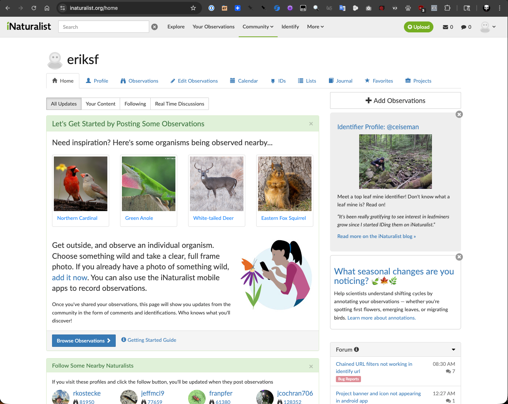
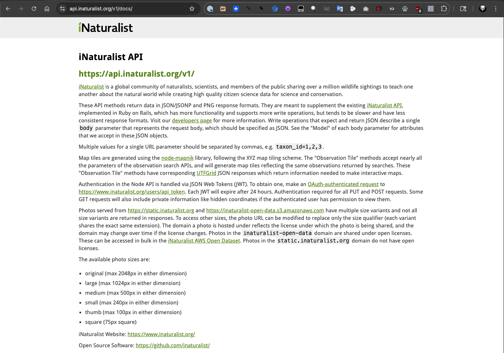
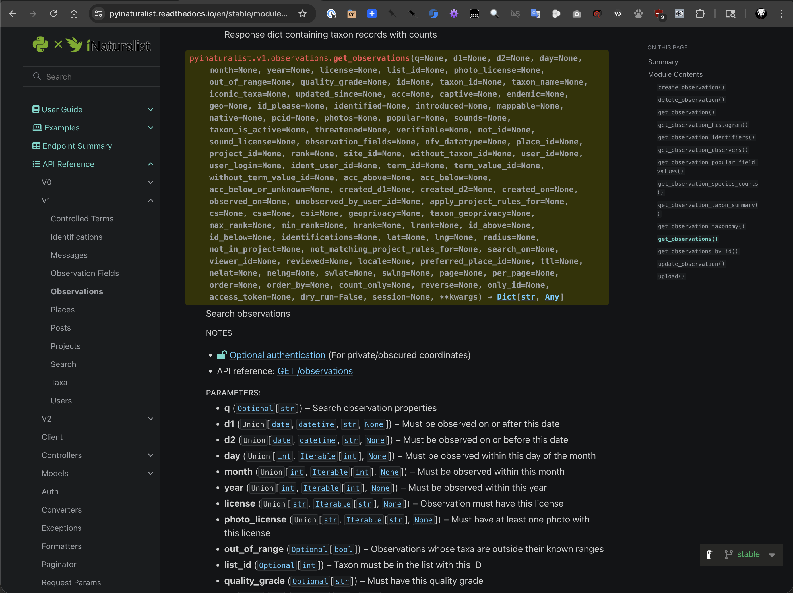
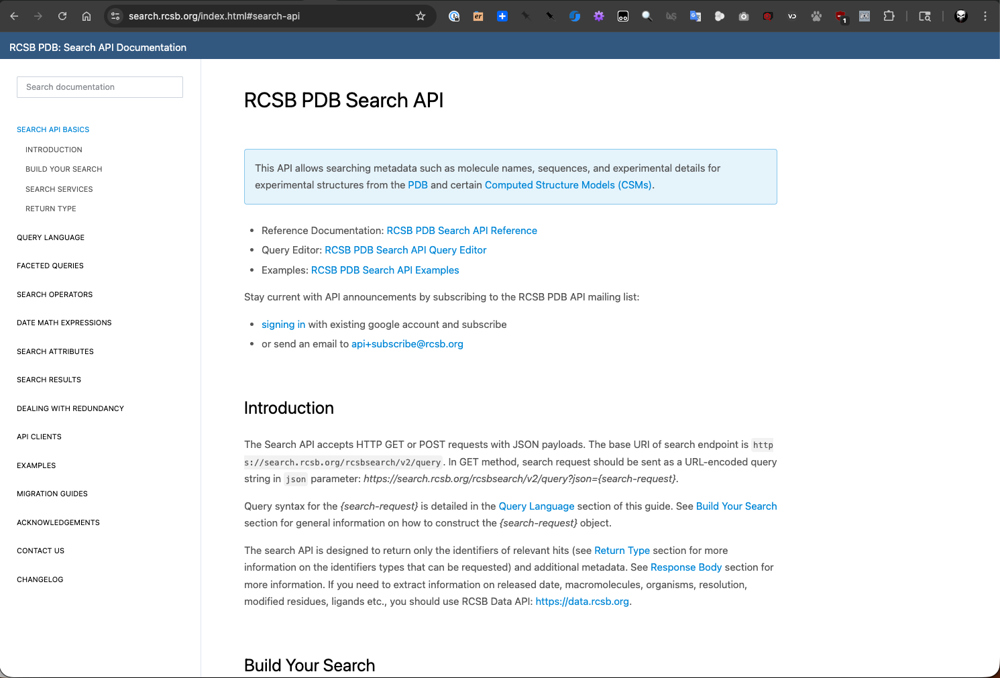
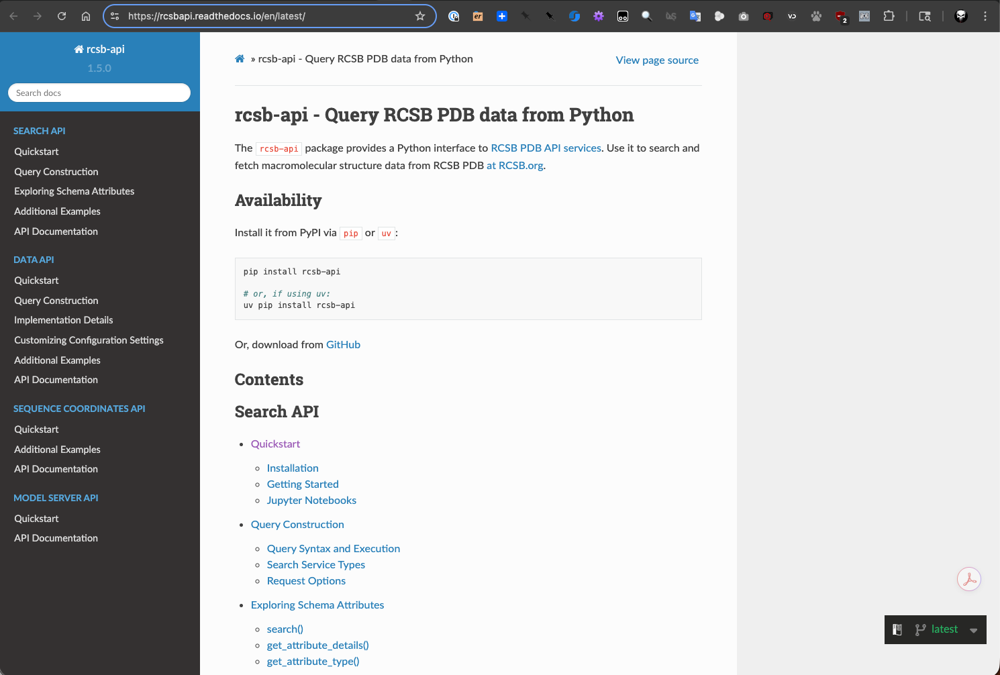
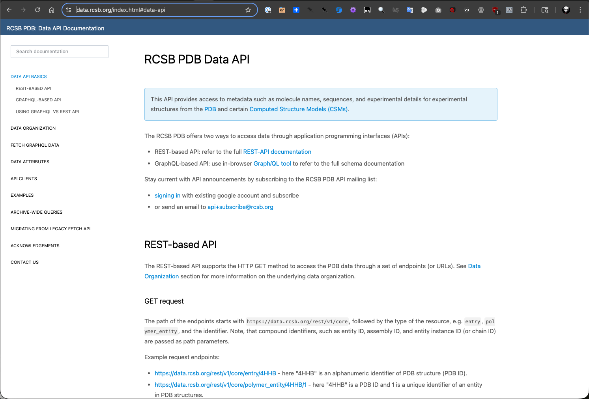
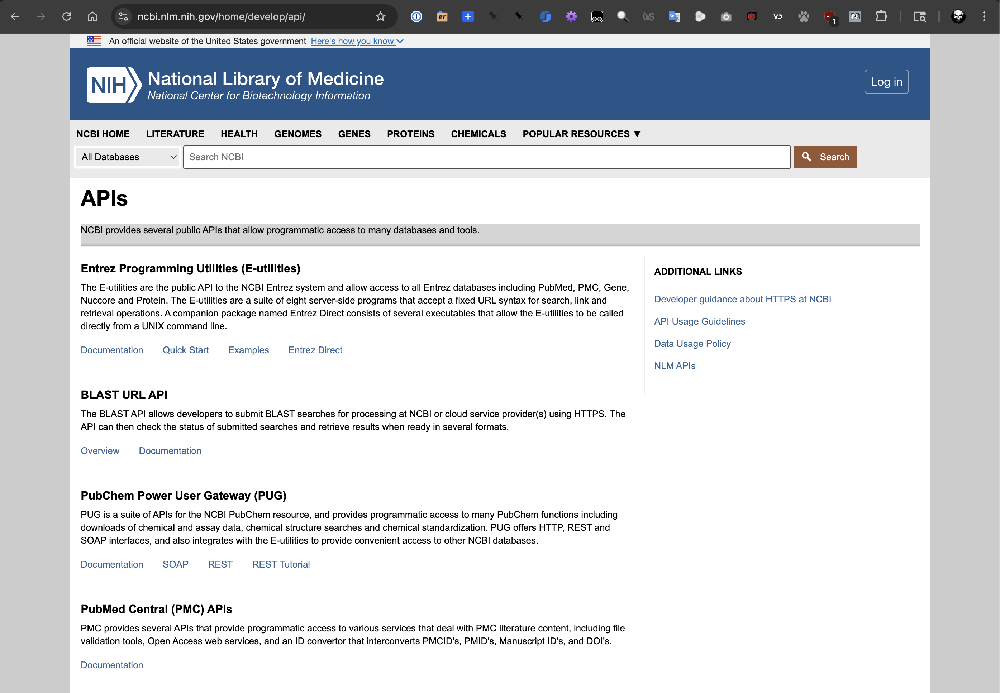

iNaturalist, RCSB PDB, and NCBI
===============================

In this section, we will explore three popular APIs in the field of bioinformatics: `iNaturalist <https://www.inaturalist.org/>`_,
`RCSB Protein Data Bank <https://www.rcsb.org/>`_ (Research Collaboratory for Structural Bioinformatics), and
`NCBI <https://www.ncbi.nlm.nih.gov/>`_ (National Center for Biotechnology Information). These APIs provide
access to a wealth of biological data, including species observations, protein structures, and genomic
information. After going through this module, students should be able to:

- Understand the purpose and functionality of each API.
- Make API requests to retrieve data from each platform.
- Parse and utilize the retrieved data for various applications in bioinformatics.

iNaturalist
-----------

iNaturalist is a citizen science project and online social network of naturalists, citizen scientists,
and biologists built on the concept of mapping and sharing observations of biodiversity across the globe.
The hundreds of thousands of members share close to one million observations of plants, animals, fungi,
and other organisms every month. The iNaturalist API allows users to access data about species observations,
including information about the location, date, and species observed.

    iNaturalist main site.

Let's take a look at the `iNaturalist API documentation <https://api.inaturalist.org/v1/docs/>`_ to understand how to make requests and retrieve data.

    iNaturalist API documentation.

As the iNaturalist API documentation shows, we can make requests to retrieve observations. Since it is a
standard RESTful API, we could use the ``requests`` library in Python to interact with it. But there is an
easier way to interact with the iNaturalist API using the ``pyinaturalist`` library, which provides a more
user-friendly interface for accessing the API. So let's install the ``pyinaturalist`` library.

.. code-block:: console

   [mbs337-vm]$ cd $HOME/mbs-337
   [mbs337-vm]$ source .venv/bin/activate
   (.venv) [mbs337-vm]$ pip3 install pyinaturalist
   (.venv) [mbs337-vm]$ pip3 list
   Package              Version
   -------------------- -----------
   annotated-types      0.7.0
   attrs                25.4.0
   biopython            1.86
   cattrs               26.1.0
   certifi              2026.1.4
   cffi                 2.0.0
   charset-normalizer   3.4.4
   cryptography         46.0.5
   idna                 3.11
   iniconfig            2.3.0
   jaraco.classes       3.4.0
   jaraco.context       6.1.0
   jaraco.functools     4.4.0
   jeepney              0.9.0
   keyring              25.7.0
   markdown-it-py       4.0.0
   mdurl                0.1.2
   more-itertools       10.8.0
   numpy                2.4.1
   packaging            26.0
   pip                  24.0
   platformdirs         4.9.2
   pluggy               1.6.0
   pycparser            3.0
   pydantic             2.12.5
   pydantic_core        2.41.5
   Pygments             2.19.2
   pyinaturalist        0.21.1
   pyrate-limiter       2.10.0
   pytest               9.0.2
   python-dateutil      2.9.0.post0
   redis                7.2.0
   requests             2.32.5
   requests-cache       1.3.0
   requests-ratelimiter 0.8.0
   rich                 14.3.3
   SecretStorage        3.5.0
   six                  1.17.0
   typing_extensions    4.15.0
   typing-inspection    0.4.2
   url-normalize        2.2.1
   urllib3              2.6.3

Now that we have the ``pyinaturalist`` library installed, we can start making requests to the iNaturalist API.
Before we dive into the code, let's take a moment to look at the `API documentation <https://pyinaturalist.readthedocs.io/en/stable/reference.html>`_
for the ``pyinaturalist`` library to understand how to use it effectively.

    iNaturalist API reference for `get_observations`.

OK, let's try to retrieve some observations for a 1 km radius around the coordinates (30.2895, -97.7368) which
is the location of the University of Texas at Austin for a 1 week period. We can use the following code to do
this:

.. code-block:: console

   [mbs337-vm]$ python3
   Python 3.12.3 (main, Jan 22 2026, 20:57:42) [GCC 13.3.0] on linux
   Type "help", "copyright", "credits" or "license" for more information.
   >>> import pyinaturalist as pin
   >>> from rich import print
   >>>
   >>> obs = pin.get_observations(lat="30.2895", lng="-97.7368", radius=1, d1="2026-02-18", d2="2026-02-24")
   >>> pin.pprint(obs)

     ID          Taxon ID   Taxon                                  Observed on    User              Location
    -------------------------------------------------------------------------------------------------------------------------------------
     339941488   18205      Melanerpes carolinus (Red-Bellied      Feb 23, 2026   johnathan12034    W 30th St, Austin, TX, US
                            Woodpecker)
     339919433   1427972    Irpex latemarginatus (Frothy           Feb 23, 2026   kirsten24         701 Dean Keeton/San Jacinto, Austin,
                            Porecrust)                                                              TX 78705, USA
     339917918   81708      Aesculus pavia (Red Buckeye)           Feb 23, 2026   kirsten24         Travis County, US-TX, US
     339841781   118492     Helicoverpa zea (Corn Earworm Moth)    Feb 22, 2026   kuramazilla       Speedway, Austin, TX, US
     339835262   43111      Sylvilagus floridanus (Eastern         Feb 21, 2026   lauren1414        W 24th St, Austin, TX, US
                            Cottontail)
     339813315   164229     Jasminum mesnyi (Primrose Jasmine)     Feb 19, 2026   rebraph           San Jacinto Blvd, Austin, TX, US
     339806172   47126      Kingdom Plantae (Plants)               Feb 22, 2026   bradc559          San Antonio St, Austin, TX, US
     339726755   54900      Papilio polyxenes asterius (Eastern    Feb 21, 2026   utfarmstand       The University of Texas at Austin,
                            Black Swallowtail)                                                      Austin, TX, US
     339668489   164038     Ilex cornuta (Chinese Holly)           Feb 21, 2026   liljegrenv        Rio Grande St, Austin, TX, US
     339657223   4956       Ardea herodias (Great Blue Heron)      Feb 21, 2026   vivian38785       San Jacinto Blvd, Austin, TX, US
     339645270   8229       Cyanocitta cristata (Blue Jay)         Feb 21, 2026   chasek29          701 Dean Keeton/San Jacinto, Austin,
                                                                                                    TX 78705, USA
     339645214   13858      Passer domesticus (House Sparrow)      Feb 21, 2026   vivian38785       Rio Grande St, Austin, TX, US
     339642368   48502      Cercis canadensis (Eastern Redbud)     Feb 21, 2026   chasek29          701 Dean Keeton/San Jacinto, Austin,
                                                                                                    TX 78705, USA
     339642071   47351      Genus Prunus (Plums, Cherries, And     Feb 21, 2026   chasek29          701 Dean Keeton/San Jacinto, Austin,
                            Allies)                                                                 TX 78705, USA
     339573515   9607       Quiscalus mexicanus (Great-Tailed      Feb 21, 2026   avi_subramanian   Austin
                            Grackle)
     339501990   41663      Procyon lotor (Common Raccoon)         Feb 20, 2026   kuramazilla       E 24th St, Austin, TX, US
     339495572   14886      Mimus polyglottos (Northern            Feb 18, 2026   mariaks16         W 24th St, Austin, TX, US
                            Mockingbird)
     339488649   57056      Medicago lupulina (Black Medick)       Feb 20, 2026   adrianj           Red River St, Austin, TX, US
     339365066   103498     Ischnura posita (Fragile Forktail)     Feb 19, 2026   etaan             Cedar St, Austin, TX, US
     339331168   47124      Class Magnoliopsida (Dicots)           Feb 19, 2026   lexi_moffett      The University of Texas at Austin,
                                                                                                    Austin, TX, US
     339202074                                                     Feb 18, 2026   chrismyzoo        Austin
     339197531   1555999    Nephroia carolina (Carolina            Feb 18, 2026   utfarmstand       E 21st St, Austin, TX, US
                            Snailseed)

   >>>

Another nice thing we can do with the ``pyinaturalist`` library is to use their data models. This allows us to
work with the data in a more structured way as opposed to working with raw dictionaries. For example, we can use
the ``Observation`` data model to access observation attributes more easily and take a look at one observation.

.. code-block:: console

   >>> my_obs = pin.Observation.from_json_list(obs)
   >>> type(my_obs[14])
   <class 'pyinaturalist.models.observation.Observation'>
   >>> print(my_obs[14])
   Observation(
    id=339573515,
    created_at='2026-02-21 09:11:43-06:00',
    captive=False,
    community_taxon_id=9607,
    identifications_count=3,
    identifications_most_agree=True,
    identifications_most_disagree=False,
    identifications_some_agree=True,
    location=(30.2868747711, -97.7400512695),
    mappable=True,
    num_identification_agreements=3,
    num_identification_disagreements=0,
    oauth_application_id=333,
    obscured=False,
    observed_on='2026-02-21 09:11:37-06:00',
    owners_identification_from_vision=True,
    place_guess='Austin',
    place_ids=[
        1,
        18,
        431,
        9853,
        53217,
        53218,
        53222,
        59613,
        60211,
        62332,
        63856,
        64422,
        64423,
        65181,
        66741,
        67465,
        68119,
        80998,
        82256,
        97394,
        113590,
        124748,
        146145,
        148549,
        151222,
        151232,
        160119
    ],
    positional_accuracy=15,
    preferences={'prefers_community_taxon': None},
    public_positional_accuracy=15,
    quality_grade='research',
    reviewed_by=[115129, 3953595, 4483440, 8880881],
    site_id=1,
    species_guess='Great-tailed Grackle',
    taxon_geoprivacy='open',
    updated_at='2026-02-21 14:06:02-06:00',
    uri='https://www.inaturalist.org/observations/339573515',
    uuid='26673574-3cd1-470c-a6b9-ad36b4d8a580',
    annotations=[],
    application=None,
    comments=[],
    faves=[],
    flags=[],
    identifications=[
        Identification(
            id=765249631,
            username='isaaceastland',
            taxon_name='Quiscalus mexicanus (Great-Tailed Grackle)',
            created_at='Feb 21, 2026',
            truncated_body=''
        ),
        Identification(
            id=765180592,
            username='avi_subramanian',
            taxon_name='Quiscalus mexicanus (Great-Tailed Grackle)',
            created_at='Feb 21, 2026',
            truncated_body=''
        ),
        Identification(
            id=765182296,
            username='bobthebob101',
            taxon_name='Quiscalus mexicanus (Great-Tailed Grackle)',
            created_at='Feb 21, 2026',
            truncated_body=''
        ),
        Identification(
            id=765289717,
            username='aguilita',
            taxon_name='Quiscalus mexicanus (Great-Tailed Grackle)',
            created_at='Feb 21, 2026',
            truncated_body=''
        )
    ],
    ofvs=[],
    photos=[Photo(id=617763422, url='https://static.inaturalist.org/photos/617763422/square.jpg')],
    project_observations=[],
    quality_metrics=[],
    sounds=[],
    taxon=Taxon(id=9607, full_name='Quiscalus mexicanus (Great-Tailed Grackle)'),
    user=User(id=4483440, login='avi_subramanian', name='Avi Subramanian'),
    votes=[]
 )

Since we are using the data model, we can easily access the attributes of the observation.
For example, we can access the taxon name.

.. code-block:: console

 >>> print(my_obs[14].taxon.full_name)
 Quiscalus mexicanus (Great-Tailed Grackle)

And we can also access the photos associated with the observation.

.. code-block:: console

 >>> print(my_obs[14].photos)
 [
    Photo(
        id=617763422,
        attribution='(c) Avi Subramanian, all rights reserved',
        original_dimensions=(1152, 2048),
        url='https://static.inaturalist.org/photos/617763422/square.jpg'
    )
 ]

    Photo of the Great-Tailed Grackle observation.

RCSB Protein Data Bank
----------------------

The RCSB Protein Data Bank (PDB) is a repository for the 3D structural data of large biological molecules,
such as proteins and nucleic acids. The PDB provides a wealth of information about the structure and function
of these molecules, which is crucial for understanding biological processes and developing new drugs.
The RCSB PDB API allows users to access this structural data programmatically, enabling researchers to retrieve
information about specific proteins, their structures, and related data.

    RCSB PDB main page.

The RCSB PDB has multiple APIs available, including a Search API for querying the database and a Data API for
retrieving detailed information about specific entries. Let's first take a look at the `RCSB PDB Search API documentation <https://search.rcsb.org/index.html#search-api>`_.

    RCSB PDB Search API documentation page.

The Search API allows us to perform complex queries to find specific entries in the PDB and is designed to return
only identifiers (and some additional metadata) for the hits that match the search criteria. The basic idea is to
send a GET request to `https://search.rcsb.org/rcsbsearch/v2/query?json={search-request}` where ``{search-request}``
is a structured JSON object that specifies the search criteria. Something like:

.. code-block:: json

  {
    "query": {
      "type": "terminal",
      "service": "full_text",
      "parameters": {
        "value": "thymidine kinase"
      }
    },
    "return_type": "entry"
  }

Again, we could use the lower-level Python ``requests`` library to interact with the Search API (and Data API), but
there is a more convenient way to interact with the RCSB PDB APIs using the ``rcsb-api`` library, which provides a
more user-friendly interface for accessing the APIs. So let's install it.

.. code-block:: console

   [mbs337-vm]$ cd $HOME/mbs-337
   [mbs337-vm]$ source .venv/bin/activate
   (.venv) [mbs337-vm]$ pip3 install rcsb-api
   (.venv) [mbs337-vm]$ pip3 list
   Package              Version
   -------------------- -----------
   annotated-types      0.7.0
   anyio                4.12.1
   attrs                25.4.0
   biopython            1.86
   cattrs               26.1.0
   certifi              2026.1.4
   cffi                 2.0.0
   charset-normalizer   3.4.4
   cryptography         46.0.5
   graphql-core         3.2.7
   h11                  0.16.0
   httpcore             1.0.9
   httpx                0.28.1
   idna                 3.11
   iniconfig            2.3.0
   jaraco.classes       3.4.0
   jaraco.context       6.1.0
   jaraco.functools     4.4.0
   jeepney              0.9.0
   keyring              25.7.0
   markdown-it-py       4.0.0
   mdurl                0.1.2
   more-itertools       10.8.0
   nest-asyncio         1.6.0
   numpy                2.4.1
   packaging            26.0
   pip                  24.0
   platformdirs         4.9.2
   pluggy               1.6.0
   pycparser            3.0
   pydantic             2.12.5
   pydantic_core        2.41.5
   Pygments             2.19.2
   pyinaturalist        0.21.1
   pyrate-limiter       2.10.0
   pytest               9.0.2
   python-dateutil      2.9.0.post0
   rcsb-api             1.5.0
   redis                7.2.0
   requests             2.32.5
   requests-cache       1.3.0
   requests-ratelimiter 0.8.0
   rich                 14.3.3
   rustworkx            0.17.1
   SecretStorage        3.5.0
   six                  1.17.0
   tqdm                 4.67.3
   typing_extensions    4.15.0
   typing-inspection    0.4.2
   url-normalize        2.2.1
   urllib3              2.6.3

With the ``rcsb-api`` library installed, we can start making requests to the RCSB PDB APIs. Let's first take a
look at the `rcsb-api documentation <https://rcsbapi.readthedocs.io/en/latest/>`_ to understand how to use the
library effectively.

    rcsb-api documentation page.

The first thing we're going to do is to use the Search API to find entries in the PDB that match a specific query.
For example, let's search for entries that contain the term "Hemoglobin". We can use the following code to do this:

.. code-block:: console

   [mbs337-vm]$ python3
   Python 3.12.3 (main, Jan 22 2026, 20:57:42) [GCC 13.3.0] on linux
   Type "help", "copyright", "credits" or "license" for more information.
   >>> from rcsbapi.search import TextQuery
   >>>
   >>> query = TextQuery(value="Hemoglobin")
   >>>
   >>> results = query()
   >>> results_list = list(results)
   >>> len(results_list)
   8918
   >>> for rid in sorted(results_list):
   >>>    print(rid)
   101M
   102M
   103M
   104M
   105M
   106M
   107M
   108M
   109M
   10NH
   110M
   111M
   112M
   155C
   ...
   4HGJ
   4HHB
   4HHR
   ...
   9YVV
   9ZKF
   9ZLJ
   9ZLM

Now that we have a list of entry IDs that match our search query, we can use the Data API to retrieve detailed
information about a specific entry. For example, let's retrieve information about the entry with ID "4HHB", which
is the PDB ID for human hemoglobin. As we did with the Search API, let's first take a look at the
`RCSB PDB Data API documentation <https://data.rcsb.org/index.html#data-api>`_.

    RCSB PDB Data API documentation page.

As you can see from the Data API documentation, there are two ways to retrieve data for a specific entry: using
the RESTful API or using `GraphQL <https://graphql.org/>`_. The RESTful API is a standard way to interact with
the API using HTTP requests, while GraphQL is a more flexible query language that allows you to specify exactly
what data you want to retrieve. Since we have already installed the ``rcsb-api`` library, we can use it to
interact with the Data API in a more convenient way.

To retrieve information about the entry with ID "4HHB", we can use the following code:

.. code-block:: console

   >>> from rcsbapi.data import DataQuery as Query
   >>>
   >>> query = Query(
   ...     input_type="entries",
   ...     input_ids=["4HHB"],
   ...     return_data_list=["exptl.method", "struct.title"]
   ... )
   >>>
   >>> result = query.exec()
   >>>
   >>> type(result)
   <class 'dict'>
   >>> print(result)
   {'data': {'entries': [{'rcsb_id': '4HHB', 'exptl': [{'method': 'X-RAY DIFFRACTION'}], 'struct': {'title': 'THE CRYSTAL STRUCTURE OF HUMAN DEOXYHAEMOGLOBIN AT 1.74 ANGSTROMS RESOLUTION'}}]}}
   >>>
   >>> print(query.get_query())
   query{entries(entry_ids: ["4HHB"]){
       rcsb_id
       exptl{
         method
     }
       struct{
         title
     }}}
   >>>

Downloading PDB files using BioPython
~~~~~~~~~~~~~~~~~~~~~~~~~~~~~~~~~~~~~

In previous sections, we have used BioPython's PDB package to parse PDB files. Now let's see
how we can use BioPython to download PDB files directly from the RCSB PDB database. This can be done using
the ``PDBList`` class from the ``Bio.PDB`` module (see `docs <https://biopython.org/docs/1.76/api/Bio.PDB.PDBList.html>`_).

.. code-block:: console

   >>> from Bio.PDB import PDBList
   >>>
   >>> pdb_list = PDBList()
   >>>
   >>> pdb_list.retrieve_pdb_file("4HHB", file_format="mmCif", pdir=".")
   Downloading PDB structure '4hhb'...
   './4hhb.cif'
   >>>
   [mbs337-vm]$ ls -l
   total 764
   -rw-r--r-- 1 ubuntu ubuntu    540 Feb 21 18:39 4HHB_summary.json
   -rw-rw-r-- 1 ubuntu ubuntu 764822 Feb 25 02:16 4hhb.cif
   drwxrwxr-x 4 ubuntu ubuntu   4096 Feb 19 17:58 docker-exercise

NCBI
----

`NCBI <https://www.ncbi.nlm.nih.gov/>`_ (National Center for Biotechnology Information) is a part of the United States National Library of Medicine,
a branch of the National Institutes of Health. NCBI provides access to a wide range of biological data,
including genomic sequences, protein sequences, and literature. The NCBI APIs allow users to access this data
programmatically, enabling researchers to retrieve information about specific genes, proteins, and other
biological entities.

    NCBI main page.

NCBI also provides multiple `APIs <https://www.ncbi.nlm.nih.gov/home/develop/api/>`_, including the E-utilities API for accessing all the Entrez databases.

    NCBI APIs page.

`Entrez <https://www.ncbi.nlm.nih.gov/search/>`_ is a search and retrieval system that provides access to a
wide range of biological data, including genomic sequences, protein sequences, and literature. It search
databases like PubMed, GenBank, GEO, and many others. The E-utilities API allows users to access this data
programmatically, enabling researchers to retrieve information about specific genes, proteins, and other
biological entities.

Again, we can turn to the BioPython library to interact with the NCBI APIs in a more convenient way.
BioPython provides the ``Entrez`` module for accessing the NCBI APIs (see `docs <https://biopython.org/docs/1.76/api/Bio.Entrez.html>`_).

Searching, downloading, and parsing GenBank records
~~~~~~~~~~~~~~~~~~~~~~~~~~~~~~~~~~~~~~~~~~~~~~~~~~~

For example, let's say we're working with Arabidopsis thaliana (thale cress), a small plant that is a popular
model organism in plant biology, and we want to retrieve the GenBank record for a gene with locus ``AT1G65480``.
This is a protein-coding gene on chromosome 1 that promotes flowering. Let's first search for the gene so we
can get its GenBank ID, and then we can use that ID to retrieve the GenBank record and parse it using BioPython.

.. code-block:: console

   [mbs337-vm]$ python3
   Python 3.12.3 (main, Jan 22 2026, 20:57:42) [GCC 13.3.0] on linux
   Type "help", "copyright", "credits" or "license" for more information.
   >>> from Bio import Entrez, SeqIO
   >>>
   >>> Entrez.email = "A.N.Other@example.com"
   >>>
   >>> with Entrez.esearch(db="protein", term="AT1G65480") as h:
   ...     results = Entrez.read(h)
   ...     type(results)
   ...     print(results)
   ...
   <class 'Bio.Entrez.Parser.DictionaryElement'>
   {'Count': '28', 'RetMax': '20', 'RetStart': '0', 'IdList': ['3178757816', '17432933', '2549168764', '2549167280', '2549167260', '2549163309', '2549152528', '332658914', '1063695107', '15237061', '15218709', '1820247506', '1315962760', '1315962758', '1315962757', '1315946694', '1315946693', '1039007658', '332196260', '508716688'], 'TranslationSet': [], 'TranslationStack': [{'Term': 'AT1G65480[All Fields]', 'Field': 'All Fields', 'Count': '28', 'Explode': 'N'}, 'GROUP'], 'QueryTranslation': 'AT1G65480[All Fields]'}
   >>>

We'll choose the second ID in the list, ``17432933``, which is the GenBank ID for the protein sequence of the gene.

.. code-block:: console

   >>> gb_rec = None
   >>> with Entrez.efetch(db="protein", id="17432933", rettype="gb", retmode="text") as h:
   ...     record = SeqIO.parse(h, "gb")
   ...     rec_list = list(record)
   ...     gb_rec = rec_list[0]
   ...
   >>>
   >>> type(gb_rec)
   <class 'Bio.SeqRecord.SeqRecord'>
   >>>
   >>> print(f"ID: {gb_rec.id}\nName: {gb_rec.name}\nDescription: {gb_rec.description}\nSequence: {gb_rec.seq}")
   ID: Q9SXZ2.2
   Name: FT_ARATH
   Description: RecName: Full=Protein FLOWERING LOCUS T
   Sequence: MSINIRDPLIVSRVVGDVLDPFNRSITLKVTYGQREVTNGLDLRPSQVQNKPRVEIGGEDLRNFYTLVMVDPDVPSPSNPHLREYLHWLVTDIPATTGTTFGNEIVCYENPSPTAGIHRVVFILFRQLGRQTVYAPGWRQNFNTREFAEIYNLGLPVAAVFYNCQRESGCGGRRL
   >>>

PubMed and Medline
~~~~~~~~~~~~~~~~~~

To continue with our example, let's say we want to find literature related to the gene ``AT1G65480``.
We can use the PubMed database to search for articles that mention this gene.

.. code-block:: console

   [mbs337-vm]$ python3
   Python 3.12.3 (main, Jan 22 2026, 20:57:42) [GCC 13.3.0] on linux
   Type "help", "copyright", "credits" or "license" for more information.
   >>> from Bio import Entrez, Medline
   >>>
   >>> Entrez.email = "A.N.Other@example.com"
   >>>
   >>> idlist = None
   >>> with Entrez.esearch(db="pubmed", term="AT1G65480") as h:
   ...     record = Entrez.read(h)
   ...     idlist = record["IdList"]
   ...
   >>> idlist
   ['31219634', '31009078', '26132805', '19825833']

It looks like there are 4 articles that mention the gene ``AT1G65480``. Let's retrieve the details of the
third article in the list, ``26132805``.

.. code-block:: console

   >>> art_list = None
   >>> with Entrez.efetch(db="pubmed", id="26132805", rettype="medline", retmode="text") as h:
   ...     records = Medline.parse(h)
   ...     art_list = list(records)
   ...
   >>>
   >>> article = art_list[0]
   >>> type(article)
   <class 'Bio.Medline.MedlineRecord'>
   >>>
   >>> print(f"ID: {article.get('PMID')}\nTitle: {article.get('TI')}\nAuthors: {article.get('AU')}\nSource: {article.get('SO')}\nAbstract: {article.get('AB')}")
   ID: 26132805
   Title: FT overexpression induces precocious flowering and normal reproductive development in Eucalyptus.
   Authors: ['Klocko AL', 'Ma C', 'Robertson S', 'Esfandiari E', 'Nilsson O', 'Strauss SH']
   Source: Plant Biotechnol J. 2016 Feb;14(2):808-19. doi: 10.1111/pbi.12431. Epub 2015 Jul 1.
   Abstract: Eucalyptus trees are among the most important species for industrial forestry worldwide. However, as with most forest trees, flowering does not begin for one to several years after planting which can limit the rate of conventional and molecular breeding. To speed flowering, we transformed a Eucalyptus grandis x urophylla hybrid (SP7) with a variety of constructs that enable overexpression of FLOWERING LOCUS T (FT). We found that FT expression led to very early flowering, with events showing floral buds within 1-5 months of transplanting to the glasshouse. The most rapid flowering was observed when the cauliflower mosaic virus 35S promoter was used to drive the Arabidopsis thaliana FT gene (AtFT). Early flowering was also observed with AtFT overexpression from a 409S ubiquitin promoter and under heat induction conditions with Populus trichocarpa FT1 (PtFT1) under control of a heat-shock promoter. Early flowering trees grew robustly, but exhibited a highly branched phenotype compared to the strong apical dominance of nonflowering transgenic and control trees. AtFT-induced flowers were morphologically normal and produced viable pollen grains and viable self- and cross-pollinated seeds. Many self-seedlings inherited AtFT and flowered early. FT overexpression-induced flowering in Eucalyptus may be a valuable means for accelerating breeding and genetic studies as the transgene can be easily segregated away in progeny, restoring normal growth and form.

Additional Resources
--------------------

* `iNaturalist API documentation <https://api.inaturalist.org/v1/docs/>`_
* `pyinaturalist API documentation <https://pyinaturalist.readthedocs.io/en/stable/reference.html>`_
* `PDB-101: Introduction to RCSB PDB APIs <https://pdb101.rcsb.org/learn/guide-to-understanding-pdb-data/introduction-to-rcsb-pdb-apis>`_
* `RCSB PDB Search API documentation <https://search.rcsb.org/index.html>`_
* `RCSB PDB Data API documentation <https://data.rcsb.org/index.html>`_
* `rcsb-api documentation <https://rcsbapi.readthedocs.io/en/latest/>`_
* `NCBI APIs documentation <https://www.ncbi.nlm.nih.gov/home/develop/api/>`_
* `BioPython documentation <https://biopython.org/docs/1.76/api/index.html>`_
* `BioPython Tutorial and Cookbook <https://biopython.org/docs/latest/Tutorial>`_
