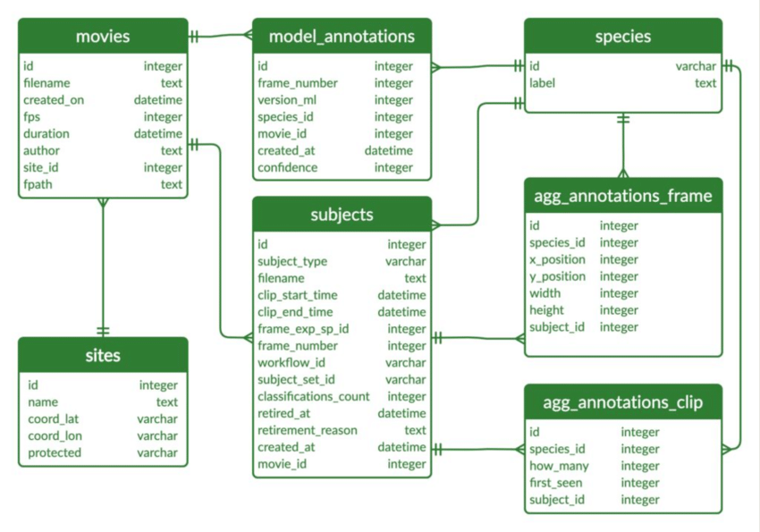
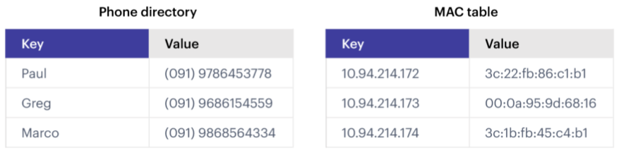

Introduction to Databases and Persistence
=========================================

Application data that lives inside a container is ephemeral - it only persists
for the lifetime of the container. We can use databases to extend the life of
our application (or user) data, and even access it from outside the container.

After going through this module, students should be able to:

* Explain the differences between SQL and NoSQL databases
* Choose the appropriate type of database for a given application / data set
* Start and find the correct port for a Redis server
* Install and import the Redis Python library
* Add data to and retrieve data from a Redis database from a Python script
* **Design Principles:** Separating the database service from the
  application container is a great example illustrating the *modularity* design
  principle.

What Is Our Motivation?
-----------------------

In the previous units, we have been working with data that is stored in files on our local file system.
This is a common way to store data, but it has some limitations:

* The data may not persistent; if we stop the container, the data will be lost unless we mount the file(s)
  into the container.
* It is not easy to query the data; we have to read the entire file into memory and then parse it to extract
  the information we need.
* It is not easy to share the data between different processes or different computers; we would have to
  implement some sort of file sharing system, which can be complex and error-prone.
* It is not easy to enforce data integrity; we would have to implement our own system for ensuring that
  the data is consistent and valid.
* It is not easy to scale; as the size of the data grows, it becomes more difficult to manage and query
  the data efficiently.
* Files are not designed for concurrent access; if multiple processes try to read from and write to the same
  file at the same time, race conditions can occur, leading to data corruption or loss.
* Files do not support transactions; if a process is interrupted while writing to a file, it can leave the
  file in an inconsistent state.

Databases are designed to address these limitations. They provide a structured way to store and manage data
and we will use them to store our data in a way that is persistent, queryable, shareable, and scalable. There
are a lot of details to fill in over the course of the rest of the semester, but for now we are going to focus
on getting data into and out of a database.

Intro to Databases
------------------

**What is a database?**

* A database is an organized collection of structured information, or data,
  typically stored electronically in a computer system.
* Databases provide a **query language** - a small, domain-specific language for interacting with the
  data. The query language is not like a typical programming language such as Python or C++; you
  cannot create large, complex programs with it. Instead, it is intended to allow for easy, efficient
  access to the data.

**Why use a database?**

* Our data needs permanence and we want to be able to stop and start our applications
  without losing data.
* We want multiple Python processes to be able to access the data at the same
  time, including Python processes that may be running on different computers.

Databases sometimes get classified into two broad categories: SQL databases (also called
relational databases) and NoSQL databases.

SQL Databases
-------------
Structured Query Language (SQL) is a language for managing structured or relational data, where
certain objects in the dataset are related to other objects in a formally or mathematically precise
way. SQL is the language used when working with a relational database. You will often see SQL
database technologies referred to as Relational Database Management Systems (RDBMS).

The SQL language is governed by an ISO standard, and relational databases are among the most popular
databases in use today. SQL was originally based on a strong, theoretical framework called the
Relational Model (and related concepts). However, today's SQL has departed significantly from that
formal framework.

Popular commercial RBDMS include:

* Oracle
* Microsoft SQL Server
* IBM Db2

Popular open-source RBDMS include:

* MySQL
* Postgres
* Sqlite

    Example of a relational database. `Source1 <https://dx.doi.org/10.3897/BDJ.9.e60548>`_

NoSQL Databases
----------------

As the name implies, a NoSQL database is simply a database that does not use SQL.
There are many different types of NoSQL databases, including:

* Time series databases
* Document stores
* Graph databases
* Simple key-value stores (like the one we will use in this class)

In some ways, it is easier to say what a NoSQL database isn't than what it is; some of the key attributes
include:

* NoSQL databases do **NOT** use tables (data structured using rows and columns)
  connected through relations
* NoSQL databases store data in "collections", "logical databases", or similar containers
* NoSQL databases often allow for missing or different attributes on objects in the same collection
* Objects in one collection do not relate or link to objects in another collection
* For example, the objects themselves could be JSON objects without a pre-defined schema

    Example of a key-value database. `Source2 <https://redis.com/nosql/key-value-databases/>`_

**SQL vs NoSQL**

Comparing SQL and NoSQL is an apples to oranges comparison.

* Both SQL and NoSQL databases have advantages and disadvantages.
* The *primary* deciding factor should be the *shape* of the data and the requirements on the
  integrity of the data. In practice, many other considerations could come into play, such as what
  expertise the project team has.
* Also consider how the data may change over time, and how important is the
  relationship between the different types of data being stored.
* SQL databases "enforce" relationships between data types, including one-to-one, one-to-many,
  and many-to-many. When the integrity of the data is important, SQL databases are a good choice.
* In many NoSQL databases, the relationship enforcement must be programmed into the application. This
  can be error-prone and can increase the development effort needed to build the application. On the
  other hand, this can allow the database to be used for use cases where relationship enforcement is
  not possible.
* SQL databases historically cannot scale to the "largest" quantities of data because of
  the ACID (Atomicity, Consistency, Isolation, Durability) guarantees they make (though this is an
  active area of research).
* NoSQL databases trade ACID guarantees for weaker properties (e.g., "eventual consistency") and
  greater scalability. It would be difficult to scale a relational database to contain
  the HTML of all websites on the internet or even all tweets ever published.

**ACID Properties**

*A - Atomicity*:	"All or Nothing" — the entire transaction succeeds or the whole thing is rolled back.
Transferring money between bank accounts — either both debit & credit succeed, or neither happens.

*C - Consistency*:	Data must always move the database from one valid state to another. A transaction
can't leave the database in an invalid state.	After a money transfer, both account balances should
reflect the right amounts — no negative balances unless the system allows overdrafts.

*I - Isolation*:	Transactions should not interfere with each other, even if they happen at the same time.
If two people try to buy the last ticket for a concert at the same time, only one should succeed —
transactions shouldn't "step on each other's toes."

*D - Durability*:	Once a transaction is committed, it's permanent, even if there's a crash or power loss.
After you confirm a hotel booking, that reservation is safely stored — even if the server crashes right
after.

**Quick Analogy**

Imagine you're ordering food online — the ACID properties make sure:

* Atomicity: Your payment and order both succeed, or neither does (you aren't charged without an order placed).
* Consistency: The restaurant's inventory reflects your order — if you order a burger, the burger count goes down by 1.
* Isolation: If two people order the last burger at the same time, only one actually gets it.
* Durability: Even if the system crashes, your order stays confirmed.

For the projects in this class, we are going to use Redis, a simple (NoSQL) "data structure" store.
There are a few reasons for this choice:

* We need a flexible data model, as the structure of the data we will store in the database will
  be changing significantly over the course of the semester.
* We need a tool that is quick to learn and simple to use. This is not a databases course, and
  learning the SQL language would take significantly more time than we can afford.

**In a Nutshell**

When to use SQL

* Structured Data with Clear Relationships
	If your data has a fixed schema (tables with columns and rows) and relationships between tables (foreign keys), SQL is great.
* Transactions are Critical
	If you need strong consistency and ACID compliance (Atomicity, Consistency, Isolation, Durability), SQL databases like PostgreSQL or MySQL are the go-to.
* Data Integrity Matters a Lot
	When you need constraints (like unique values, foreign key enforcement, or type checks) SQL databases shine.
* Analytics and Complex Queries
	SQL is excellent when you need to join tables, filter, aggregate, or run complex queries across datasets.
* Standardized Reporting
	If your business relies heavily on structured reporting and analysis, SQL's mature querying (like GROUP BY, JOIN, etc.) fits well.

When to use NoSQL

* Flexible or Evolving Schema
	If your data structure changes often (new fields, nested data, etc.), NoSQL (like MongoDB or DynamoDB) is more forgiving.
* Massive Scale with Simple Queries
	If you have very large amounts of data and are optimizing for speed over complex querying, NoSQL (especially key-value or document stores) is often faster.
* High Throughput, Low Latency Needs
	For systems like caching, user sessions, or event logging, NoSQL can handle quick reads/writes with ease.
* Unstructured or Semi-Structured Data
	Documents, JSON blobs, logs, and sensor data are often a better fit for document or column-family stores than rigid tables.
* Horizontal Scaling
	NoSQL databases are typically designed for easier horizontal scaling (sharding/partitioning across servers) compared to SQL.
* Big Data & Distributed Systems
	If you're building something like a recommendation engine, analytics pipeline, or IoT platform, NoSQL can shine.

Quick Rule of Thumb

If you need...
* Strong consistency + relationships:	SQL
* High flexibility + scalability:	NoSQL

Redis
-----

Redis is a very popular NoSQL database and "data structure store" with lots of
advanced features including:

.. note::

   Before going any further, let's play around with Redis a little bit in a browser:
   `https://redis.io/try-free/ <https://redis.io/try-free/>`_
   Try the commands ``SET``, ``GET``, ``HSET``, ``HGET``, ``KEYS``, ``HKEYS``

Key-Value Store
~~~~~~~~~~~~~~~

Redis provides key-value store functionality:

* The items stored in a Redis database are structured as ``key:value`` objects.
* The primary requirement is that the ``key`` be unique across the database.
* A single Redis server can support multiple databases, indexed by an integer.
* The data itself can be stored as JSON.

Notes about Keys
~~~~~~~~~~~~~~~~

Redis keys have the following properties/requirements:

* Keys are often strings, but they can be any "binary sequence".
* Long keys can lead to performance issues.
* A format such as ``<object_type>:<object_id>`` is a good practice.

Notes on Values
~~~~~~~~~~~~~~~

* Values are typed; some of the primary types include:

  * Binary-safe strings
  * Lists (sorted collections of strings)
  * Sets (unsorted, unique collections of strings)
  * Hashes (maps of fields with associated values; both field and value are type ``string``)

* There is no native "JSON" type; to store JSON, one can use an encoding and store
  the data as a binary-safe string, or one can use a hash and convert the object
  into and out of JSON.
* The basic string type is a "binary-safe" string, meaning it must include an
  encoding.

  * In Python terms, the string is stored and returned as type ``bytes``.
  * By default, the string will be encoded with UTF-8, but we can specify the
    encoding when storing the string.
  * Since bytes are returned, it will be our responsibility to decode using the
    same encoding.

Hash Maps
~~~~~~~~~

* Hashes provide another way of storing dictionary-like data in Redis
* The values of the keys are type ``string``

Running Redis
-------------

To use Redis on your Jetstream VMs, we must have an instance of the Redis server
running. We will use a `containerized version of Redis <https://hub.docker.com/_/redis/tags>`_
that we each need to pull from Docker Hub:

.. code-block:: console

   # start the Redis server on the command line:
   [mbs337-vm]$ docker run -d -p 6379:6379 redis:8
   Unable to find image 'redis:8' locally
   8: Pulling from library/redis
   0c8d55a45c0d: Pull complete
   bbed7540f434: Pull complete
   35b667b631ff: Pull complete
   a15985f29cdf: Pull complete
   6397ab563848: Pull complete
   4f4fb700ef54: Pull complete
   4a43643650f6: Pull complete
   Digest: sha256:7b6fb55d8b0adcd77269dc52b3cfffe5f59ca5d43dec3c90dbe18aacce7942e1
   Status: Downloaded newer image for redis:8
   33827c602568a8d09a1d755dc93035dd42e7474a11213eac66aa8fb0ef239c2e

The ``-d`` flag detaches your terminal from the running container - i.e. it
runs the container in the background. The ``-p`` flag maps a port on the Jetstream
VM (6379, in the above case) to a port inside the container (again 6379, in the
above case). In the above example, the Redis database was set up to use the
default port inside the container (6379), and we can access that through our
specified port on Jetstream (6379). This explicit mapping is convenient if you
have multiple services running on the same VM and you want to avoid port
collisions.

Check to see that things are up and running with:

.. code-block:: console

   [mbs337-vm]$ docker ps
   CONTAINER ID   IMAGE     COMMAND                  CREATED          STATUS         PORTS                                         NAMES
   33827c602568   redis:8   "docker-entrypoint.s…"   11 seconds ago   Up 9 seconds   0.0.0.0:6379->6379/tcp, [::]:6379->6379/tcp   gallant_fermi

The list should have a container with the name you gave it, an ``UP`` status,
and the port mapping that you specified.

If the above is not found in the list of running containers, try to debug with
the following:

.. code-block:: console

   [mbs337-vm]$ docker logs "your-container-name"
   -or-
   [mbs337-vm]$ docker logs "your-container-ID"
   [mbs337-vm]$ docker logs 33827c602568
   Starting Redis Server
   1:C 21 Feb 2026 18:04:29.653 * oO0OoO0OoO0Oo Redis is starting oO0OoO0OoO0Oo
   1:C 21 Feb 2026 18:04:29.653 * Redis version=8.6.0, bits=64, commit=00000000, modified=1, pid=1, just started
   1:C 21 Feb 2026 18:04:29.653 * Configuration loaded
   1:M 21 Feb 2026 18:04:29.653 * monotonic clock: POSIX clock_gettime
   1:M 21 Feb 2026 18:04:29.654 * Running mode=standalone, port=6379.
   ...
   1:M 21 Feb 2026 18:04:29.661 * Server initialized
   1:M 21 Feb 2026 18:04:29.661 * Ready to accept connections tcp

The Redis server is up and available on port **6379**. Although we could use
the Redis CLI to interact with the server directly, in this class we will focus
on the Redis Python library so we can interact with the server from our Python
scripts.

.. warning::

   Pause for a minute to think about why we are running ``redis:8``. In the terminal output, it
   looks like the actual version of Redis is ``version=8.6.0``. What do you need to know about
   `semantic versioning <https://semver.org/>`_ in order to future-proof your code?

To interact with this Redis server, we need to install the Redis Python library:

.. code-block:: console

   [mbs337-vm]$ cd $HOME/mbs-337
   [mbs337-vm]$ source .venv/bin/activate
   (.venv) [mbs337-vm]$ pip3 install redis
   (.venv) [mbs337-vm]$ pip3 list
   Package           Version
   ----------------- -------
   annotated-types   0.7.0
   biopython         1.86
   iniconfig         2.3.0
   numpy             2.4.1
   packaging         26.0
   pip               24.0
   pluggy            1.6.0
   pydantic          2.12.5
   pydantic_core     2.41.5
   Pygments          2.19.2
   pytest            9.0.2
   redis             7.2.0
   typing_extensions 4.15.0
   typing-inspection 0.4.2

Then open up an interactive Python interpreter to connect to the server:

.. code-block:: console

   [mbs337-vm]$ python3
   Python 3.12.3 (main, Jan 22 2026, 20:57:42) [GCC 13.3.0] on linux
   Type "help", "copyright", "credits" or "license" for more information.
   >>>

.. code-block:: python3

   >>> import redis
   >>>
   >>> rd=redis.Redis(host='127.0.0.1', port=6379, db=<some integer>)
   >>>
   >>> type(rd)
   <class 'redis.client.Redis'>

You've just created a Python client object to the Redis server called ``rd``. This
object has methods for adding, modifying, deleting, and analyzing data in
the database instance, among other things.

Some quick notes:

* We are using the IP of the gateway (``127.0.0.1``) on our localhost and the
  default Redis port (``6379``).
* Redis organizes collections into "databases" identified by an integer index.
  Here, we are specifying ``db=<some integer>`` (we chose 0); if that database does not exist it will be
  created for us.

Working with Redis
------------------

We can create new entries in the database using the ``.set()`` method. Remember,
entries in a Redis database take the form of a key:value pair. For example:

.. code-block:: python3

   >>> rd.set('my_key', 'my_value')
   True

This operation saved a key in the Redis server (``db=0``) called ``my_key`` and
with value ``my_value``. Note the method returned True, indicating that the
request was successful.

We can retrieve it using the ``.get()`` method:

.. code-block:: python3

   >>> rd.get('my_key')
   b'my_value'

Note that ``b'my_value'`` was returned; in particular, Redis returned binary
data (i.e., type ``bytes``). The string was encoded for us (in this case, using
Unicode). We could have been explicit and set the encoding ourselves. The
``bytes`` class has a ``.decode()`` method that can convert this back to a
normal string, e.g.:

.. code-block:: python3

   >>> rd.get('my_key')
   b'my_value'
   >>> type(rd.get('my_key'))
   <class 'bytes'>
   >>>
   >>> rd.get('my_key').decode('utf-8')
   'my_value'
   >>> type( rd.get('my_key').decode('utf-8') )
   <class 'str'>

Redis and JSON
--------------

A lot of the information we exchange comes in JSON or Python dictionary format.
To store pure JSON as a binary-safe string ``value`` in a Redis database, we
need to be sure to dump it as a string (``json.dumps()``):

.. code-block:: python3

   >>> import json
   >>> d = {'a': 1, 'b': 2, 'c': 3}
   >>> rd.set('k1', json.dumps(d))
   True

Retrieve the data again and get it back into JSON / Python dictionary format
using the ``json.loads()`` method:

.. code-block:: python3

   >>> rd.get('k1')
   b'{"a": 1, "b": 2, "c": 3}'
   >>> type(rd.get('k1'))
   <class 'bytes'>
   >>>
   >>> json.loads(rd.get('k1'))
   {'a': 1, 'b': 2, 'c': 3}
   >>> type(json.loads(rd.get('k1')))
   <class 'dict'>

.. note::

   In some versions of Python, you may need to specify the encoding as we did
   earlier, e.g.:

   .. code-block:: python3

      >>> json.loads(rd.get('k1').decode('utf-8'))
      {'a': 1, 'b': 2, 'c': 3}

Hashes
~~~~~~

Hashes provide another way of storing dictionary-like data in Redis.

* Hashes are useful when different fields are encoded in different ways; for
  example, a mix of binary and unicode data.
* Each field in a hash can be treated with a separate decoding scheme, or not
  decoded at all.
* Use ``hset()`` to set a single field value in a hash or to set
  multiple fields at once.
* Use ``hget()`` to get a single field within a hash or to get all of the fields.

.. code-block:: python3

   # set multiple fields on a hash
   >>> rd.hset('k2', mapping={'name': 'Erik', 'email': 'eferlanti@tacc.utexas.edu'})
   2

   # set a single field on a hash
   >>> rd.hset('k2', 'type', 'instructor')
   1

   # get one field
   >>> rd.hget('k2', 'name')
   b'Erik'

   # get all the fields in the hash
   >>> rd.hgetall('k2')
   {b'name': b'Erik', b'email': b'eferlanti@tacc.utexas.edu', b'type': b'instructor'}

.. tip::

   You can use ``rd.keys()`` to return all keys from a database, and
   ``rd.hkeys(key)`` to return the list of keys within hash '``key``', e.g.:

   .. code-block:: python3

      >>> rd.keys()
      [b'k2', b'my_key', b'k1']
      >>> rd.hkeys('k2')
      [b'name', b'email', b'type']

EXERCISE 1
~~~~~~~~~~

Save the hemoglobin structure 4HHB per-chain residue statistics data (i.e., the ``4HHB_summary.json`` output
file from Homework 4/5) into Redis. Each chain summary data point should be stored as a single Redis object.
Think about what data type you want to use in Redis for storing the data.

If needed, you can download the JSON file with the following command:

.. code-block:: console

  $ wget https://raw.githubusercontent.com/TACC/mbs-337-sp26/refs/heads/main/docs/unit06/scripts/4HHB_summary.json

.. code-block:: json

  {
    "chains": [
      {
        "chain_id": "A",
        "total_residues": 198,
        "standard_residues": 141,
        "hetero_residue_count": 57
      },
      {
        "chain_id": "B",
        "total_residues": 205,
        "standard_residues": 146,
        "hetero_residue_count": 59
      },
      {
        "chain_id": "C",
        "total_residues": 201,
        "standard_residues": 141,
        "hetero_residue_count": 60
      },
      {
        "chain_id": "D",
        "total_residues": 197,
        "standard_residues": 146,
        "hetero_residue_count": 51
      }
    ]
  }

.. toggle:: Click

  .. code-block:: console

    [mbs337-vm]$ python3
    Python 3.12.3 (main, Jan 22 2026, 20:57:42) [GCC 13.3.0] on linux
    Type "help", "copyright", "credits" or "license" for more information.
    >>> import json
    >>> import redis
    >>> rd = redis.Redis(host='127.0.0.1', port=6379, db=1)
    >>> data = json.load(open('4HHB_summary.json'))
    >>> print(data)
    {'chains': [{'chain_id': 'A', 'total_residues': 198, 'standard_residues': 141, 'hetero_residue_count': 57}, {'chain_id': 'B', 'total_residues': 205, 'standard_residues': 146, 'hetero_residue_count': 59}, {'chain_id': 'C', 'total_residues': 201, 'standard_residues': 141, 'hetero_residue_count': 60}, {'chain_id': 'D', 'total_residues': 197, 'standard_residues': 146, 'hetero_residue_count': 51}]}
    >>> for chain in data['chains']:
    ...     rd.set(chain['chain_id'], json.dumps(chain))
    ...
    True
    True
    True
    True

EXERCISE 2
~~~~~~~~~~

Check that you stored the data correctly:

* Check the total number of keys in your Redis database against the total number of objects in the
  JSON file.
* Read all of the chain summary objects out of Redis and check that each object has the correct fields.

.. toggle:: Click

  .. code-block:: console

    >>> rd.keys()
    [b'D', b'B', b'C', b'A']
    >>> for key in rd.keys():
    ...     print(json.loads(rd.get(key)))
    ...
    {'chain_id': 'D', 'total_residues': 197, 'standard_residues': 146, 'hetero_residue_count': 51}
    {'chain_id': 'B', 'total_residues': 205, 'standard_residues': 146, 'hetero_residue_count': 59}
    {'chain_id': 'C', 'total_residues': 201, 'standard_residues': 141, 'hetero_residue_count': 60}
    {'chain_id': 'A', 'total_residues': 198, 'standard_residues': 141, 'hetero_residue_count': 57}

EXERCISE 3
~~~~~~~~~~

* Exit the Python interactive interpreter or kill the Python script that is running your Redis client.
  In a new Python session, re-establish the Redis client. What is in the database?
* Now kill the Redis container. Start the Redis container again. What is in the database?

.. toggle:: Click

  .. code-block:: console

    [mbs337-vm]$ python3
    Python 3.12.3 (main, Jan 22 2026, 20:57:42) [GCC 13.3.0] on linux
    Type "help", "copyright", "credits" or "license" for more information.
    >>> import json
    >>> import redis
    >>> rd = redis.Redis(host='127.0.0.1', port=6379, db=1)
    >>> rd.keys()
    [b'D', b'B', b'C', b'A']
    >>> for key in rd.keys():
    ...     print(json.loads(rd.get(key)))
    ...
    {'chain_id': 'D', 'total_residues': 197, 'standard_residues': 146, 'hetero_residue_count': 51}
    {'chain_id': 'B', 'total_residues': 205, 'standard_residues': 146, 'hetero_residue_count': 59}
    {'chain_id': 'C', 'total_residues': 201, 'standard_residues': 141, 'hetero_residue_count': 60}
    {'chain_id': 'A', 'total_residues': 198, 'standard_residues': 141, 'hetero_residue_count': 57}

To stop the Redis container, you can use the following command:

  .. code-block:: console

    [mbs337-vm]$ docker stop "your-container-name"
    -or-
    [mbs337-vm]$ docker stop "your-container-ID"
    [mbs337-vm]$ docker ps
    CONTAINER ID   IMAGE     COMMAND                  CREATED       STATUS       PORTS                                         NAMES
    33827c602568   redis:8   "docker-entrypoint.s…"   2 hours ago   Up 2 hours   0.0.0.0:6379->6379/tcp, [::]:6379->6379/tcp   gallant_fermi
    [mbs337-vm]$ docker stop 33827c602568
    33827c602568
    [mbs337-vm]$ docker ps -a
    CONTAINER ID   IMAGE     COMMAND   CREATED   STATUS    PORTS     NAMES

.. toggle:: Click

  .. code-block:: console

    [mbs337-vm]$ docker run --rm -d -p 6379:6379 redis:8
    a3b7e2370b4b4d989432eaf8354fae27b5fde9f171fc410c8e28b72a960b8a48
    [mbs337-vm]$ python3
    Python 3.12.3 (main, Jan 22 2026, 20:57:42) [GCC 13.3.0] on linux
    Type "help", "copyright", "credits" or "license" for more information.
    >>> import json
    >>> import redis
    >>> rd = redis.Redis(host='127.0.0.1', port=6379, db=0)
    >>> rd.keys()
    []
    [mbs337-vm]$ docker ps
    CONTAINER ID   IMAGE     COMMAND                  CREATED         STATUS         PORTS                                         NAMES
    a3b7e2370b4b   redis:8   "docker-entrypoint.s…"   3 minutes ago   Up 3 minutes   0.0.0.0:6379->6379/tcp, [::]:6379->6379/tcp   pensive_turing
    [mbs337-vm]$ docker stop a3b7e2370b4b
    a3b7e2370b4b
    [mbs337-vm]$ docker ps -a
    CONTAINER ID   IMAGE     COMMAND                  CREATED         STATUS                     PORTS                                         NAMES

Additional Resources
--------------------

* Many of the materials in this module were adapted from `COE 332: Software Engineering & Design <https://coe-332-sp25.readthedocs.io/en/latest/unit07/intro_to_redis.html>`_
* `Redis Docs <https://redis.io/documentation>`_
* `Redis Python Library <https://redis-py.readthedocs.io/en/stable/>`_
* `Try Redis in a Browser <https://redis.io/try-free/>`_
* `Semantic Versioning <https://semver.org/>`_
