Introduction to Jupyter Notebooks
=================================

In this section, we will learn how to work with Jupyter Notebooks and how to run and access them
from our Linux VM. After going through this module, students should be able to:

* Identify the components of a Jupyter Notebook and understand how they work together
* Create and run Jupyter Notebooks on a Linux VM
* Understand the Jupyter Notebook interface
* Learn how to share Jupyter Notebooks with others and how to export them in different formats


What is a Jupyter Notebook?
---------------------------

Jupyter Notebooks offer a great way to write and share code, equations, visualizations, and narrative text.
They are widely used in data science, scientific computing, and education for interactive computing and data
analysis. The intuitive workflow of Jupyter Notebooks promotes iterative and rapid development, making it
easier to explore data and share results with others.

Jupyter Notebooks are part of the open-source `Project Jupyter <https://jupyter.org/>`_, and they support
over 40 programming languages, including Python, R, and Julia. It is the successor to the IPython Notebook
which came out in 2011 and was renamed to Jupyter in 2015 to reflect the support for multiple languages.
Jupyter Notebook is built off of IPython, which is a way of running Python code interactively in a terminal
using a REPL (Read-Eval-Print-Loop) interface. The IPython kernel (the default kernel for Jupyter Notebooks) runs
the computations and sends the results back to the notebook interface, which displays them in a user-friendly way.

Getting Started with Jupyter Notebooks
--------------------------------------

Installation
~~~~~~~~~~~~

To get started, let's install Jupyter Notebook in our virtual environment on our Linux VM.
You can do this using pip:

.. code-block:: console

   [mbs337-vm]$ cd $HOME/mbs-337
   [mbs337-vm]$ source .venv/bin/activate
   (.venv) [mbs337-vm]$ pip3 install jupyter

The package ``jupyter`` is actually a meta-package that will install the following dependencies: notebook,
jupyterlab, ipython, ipykernel, jupyter-console, nbconvert, and ipywidgets.

.. code-block:: console

   (.venv) [mbs337-vm]$ pip3 list
   Package                   Version
   ------------------------- -----------
   annotated-types           0.7.0
   anyio                     4.12.1
   argon2-cffi               25.1.0
   argon2-cffi-bindings      25.1.0
   arrow                     1.4.0
   asttokens                 3.0.1
   async-lru                 2.2.0
   attrs                     25.4.0
   babel                     2.18.0
   beautifulsoup4            4.14.3
   biopython                 1.86
   bleach                    6.3.0
   cattrs                    26.1.0
   certifi                   2026.1.4
   cffi                      2.0.0
   charset-normalizer        3.4.4
   comm                      0.2.3
   cryptography              46.0.5
   debugpy                   1.8.20
   decorator                 5.2.1
   defusedxml                0.7.1
   executing                 2.2.1
   fastjsonschema            2.21.2
   fqdn                      1.5.1
   graphql-core              3.2.7
   h11                       0.16.0
   httpcore                  1.0.9
   httpx                     0.28.1
   idna                      3.11
   iniconfig                 2.3.0
   ipykernel                 7.2.0
   ipython                   9.10.0
   ipython_pygments_lexers   1.1.1
   ipywidgets                8.1.8
   isoduration               20.11.0
   jaraco.classes            3.4.0
   jaraco.context            6.1.0
   jaraco.functools          4.4.0
   jedi                      0.19.2
   jeepney                   0.9.0
   Jinja2                    3.1.6
   json5                     0.13.0
   jsonpointer               3.0.0
   jsonschema                4.26.0
   jsonschema-specifications 2025.9.1
   jupyter                   1.1.1
   jupyter_client            8.8.0
   jupyter-console           6.6.3
   jupyter_core              5.9.1
   jupyter-events            0.12.0
   jupyter-lsp               2.3.0
   jupyter_server            2.17.0
   jupyter_server_terminals  0.5.4
   jupyterlab                4.5.5
   jupyterlab_pygments       0.3.0
   jupyterlab_server         2.28.0
   jupyterlab_widgets        3.0.16
   keyring                   25.7.0
   lark                      1.3.1
   markdown-it-py            4.0.0
   MarkupSafe                3.0.3
   matplotlib-inline         0.2.1
   mdurl                     0.1.2
   mistune                   3.2.0
   more-itertools            10.8.0
   nbclient                  0.10.4
   nbconvert                 7.17.0
   nbformat                  5.10.4
   nest-asyncio              1.6.0
   notebook                  7.5.4
   notebook_shim             0.2.4
   numpy                     2.4.1
   packaging                 26.0
   pandocfilters             1.5.1
   parso                     0.8.6
   pexpect                   4.9.0
   pip                       24.0
   platformdirs              4.9.2
   pluggy                    1.6.0
   prometheus_client         0.24.1
   prompt_toolkit            3.0.52
   psutil                    7.2.2
   ptyprocess                0.7.0
   pure_eval                 0.2.3
   pycparser                 3.0
   pydantic                  2.12.5
   pydantic_core             2.41.5
   Pygments                  2.19.2
   pyinaturalist             0.21.1
   pyrate-limiter            2.10.0
   pytest                    9.0.2
   python-dateutil           2.9.0.post0
   python-json-logger        4.0.0
   PyYAML                    6.0.3
   pyzmq                     27.1.0
   rcsb-api                  1.5.0
   redis                     7.2.0
   referencing               0.37.0
   requests                  2.32.5
   requests-cache            1.3.0
   requests-ratelimiter      0.8.0
   rfc3339-validator         0.1.4
   rfc3986-validator         0.1.1
   rfc3987-syntax            1.1.0
   rich                      14.3.3
   rpds-py                   0.30.0
   rustworkx                 0.17.1
   SecretStorage             3.5.0
   Send2Trash                2.1.0
   setuptools                82.0.0
   six                       1.17.0
   soupsieve                 2.8.3
   stack-data                0.6.3
   terminado                 0.18.1
   tinycss2                  1.4.0
   tornado                   6.5.4
   tqdm                      4.67.3
   traitlets                 5.14.3
   typing_extensions         4.15.0
   typing-inspection         0.4.2
   tzdata                    2025.3
   uri-template              1.3.0
   url-normalize             2.2.1
   urllib3                   2.6.3
   wcwidth                   0.6.0
   webcolors                 25.10.0
   webencodings              0.5.1
   websocket-client          1.9.0
   widgetsnbextension        4.0.15


Running the first Jupyter Notebook
~~~~~~~~~~~~~~~~~~~~~~~~~~~~~~~~~~

Currently, there are two interfaces for Jupyter Notebooks: the classic notebook interface and the newer
JupyterLab interface. Both interfaces allow you to create and run Jupyter Notebooks, but JupyterLab offers
a more modern and feature-rich experience. You can choose either interface based on your preferences.

First, let's create a configuration file for Jupyter Notebook/Lab:

.. code-block:: console

   (.venv) [mbs337-vm]$ cd
   (.venv) [mbs337-vm]$ mkdir .jupyter && cd .jupyter
   (.venv) [mbs337-vm]$ wget https://raw.githubusercontent.com/tacc/mbs-337-sp26/main/docs/unit07/scripts/jupyter_config.py
   (.venv) [mbs337-vm]$ ls -l
   total 4
   -rw-rw-r-- 1 ubuntu ubuntu 241 Mar  1 17:01 jupyter_config.py


.. code-block:: python3

   c = get_config()
   c.IPKernelApp.pylab = "inline"  # if you want plotting support always
   c.ServerApp.ip = "0.0.0.0"
   c.ServerApp.port = 8888
   c.ServerApp.open_browser = False
   c.ServerApp.allow_origin = "*"
   c.ServerApp.allow_remote_access = True


Now, let's set a password for our Jupyter Notebook/Lab. Run the following command and follow the prompts
to set a password:

.. code-block:: console

   (.venv) [mbs337-vm]$ jupyter notebook password
   Enter password: ********
   Verify password: ********
   [JupyterPasswordApp] Wrote hashed password to /home/ubuntu/.jupyter/jupyter_server_config.json
   (.venv) [mbs337-vm]$ ls -l
   total 12
   -rw-rw-r-- 1 ubuntu ubuntu 241 Mar  1 17:01 jupyter_config.py
   -rw------- 1 ubuntu ubuntu 162 Mar  1 17:36 jupyter_server_config.json
   -rw-rw-r-- 1 ubuntu ubuntu  32 Mar  1 17:36 migrated

Finally, let's start the Jupyter Notebook/Lab server:

.. code-block:: console

   (.venv) [mbs337-vm]$ cd $HOME/mbs-337
   (.venv) [mbs337-vm]$ curl ip.me
   129.114.38.51
   (.venv) [mbs337-vm]$ jupyter lab  # or "jupyter notebook"
   [I 2026-03-01 17:40:03.353 ServerApp] jupyter_lsp | extension was successfully linked.
   [I 2026-03-01 17:40:03.357 ServerApp] jupyter_server_terminals | extension was successfully linked.
   [I 2026-03-01 17:40:03.361 ServerApp] jupyterlab | extension was successfully linked.
   [I 2026-03-01 17:40:03.365 ServerApp] notebook | extension was successfully linked.
   [I 2026-03-01 17:40:03.609 ServerApp] notebook_shim | extension was successfully linked.
   [I 2026-03-01 17:40:03.623 ServerApp] notebook_shim | extension was successfully loaded.
   [I 2026-03-01 17:40:03.625 ServerApp] jupyter_lsp | extension was successfully loaded.
   [I 2026-03-01 17:40:03.626 ServerApp] jupyter_server_terminals | extension was successfully loaded.
   [I 2026-03-01 17:40:03.628 LabApp] JupyterLab extension loaded from /home/ubuntu/mbs-337/.venv/lib/python3.12/site-packages/jupyterlab
   [I 2026-03-01 17:40:03.628 LabApp] JupyterLab application directory is /home/ubuntu/mbs-337/.venv/share/jupyter/lab
   [I 2026-03-01 17:40:03.628 LabApp] Extension Manager is 'pypi'.
   [I 2026-03-01 17:40:03.670 ServerApp] jupyterlab | extension was successfully loaded.
   [I 2026-03-01 17:40:03.673 ServerApp] notebook | extension was successfully loaded.
   [I 2026-03-01 17:40:03.673 ServerApp] Serving notebooks from local directory: /home/ubuntu/mbs-337
   [I 2026-03-01 17:40:03.673 ServerApp] Jupyter Server 2.17.0 is running at:
   [I 2026-03-01 17:40:03.673 ServerApp] http://mbs-337-15:8888/lab
   [I 2026-03-01 17:40:03.673 ServerApp]     http://127.0.0.1:8888/lab
   [I 2026-03-01 17:40:03.674 ServerApp] Use Control-C to stop this server and shut down all kernels (twice to skip confirmation).

Go to a browser and enter the following URL to access the Jupyter Notebook/Lab interface using the public IP
address of your Linux VM (that you got from the ``curl ip.me`` command above):

.. code-block:: text

   http://<your-vm-public-ip>:8888/lab  # or "http://<your-vm-public-ip>:8888/tree" for the classic notebook interface

When you access the Jupyter Notebook/Lab interface for the first time, you will be prompted to enter the password.


    Jupyter Notebook/Lab Login Page

After logging in, you will see the Jupyter Notebook/Lab interface where you can create and manage your notebooks.
This is the lab interface.

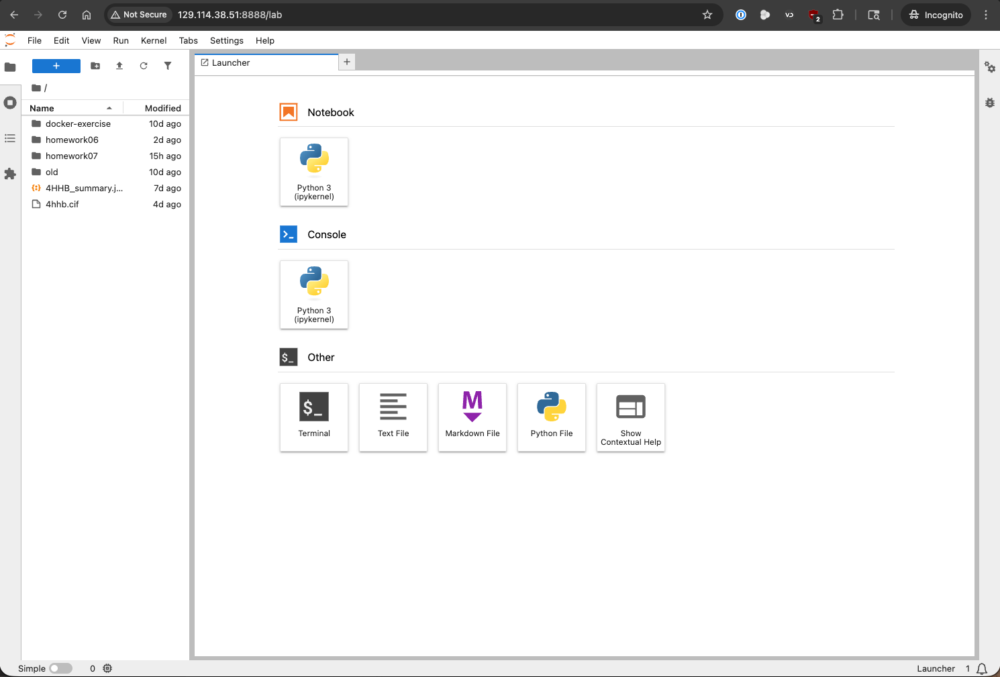

    Jupyter Lab Interface

And this is the classic notebook interface.

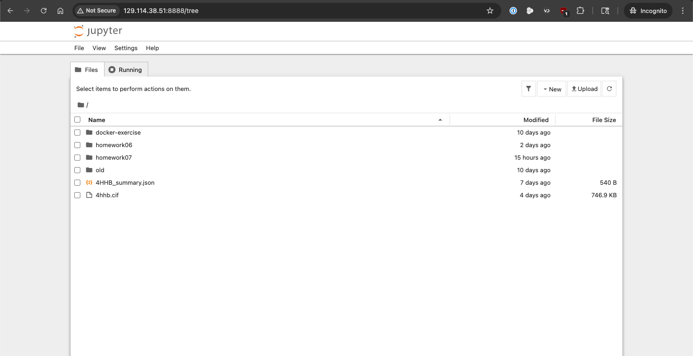

    Jupyter Notebook Interface

In fact, you can switch between the two interfaces by changing the URL. For example, if you are in the lab
interface at ``http://<your-vm-public-ip>:8888/lab``, you can switch to the classic notebook interface by
changing the URL to ``http://<your-vm-public-ip>:8888/tree``. Similarly, if you are in the classic notebook
interface, you can switch to the lab interface by changing the URL to ``http://<your-vm-public-ip>:8888/lab``.

With the interface up and running, you can create a new notebook by clicking on the "Python 3" button under the
"Notebook" section in the "Launcher" tab of JupyterLab,

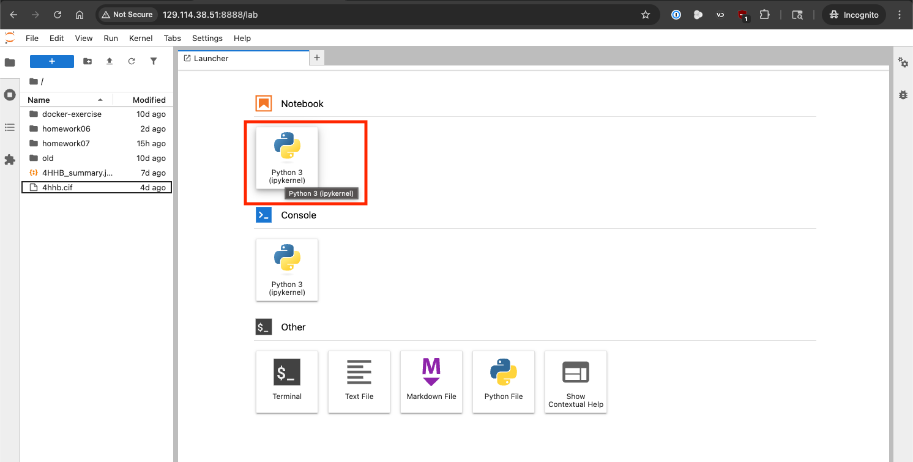

    Jupyter Lab Create New Notebook

or by clicking on "New" menu and then "Python 3" in the classic notebook interface.

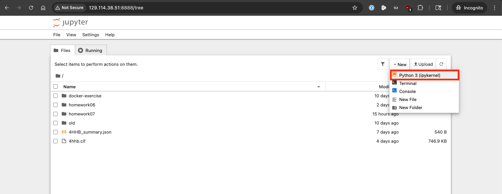

    Jupyter Notebook Create New Notebook

This will open a new notebook where you can start writing and executing code.

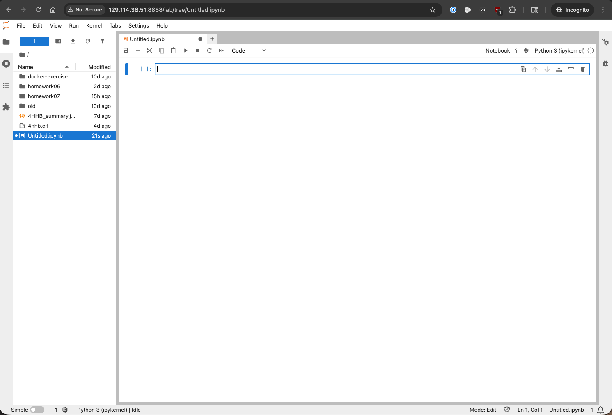

    New Jupyter Notebook in the Lab Interface

The .ipynb file
~~~~~~~~~~~~~~~

A new notebook will be created in the current directory with a ``.ipynb`` extension. You should see this file in
your file browser and the "tab" of your notebook called ``Untitled.ipynb``. This is a JSON file
that contains the code, output, and metadata of the notebook. You can open this file in a text editor to see
its contents, but it is not meant to be edited directly. Instead, you should use the Jupyter Notebook interface
to edit and run the notebook. Make sure to save your notebook frequently to avoid losing your work.

The Notebook Interface
~~~~~~~~~~~~~~~~~~~~~~

If you look around at the notebook interface, you'll see lots of buttons and menu options to control the notebook.
You can use these buttons and menu options to perform various actions such as saving the notebook, adding new cells,
running cells, and changing the cell type. The interface is designed to be intuitive and user-friendly,
so feel free to explore and experiment with it. If you're a fan of keyboard shortcuts, you can also use them to
navigate and control the notebook more efficiently. You can find a list of keyboard shortcuts in the "Help" menu
under "Show Keyboard Shortcuts..." (Cmd-Shift-H on Mac, Ctrl-Shift-H on Windows/Linux).

There are two important elements of the notebook interface that you should be familiar with: cells and kernels.

* **Cells** are the building blocks of a Jupyter Notebook. They can contain code, markdown, or raw text. You can add,
  delete, and rearrange cells as needed.

* **Kernels** are the computational engines that execute the code in the notebook. The Jupyter Notebook has a
  built-in kernel for Python, but there are kernels available for each supported programming language.

Cells
^^^^^

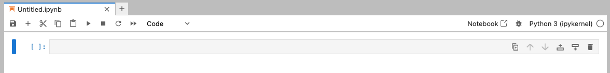

    Jupyter Notebook cell

Cells make up the body of a Jupyter Notebook. There are three types of cells:

* **Code** cells are used to write and execute code. When you run a code cell, the code is sent to the kernel
  for execution, and the output is displayed below the cell.
* **Markdown** cells are used to write formatted text using `Markdown <https://www.markdownguide.org/>`_ syntax. You
  can use markdown cells to add headings, lists, links, images, and other formatting to your notebook.
* **Raw** cells are used to write unformatted text that will not be rendered as markdown or executed as code.
  Raw cells are typically used for including plain text or code that you do not want to be executed.

Let's test out a code cell by writing a simple Python command and running it. In a new code cell, type the
following code:

.. code-block:: python3

   print("Hello, Jupyter!")

Then, run the cell by clicking the "Run" button in the toolbar or by pressing Shift-Enter. You should see the
output "Hello, Jupyter!" displayed below the cell.

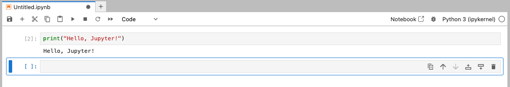

    Jupyter Notebook cell with output from code

We can put documentation in a cell by changing the cell type to "Markdown" and writing some markdown text.
For example, you can write:

.. code-block:: markdown

    # Markdown cell

    This is a Markdown cell. It can contain any type of markup like

    * list
      * indented

    or code

    ```
    foo()
    ```

When you run the markdown cell, the markdown will be rendered as formatted text.

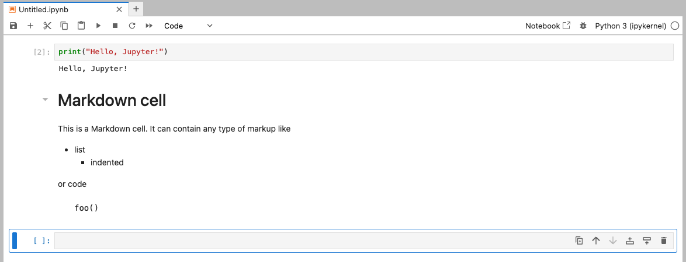

    Jupyter Notebook cell with markdown output

Kernels
^^^^^^^

The kernel is the computational engine that executes the code in the notebook. When you run a code cell,
the code is sent to the kernel for execution, and the output is sent back to the notebook interface for display.
The kernel also keeps track of the state of the notebook, including variable values and imports, so that you can
run cells in any order and still have access to the variables and functions defined in previous cells. For example,
if we import some libraries and create a function in one cell, we can use those libraries and call that function
in another cell without having to re-import or redefine them.

.. code-block:: python3

   import numpy as np

   def square(x):
       return x**2

And then in another cell:

.. code-block:: python3

   print(square(5))
   print(np.sqrt(25))

The kernel will execute the code in the second cell and return the output:

.. code-block:: text

   25
   5.0

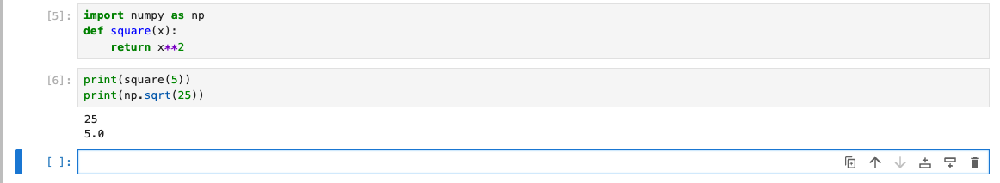

    Jupyter Notebook using libraries and functions defined in previous cells

The basic flow of the notebook interface is from top to bottom, but you can run cells in any order and the
kernel will keep track of the state of the notebook. If you ever need to reset the state of the notebook,
you can use some of the handy options in the "Kernel" menu:

* **Restart Kernel** will restart the kernel and clear all variables and imports, but it will not clear the
  code in the cells. This is useful if you want to start fresh without losing your code.
* **Restart Kernel and Clear Outputs of All Cells** will restart the kernel, clear all variables and imports, and
  clear all outputs from all cells. This is useful if you want to start fresh and have a clean notebook interface.
* **Restart Kernel and Run All Cells** will restart the kernel, clear all variables and imports, and run all cells
  in order.

Jupyter Terminals
~~~~~~~~~~~~~~~~~

Jupyter also provides a terminal interface that allows you to run shell commands directly from the Jupyter
interface. To open a terminal, click on the "Terminal" button in the "Launcher" tab of JupyterLab or
select "New" > "Terminal" in the classic notebook interface. This will open a new terminal window on the
Linux VM Jupyter is running on. This is useful for running commands that are not easily executed from a code
cell, such as installing packages or managing files.

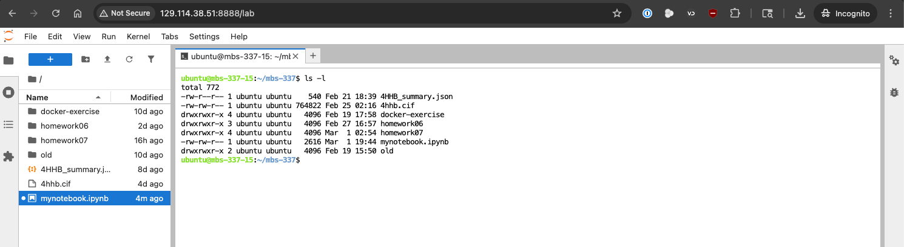

    Jupyter Terminal Interface

Sharing Notebooks
-----------------

Jupyter Notebooks can be easily shared with others. You can share the .ipynb file directly, or you can export
the notebook in different formats such as HTML, PDF, or Markdown using the "File" menu under
"Save and Export Notebook As".

.. note::

   Certain formats (e.g. PDF) may require additional dependencies to be installed on your system,
   such as ``pandoc`` for PDF export. If you encounter issues exporting to a specific format, make
   sure to check the Jupyter documentation for any additional requirements.

For example, let's export our notebook as an HTML file. You can select "File" > "Save and Export Notebook As"
> "HTML" from the menu. This will give you a local Save dialog box where you can choose the location to save and name the
HTML file.

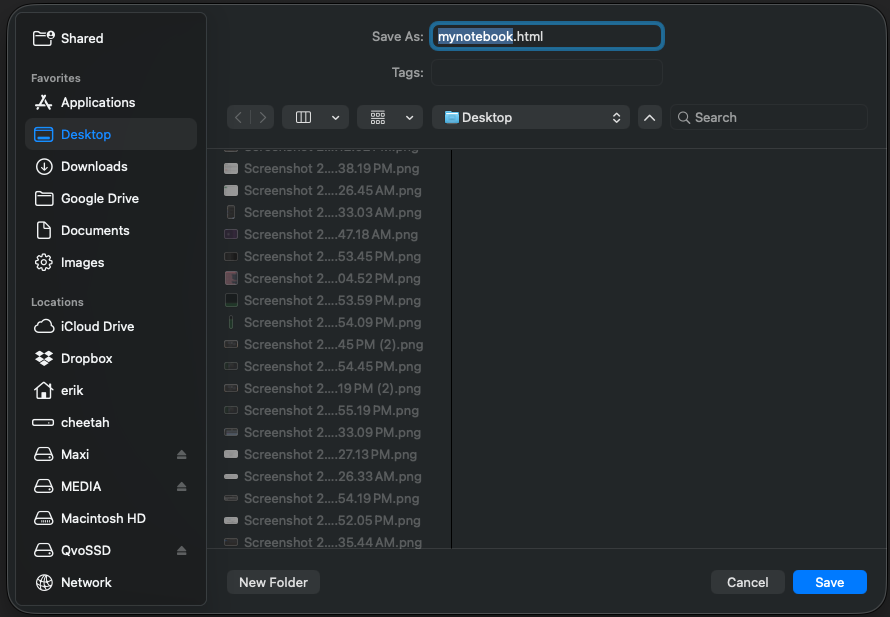

    Jupyter Lab Export Notebook as HTML

Once saved, you can open the HTML file on your local machine using a web browser, and it will display the notebook
with all the code, outputs, and markdown rendered as it appears in the Jupyter interface. This is a great way to
share your work with others who may not have Jupyter installed.

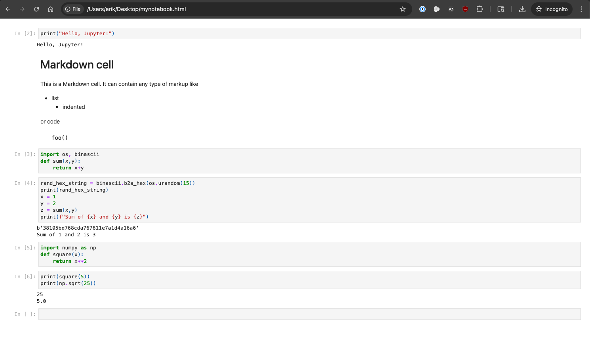

    HTML export of a Jupyter Notebook opened in a web browser

Sharing the .ipynb file directly is as simple as giving the file to someone else, but keep in mind that the
recipient will need to have Jupyter installed to view and run the notebook. Additionally, if the notebook
contains code that relies on specific libraries or data files, the recipient will need to have those
dependencies installed and the data files available to run the notebook successfully.

GitHub also provides a great way to share Jupyter Notebooks. You can create a repository on GitHub and upload
your .ipynb file(s) there. A neat feature of GitHub is that it will render the notebook directly in the browser,
allowing others to view it without needing to download the file or have Jupyter installed.

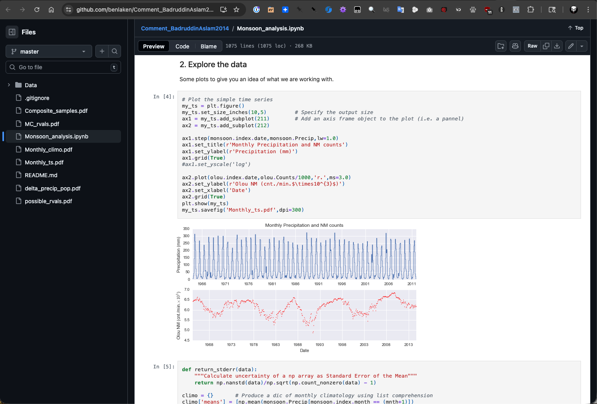

    GitHub rendering of a Jupyter Notebook. Source: `GitHub <https://github.com/benlaken/Comment_BadruddinAslam2014>`_.


Additional Resources
--------------------

* `Jupyter Notebook Documentation <https://docs.jupyter.org/en/latest/>`_
* `The Ultimate Beginner’s Guide to Jupyter Notebooks <https://medium.com/velotio-perspectives/the-ultimate-beginners-guide-to-jupyter-notebooks-6b00846ed2af>`_
* `Using Jupyter Notebooks - ML for Life Sciences @ TACC <https://life-sciences-ml-at-tacc.readthedocs.io/en/latest/section1/tap_and_jupyter.html#using-jupyter-notebooks>`_
