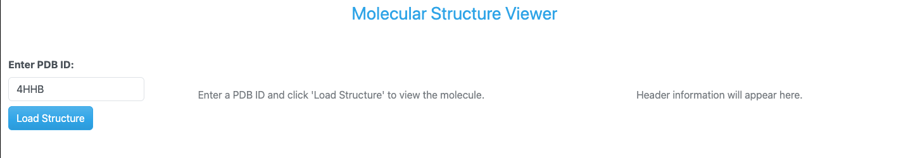
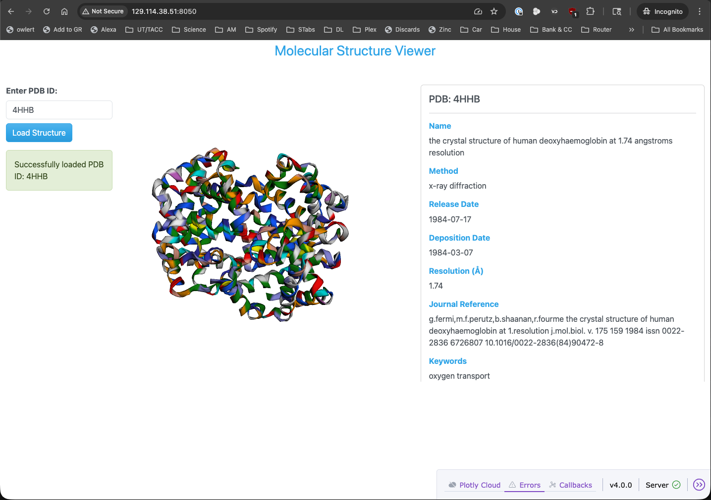

Real Dashboards: Adding a Component to Display Header Information
=================================================================

To enhance our PDB dashboard, we can add a component to display header information, such as the PDB ID,
the name of the molecule, the method, and other relevant details. The idea here is just to add another column
to our layout to the right of the molecule viewer that will display this information in a nice format.

    PDB dashboard layout with an additional column for header information.

Updated Imports
---------------

To implement this feature, we will need to import some additional components from Biopython. Specifically,
we will need to import the `parse_pdb_header` function from Biopython's `Bio.PDB` module to parse the
PDB file and extract the header information. Let's update our imports in the ``app.py`` file to include
this new import.

.. code-block:: python

    from Bio.PDB import PDBList, parse_pdb_header

Updated Layout
--------------

Next, we will update our layout to include a new column for the header information. We will use a
**dbc.Col** component to create this new column, and we will give it an id of ``header-info`` so
that we can update its content with a callback function later. Since we want this column to be to
the right of the molecule viewer, we will place it after the column that contains the molecule viewer
in our layout and resize the columns accordingly (give the molecule viewer column and the header info
column a width 0f 5). Let's update our layout code in the ``app.py`` file to include this new column.

.. code-block:: python
    :emphasize-lines: 26, 28-35

    # App layout
    app.layout = dbc.Container([
        dbc.Row([
            html.Div("Molecular Structure Viewer", className="text-primary text-center fs-3 mb-4")
        ]),

        dbc.Row([
            dbc.Col([
                dbc.Label("Enter PDB ID:", className="fw-bold"),
                dbc.Input(
                    id='pdb-input',
                    type='text',
                    placeholder='e.g., 4HHB, 3AID, 2MRU, 4K8X',
                    value='4HHB',
                    className="mb-2"
                ),
                dbc.Button("Load Structure", id='load-button', color="primary"),
                html.Div(id='status-message', className="mt-3")
            ], width=2),

            dbc.Col([
                html.Div(id='molecule-viewer', children=[
                    html.Div("Enter a PDB ID and click 'Load Structure' to view the molecule.",
                            className="text-center text-muted mt-5")
                ])
            ], width=5),

            dbc.Col([
                html.Div(id='header-info', children=[
                    html.Div("Header information will appear here.",
                            className="text-center text-muted mt-5")
                ], style={'maxHeight': '600px', 'overflowY': 'auto'})
            ], width=5)
        ], className="mt-4"),
    ], fluid=True)

Updated Callback Function
-------------------------

Since we want to update the content of the new header information column when the user loads a new PDB structure,
we will need to update our callback function to include an additional output for the header information.

.. code-block:: python
    :emphasize-lines: 3

    @callback(
        [Output('molecule-viewer', 'children'),
        Output('header-info', 'children'),
        Output('status-message', 'children')],
        Input('load-button', 'n_clicks'),
        State('pdb-input', 'value'),
        prevent_initial_call=True
    )

As we saw in the layout section, we will target the id `header-info` to update the content of the header
information column and will replace the existing content of `children`.

Now we need to update the logic of our callback function, ``load_molecule``, to parse the header information
from the PDB file and create a nice format to display it in the header information column. We will add the
following code to our callback function to parse the header information from the PDB file:

.. code-block:: python

    # Parse PDB header information
    header_info = parse_pdb_header(pdb_file)

Then, we will call a helper function called `create_header_display` that will take the parsed header information
and create a nice format using **dbc.Card** and **dbc.CardBody** to display it in the header information column.

.. code-block:: python

    header_display = create_header_display(header_info, pdb_id)

And, the helper function `create_header_display` will look something like this:

.. code-block:: python

    def create_header_display(header_info, pdb_id):
        """Create a formatted display of PDB header information"""
        header_sections = []

        # Title
        if 'name' in header_info:
            header_sections.append(
                html.Div([
                    html.H6("Name", className="fw-bold mt-3 mb-2"),
                    html.P(header_info['name'], className="text-sm")
                ])
            )

        # Structure Classification
        if 'structure_method' in header_info:
            header_sections.append(
                html.Div([
                    html.H6("Method", className="fw-bold mt-3 mb-2"),
                    html.P(header_info['structure_method'], className="text-sm")
                ])
            )

        # Release Date
        if 'release_date' in header_info:
            header_sections.append(
                html.Div([
                    html.H6("Release Date", className="fw-bold mt-3 mb-2"),
                    html.P(header_info['release_date'], className="text-sm")
                ])
            )

        # Deposition Date
        if 'deposition_date' in header_info:
            header_sections.append(
                html.Div([
                    html.H6("Deposition Date", className="fw-bold mt-3 mb-2"),
                    html.P(header_info['deposition_date'], className="text-sm")
                ])
            )

        # Resolution
        if 'resolution' in header_info and header_info['resolution'] is not None:
            header_sections.append(
                html.Div([
                    html.H6("Resolution (Å)", className="fw-bold mt-3 mb-2"),
                    html.P(f"{header_info['resolution']:.2f}", className="text-sm")
                ])
            )

        if 'journal_reference' in header_info and header_info['journal_reference']:
            journal_text = header_info['journal_reference']
            header_sections.append(
                html.Div([
                    html.H6("Journal Reference", className="fw-bold mt-3 mb-2"),
                    html.P(journal_text, className="text-sm", style={'wordWrap': 'break-word'})
                ])
            )

        # Keywords
        if 'keywords' in header_info and header_info['keywords']:
            keywords_text = header_info['keywords']
            header_sections.append(
                html.Div([
                    html.H6("Keywords", className="fw-bold mt-3 mb-2"),
                    html.P(keywords_text, className="text-sm", style={'wordWrap': 'break-word'})
                ])
            )

        if header_sections:
            return dbc.Card([
                dbc.CardBody([
                    html.H5(f"PDB: {pdb_id.upper()}", className="card-title"),
                    html.Hr(),
                    *header_sections
                ])
            ], style={'height': '100%'})
        else:
            return html.Div("No header information available.", className="text-center text-muted mt-5")

Of course, now that we have added a third output to our callback function, we will also need to update the
any return statements in the callback function to include the new output for the header information.
For example, if we don't receive a valid PDB ID, we will return:

.. code-block:: python

    if not pdb_id:
        return (
            html.Div("Please enter a valid PDB ID.", className="text-center text-muted mt-5"),
            html.Div("Header information will appear here.", className="text-center text-muted mt-5"),
            dbc.Alert("Please enter a PDB ID.", color="warning")
        )

Or, if there is an error loading the molecule, we will return:

.. code-block:: python

    except Exception as e:
        error_msg = dbc.Alert(
            f"Error loading PDB {pdb_id.upper()}: {str(e)}",
            color="danger"
        )
        empty_viewer = html.Div(
            "Failed to load molecule. Please check the PDB ID and try again.",
            className="text-center text-muted mt-5"
        )
        empty_header = html.Div(
            "Header information will appear here.",
            className="text-center text-muted mt-5"
        )
        return empty_viewer, empty_header, error_msg

And, finally, if the molecule loads successfully, we will return:

.. code-block:: python

    return viewer, header_display, status

Running the Updated App
-----------------------

Finally, putting all of these updates together, our updated ``app.py`` file should look like this:

.. dropdown:: Code
    :icon: code
    :color: secondary

    .. code-block:: python
        :linenos:
        :emphasize-lines: 5, 39-48, 53, 64, 91-92, 97-98, 105, 116-120, 134-211

        import os

        import dash_bio as dashbio
        import dash_bootstrap_components as dbc
        from Bio.PDB import PDBList, parse_pdb_header
        from dash import Dash, Input, Output, State, callback, html
        from dash_bio.utils import PdbParser as DashPdbParser
        from dash_bio.utils import create_mol3d_style

        # Initialize the Dash app
        external_stylesheets = [dbc.themes.CERULEAN]
        app = Dash(__name__, external_stylesheets=external_stylesheets)

        # App layout
        app.layout = dbc.Container([
            dbc.Row([
                html.Div("Molecular Structure Viewer", className="text-primary text-center fs-3 mb-4")
            ]),

            dbc.Row([
                dbc.Col([
                    dbc.Label("Enter PDB ID:", className="fw-bold"),
                    dbc.Input(
                        id='pdb-input',
                        type='text',
                        placeholder='e.g., 4HHB, 3AID, 2MRU, 4K8X',
                        value='4HHB',
                        className="mb-2"
                    ),
                    dbc.Button("Load Structure", id='load-button', color="primary"),
                    html.Div(id='status-message', className="mt-3")
                ], width=2),

                dbc.Col([
                    html.Div(id='molecule-viewer', children=[
                        html.Div("Enter a PDB ID and click 'Load Structure' to view the molecule.",
                                className="text-center text-muted mt-5")
                    ])
                ], width=5),

                dbc.Col([
                    html.Div(id='header-info', children=[
                        html.Div("Header information will appear here.",
                                className="text-center text-muted mt-5")
                    ], style={'maxHeight': '600px', 'overflowY': 'auto'})
                ], width=5)
            ], className="mt-4"),
        ], fluid=True)

        # Callback to load and display molecule
        @callback(
            [Output('molecule-viewer', 'children'),
            Output('header-info', 'children'),
            Output('status-message', 'children')],
            Input('load-button', 'n_clicks'),
            State('pdb-input', 'value'),
            prevent_initial_call=True
        )
        def load_molecule(load_clicks, pdb_id):

            if not pdb_id:
                return (
                    html.Div("Please enter a valid PDB ID.", className="text-center text-muted mt-5"),
                    html.Div("Header information will appear here.", className="text-center text-muted mt-5"),
                    dbc.Alert("Please enter a PDB ID.", color="warning")
                )

            try:
                # Clean up PDB ID (remove whitespace, convert to lowercase)
                pdb_id = pdb_id.strip().lower()

                # Create PDB directory if it doesn't exist
                pdb_dir = './pdb_files'
                os.makedirs(pdb_dir, exist_ok=True)

                # Download PDB file using BioPython
                pdbl = PDBList()
                pdb_file = pdbl.retrieve_pdb_file(pdb_id, pdir=pdb_dir, file_format='pdb')

                # Read PDB file content for visualization
                dash_parser = DashPdbParser(pdb_file)
                pdb_data = dash_parser.mol3d_data()  # Get data in format suitable for Molecule3dViewer
                # create styles for visualization needed by Molecule3dViewer
                # atoms is a list of dictionaries obtained from parsing the PDB file with DashPdbParser
                # visualization_type can be 'cartoon', 'stick', 'sphere'
                # color_element can be 'residue', 'chain', 'element', 'partialCharge'
                styles = create_mol3d_style(
                    pdb_data['atoms'], visualization_type='cartoon', color_element='residue'
                )

                # Parse PDB header information
                header_info = parse_pdb_header(pdb_file)

                # Create Molecule3dViewer component
                viewer = create_molecule_viewer(pdb_data, styles)

                # Create header display
                header_display = create_header_display(header_info, pdb_id)

                status = dbc.Alert(
                    f"Successfully loaded PDB ID: {pdb_id.upper()}",
                    color="success"
                )

                return viewer, header_display, status

            except Exception as e:
                error_msg = dbc.Alert(
                    f"Error loading PDB {pdb_id.upper()}: {str(e)}",
                    color="danger"
                )
                empty_viewer = html.Div(
                    "Failed to load molecule. Please check the PDB ID and try again.",
                    className="text-center text-muted mt-5"
                )
                empty_header = html.Div(
                    "Header information will appear here.",
                    className="text-center text-muted mt-5"
                )
                return empty_viewer, empty_header, error_msg

        def create_molecule_viewer(pdb_data, styles):
            """Create a Molecule3dViewer from PDB data"""
            return dashbio.Molecule3dViewer(
                id='molecule-3d',
                modelData=pdb_data,
                styles=styles,
                selectionType='atom',
                backgroundColor='#F0F0F0',
                height=600,
                width='100%'
            )

        def create_header_display(header_info, pdb_id):
            """Create a formatted display of PDB header information"""
            header_sections = []

            # Title
            if 'name' in header_info:
                header_sections.append(
                    html.Div([
                        html.H6("Name", className="fw-bold mt-3 mb-2"),
                        html.P(header_info['name'], className="text-sm")
                    ])
                )

            # Structure Classification
            if 'structure_method' in header_info:
                header_sections.append(
                    html.Div([
                        html.H6("Method", className="fw-bold mt-3 mb-2"),
                        html.P(header_info['structure_method'], className="text-sm")
                    ])
                )

            # Release Date
            if 'release_date' in header_info:
                header_sections.append(
                    html.Div([
                        html.H6("Release Date", className="fw-bold mt-3 mb-2"),
                        html.P(header_info['release_date'], className="text-sm")
                    ])
                )

            # Deposition Date
            if 'deposition_date' in header_info:
                header_sections.append(
                    html.Div([
                        html.H6("Deposition Date", className="fw-bold mt-3 mb-2"),
                        html.P(header_info['deposition_date'], className="text-sm")
                    ])
                )

            # Resolution
            if 'resolution' in header_info and header_info['resolution'] is not None:
                header_sections.append(
                    html.Div([
                        html.H6("Resolution (Å)", className="fw-bold mt-3 mb-2"),
                        html.P(f"{header_info['resolution']:.2f}", className="text-sm")
                    ])
                )

            if 'journal_reference' in header_info and header_info['journal_reference']:
                journal_text = header_info['journal_reference']
                header_sections.append(
                    html.Div([
                        html.H6("Journal Reference", className="fw-bold mt-3 mb-2"),
                        html.P(journal_text, className="text-sm", style={'wordWrap': 'break-word'})
                    ])
                )

            # Keywords
            if 'keywords' in header_info and header_info['keywords']:
                keywords_text = header_info['keywords']
                header_sections.append(
                    html.Div([
                        html.H6("Keywords", className="fw-bold mt-3 mb-2"),
                        html.P(keywords_text, className="text-sm", style={'wordWrap': 'break-word'})
                    ])
                )

            if header_sections:
                return dbc.Card([
                    dbc.CardBody([
                        html.H5(f"PDB: {pdb_id.upper()}", className="card-title"),
                        html.Hr(),
                        *header_sections
                    ])
                ], style={'height': '100%'})
            else:
                return html.Div("No header information available.", className="text-center text-muted mt-5")

        # Run the app
        if __name__ == "__main__":
            app.run(host='0.0.0.0', port=8050, debug=True)

To run the updated app, simply execute the following command in your VS Code terminal (if it's not already
running):

.. code-block:: console

    (.venv) [mbs337-vm]$ python app.py
    Dash is running on http://0.0.0.0:8050/

    * Serving Flask app 'app'
    * Debug mode: on

Now we can navigate to ``http://<IP_ADDRESS>:8050/`` in our web browser to see the updated PDB dashboard
with the new header information column.

    PDB dashboard application with added header information running in a web browser.

Additional Resources
--------------------

* `Dash Documentation <https://dash.plotly.com/>`_
* `Plotly Documentation <https://plotly.com/python/>`_
* `Dash Bootstrap Components Documentation <https://www.dash-bootstrap-components.com/>`_
* `Dash Bio Documentation <https://dash.plotly.com/dash-bio>`_
* `Biopython Documentation <https://biopython.org/wiki/Documentation>`_
* `Bootstrap Documentation <https://getbootstrap.com/docs/5.3/getting-started/introduction/>`_
* `Bootstrap Cheat Sheet <https://bootstrap-cheatsheet.themeselection.com/>`_
