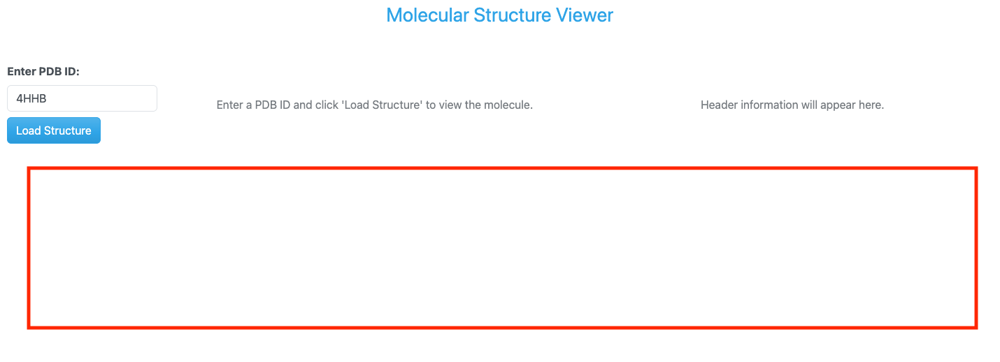
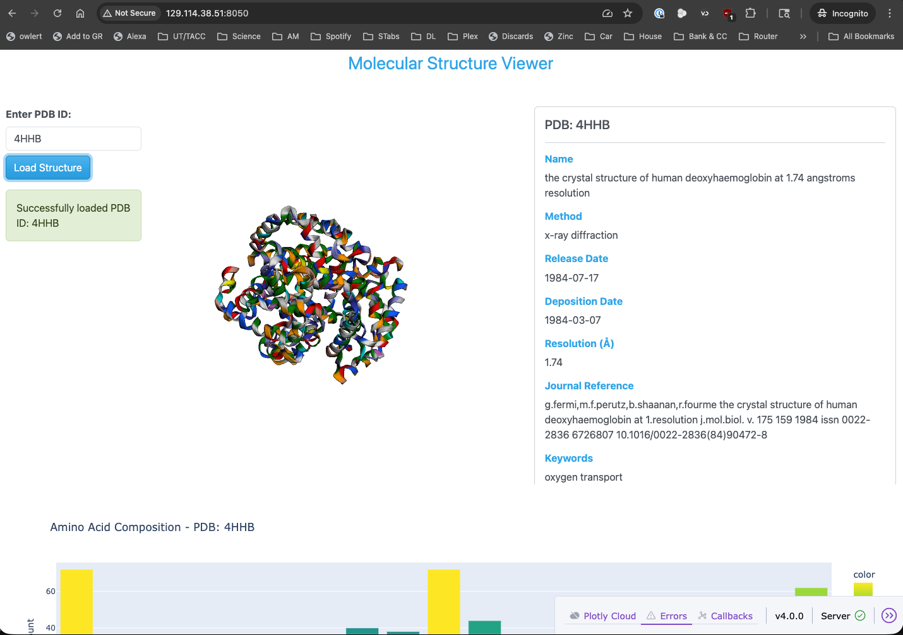

Real Dashboards: Adding a Component to Display a Histogram of Amino Acid Frequencies
====================================================================================

Let's add one more feature to our PDB dashboard to make it even more informative. We will add a component
that displays a histogram of the amino acid frequencies in the loaded PDB structure. This will give users
a quick visual overview of the composition of the molecule they are viewing. To do this, we will use
Dash's `dcc.Graph` component and have it contain a histogram created by Plotly Express based on the amino acid
frequencies calculated from the PDB file. This will lead us to adding another row to our layout below
the molecule viewer and header information columns.

    PDB dashboard layout with added row for amino acid frequency histogram.

Updated Imports
---------------

To implement this feature, we will need to import some additional components from Dash, BioPython, and
Plotly Express. Specifically, we will need to import the `dcc` module from Dash to use the `Graph` component,
the `PDBParser` class from Biopython to parse the PDB file, and the `plotly.express` module to create the histogram.
Let's update our imports in the ``app.py`` file.

.. code-block:: python

    from collections import Counter

    import plotly.express as px
    from Bio.PDB import PDBList, PDBParser, parse_pdb_header
    from dash import Dash, Input, Output, State, callback, dcc, html

Updated Layout
--------------

Next, we will update our layout to include a new row for the amino acid frequency histogram. We will use a
**dbc.Row** component to create this new row which will contain a **dbc.Col** component that will hold the
**dcc.Graph** component for the histogram. This new column will span the full width of the layout (width=12).

.. code-block:: python

    dbc.Row([
        dbc.Col([
            dcc.Graph(id='amino-acid-histogram', figure={}, style={'display': 'none'})
        ], width=12)
    ], className="mt-4"),

Updated Callback Function
-------------------------

Again, since we want to update the content of the new histogram component when the user loads a new PDB
structure, we will need to update our callback function to include an additional two outputs for the
histogram figure.

.. code-block:: python
    :emphasize-lines: 4-5

    @callback(
        [Output('molecule-viewer', 'children'),
        Output('header-info', 'children'),
        Output('amino-acid-histogram', 'figure'),
        Output('amino-acid-histogram', 'style'),
        Output('status-message', 'children')],
        Input('load-button', 'n_clicks'),
        State('pdb-input', 'value'),
        prevent_initial_call=True
    )

As you saw in the layout section, we will target the id `amino-acid-histogram` to update both the
content and style of the histogram component.

Once again we need to update the logic of our callback function, ``load_molecule``, to calculate the
amino acid frequencies from the PDB file and create a histogram figure using Plotly Express. We will
add the following code to our callback function to calculate the amino acid frequencies:

.. code-block:: python

    # Parse PDB structure for amino acid analysis
    bio_parser = PDBParser(QUIET=True)
    structure = bio_parser.get_structure(pdb_id, pdb_file)
    amino_acid_counts = count_amino_acids(structure)

As you can see, we will use Biopython's `PDBParser` to parse the PDB file and then to get the structure.
Then we will call a helper function called `count_amino_acids` that will take the parsed structure and
return a `collections.Counter` object (dictionary) with the counts of each amino acid in the structure. The
`count_amino_acids` function will look something like this:

.. code-block:: python

    def count_amino_acids(structure):
        """Count amino acid frequencies in a PDB structure"""
        # Standard amino acids (3-letter codes)
        standard_aa = {
            'ALA', 'CYS', 'ASP', 'GLU', 'PHE', 'GLY', 'HIS', 'ILE', 'LYS', 'LEU',
            'MET', 'ASN', 'PRO', 'GLN', 'ARG', 'SER', 'THR', 'VAL', 'TRP', 'TYR'
        }

        amino_acids = []

        # Iterate through all residues in all chains
        for model in structure:
            for chain in model:
                for residue in chain:
                    # Get residue name and check if it's a standard amino acid
                    res_name = residue.get_resname().strip()
                    if res_name in standard_aa:
                        amino_acids.append(res_name)

        # Count frequencies
        return Counter(amino_acids)

Then, we will create a histogram figure using Plotly Express based on the amino acid counts. We
have created a helper function called `create_amino_acid_histogram` that takes the amino acid counts
and the PDB ID as input and returns a Plotly figure object.

.. code-block:: python

    # Create amino acid histogram
    histogram = create_amino_acid_histogram(amino_acid_counts, pdb_id)

The `create_amino_acid_histogram` function will look something like this:

.. code-block:: python

    def create_amino_acid_histogram(amino_acid_counts, pdb_id):
        """Create a Plotly histogram of amino acid frequencies"""
        if not amino_acid_counts:
            return {}

        # Convert to lists for plotting
        amino_acids = list(amino_acid_counts.keys())
        counts = list(amino_acid_counts.values())

        # Create bar chart (histogram)
        fig = px.bar(
            x=amino_acids,
            y=counts,
            labels={'x': 'Amino Acid', 'y': 'Frequency'},
            title=f'Amino Acid Composition - PDB: {pdb_id.upper()}',
            color=counts,
            color_continuous_scale='Viridis'
        )

        # Update layout
        fig.update_layout(
            xaxis_title='Amino Acid (3-letter code)',
            yaxis_title='Count',
            showlegend=False,
            height=400,
            hovermode='x'
        )

        # Sort by amino acid name for consistent display
        fig.update_xaxes(categoryorder='category ascending')

        return fig

Once again, since we have added two new outputs to our callback function, we will also need to update the
return statements in the callback function to include the new outputs for the histogram figure and style.
For example, if we don't receive a valid PDB ID, we will return:

.. code-block:: python
    :emphasize-lines: 5-6

    if not pdb_id:
        return (
            html.Div("Please enter a valid PDB ID.", className="text-center text-muted mt-5"),
            html.Div("Header information will appear here.", className="text-center text-muted mt-5"),
            {},
            {'display': 'none'},
            dbc.Alert("Please enter a PDB ID.", color="warning")
        )

Or, if there is an error loading the molecule, we will return:

.. code-block:: python
    :emphasize-lines: 14

    except Exception as e:
        error_msg = dbc.Alert(
            f"Error loading PDB {pdb_id.upper()}: {str(e)}",
            color="danger"
        )
        empty_viewer = html.Div(
            "Failed to load molecule. Please check the PDB ID and try again.",
            className="text-center text-muted mt-5"
        )
        empty_header = html.Div(
            "Header information will appear here.",
            className="text-center text-muted mt-5"
        )
        return empty_viewer, empty_header, {}, {'display': 'none'}, error_msg

And, finally, if the molecule loads successfully, we will return:

.. code-block:: python

    if not histogram:
            return viewer, header_display, histogram, {'display': 'none'}, status
        else:
            return viewer, header_display, histogram, {'display': 'block'}, status

Running the Updated App
-----------------------

Once again, putting all of these updates together, our updated ``app.py`` file should look like this:

.. code-block:: python
    :linenos:
    :emphasize-lines: 2, 6-8, 50-55, 62-63, 75-76, 103-106, 117-118, 125-128, 143, 236-256, 258-289

    import os
    from collections import Counter

    import dash_bio as dashbio
    import dash_bootstrap_components as dbc
    import plotly.express as px
    from Bio.PDB import PDBList, PDBParser, parse_pdb_header
    from dash import Dash, Input, Output, State, callback, dcc, html
    from dash_bio.utils import PdbParser as DashPdbParser
    from dash_bio.utils import create_mol3d_style

    # Initialize the Dash app
    external_stylesheets = [dbc.themes.CERULEAN]
    app = Dash(__name__, external_stylesheets=external_stylesheets)

    # App layout
    app.layout = dbc.Container([
        dbc.Row([
            html.Div("Molecular Structure Viewer", className="text-primary text-center fs-3 mb-4")
        ]),

        dbc.Row([
            dbc.Col([
                dbc.Label("Enter PDB ID:", className="fw-bold"),
                dbc.Input(
                    id='pdb-input',
                    type='text',
                    placeholder='e.g., 4HHB, 3AID, 2MRU, 4K8X',
                    value='4HHB',
                    className="mb-2"
                ),
                dbc.Button("Load Structure", id='load-button', color="primary"),
                html.Div(id='status-message', className="mt-3")
            ], width=2),

            dbc.Col([
                html.Div(id='molecule-viewer', children=[
                    html.Div("Enter a PDB ID and click 'Load Structure' to view the molecule.",
                            className="text-center text-muted mt-5")
                ])
            ], width=5),

            dbc.Col([
                html.Div(id='header-info', children=[
                    html.Div("Header information will appear here.",
                            className="text-center text-muted mt-5")
                ], style={'maxHeight': '600px', 'overflowY': 'auto'})
            ], width=5)
        ], className="mt-4"),

        dbc.Row([
            dbc.Col([
                dcc.Graph(id='amino-acid-histogram', figure={}, style={'display': 'none'})
            ], width=12)
        ], className="mt-4"),
    ], fluid=True)

    # Callback to load and display molecule
    @callback(
        [Output('molecule-viewer', 'children'),
        Output('header-info', 'children'),
        Output('amino-acid-histogram', 'figure'),
        Output('amino-acid-histogram', 'style'),
        Output('status-message', 'children')],
        Input('load-button', 'n_clicks'),
        State('pdb-input', 'value'),
        prevent_initial_call=True
    )
    def load_molecule(load_clicks, pdb_id):

        if not pdb_id:
            return (
                html.Div("Please enter a valid PDB ID.", className="text-center text-muted mt-5"),
                html.Div("Header information will appear here.", className="text-center text-muted mt-5"),
                {},
                {'display': 'none'},
                dbc.Alert("Please enter a PDB ID.", color="warning")
            )

        try:
            # Clean up PDB ID (remove whitespace, convert to lowercase)
            pdb_id = pdb_id.strip().lower()

            # Create PDB directory if it doesn't exist
            pdb_dir = './pdb_files'
            os.makedirs(pdb_dir, exist_ok=True)

            # Download PDB file using BioPython
            pdbl = PDBList()
            pdb_file = pdbl.retrieve_pdb_file(pdb_id, pdir=pdb_dir, file_format='pdb')

            # Read PDB file content for visualization
            dash_parser = DashPdbParser(pdb_file)
            pdb_data = dash_parser.mol3d_data()  # Get data in format suitable for Molecule3dViewer
            # create styles for visualization needed by Molecule3dViewer
            # atoms is a list of dictionaries obtained from parsing the PDB file with DashPdbParser
            # visualization_type can be 'cartoon', 'stick', 'sphere'
            # color_element can be 'residue', 'chain', 'element', 'partialCharge'
            styles = create_mol3d_style(
                pdb_data['atoms'], visualization_type='cartoon', color_element='residue'
            )

            # Parse PDB structure for amino acid analysis
            bio_parser = PDBParser(QUIET=True)
            structure = bio_parser.get_structure(pdb_id, pdb_file)
            amino_acid_counts = count_amino_acids(structure)

            # Parse PDB header information
            header_info = parse_pdb_header(pdb_file)

            # Create Molecule3dViewer component
            viewer = create_molecule_viewer(pdb_data, styles)

            # Create header display
            header_display = create_header_display(header_info, pdb_id)

            # Create amino acid histogram
            histogram = create_amino_acid_histogram(amino_acid_counts, pdb_id)

            status = dbc.Alert(
                f"Successfully loaded PDB ID: {pdb_id.upper()}",
                color="success"
            )

            if not histogram:
                return viewer, header_display, histogram, {'display': 'none'}, status
            else:
                return viewer, header_display, histogram, {'display': 'block'}, status

        except Exception as e:
            error_msg = dbc.Alert(
                f"Error loading PDB {pdb_id.upper()}: {str(e)}",
                color="danger"
            )
            empty_viewer = html.Div(
                "Failed to load molecule. Please check the PDB ID and try again.",
                className="text-center text-muted mt-5"
            )
            empty_header = html.Div(
                "Header information will appear here.",
                className="text-center text-muted mt-5"
            )
            return empty_viewer, empty_header, {}, {'display': 'none'}, error_msg

    def create_molecule_viewer(pdb_data, styles):
        """Create a Molecule3dViewer from PDB data"""
        return dashbio.Molecule3dViewer(
            id='molecule-3d',
            modelData=pdb_data,
            styles=styles,
            selectionType='atom',
            backgroundColor='#F0F0F0',
            height=600,
            width='100%'
        )

    def create_header_display(header_info, pdb_id):
        """Create a formatted display of PDB header information"""
        header_sections = []

        # Title
        if 'name' in header_info:
            header_sections.append(
                html.Div([
                    html.H6("Name", className="fw-bold mt-3 mb-2"),
                    html.P(header_info['name'], className="text-sm")
                ])
            )

        # Structure Classification
        if 'structure_method' in header_info:
            header_sections.append(
                html.Div([
                    html.H6("Method", className="fw-bold mt-3 mb-2"),
                    html.P(header_info['structure_method'], className="text-sm")
                ])
            )

        # Release Date
        if 'release_date' in header_info:
            header_sections.append(
                html.Div([
                    html.H6("Release Date", className="fw-bold mt-3 mb-2"),
                    html.P(header_info['release_date'], className="text-sm")
                ])
            )

        # Deposition Date
        if 'deposition_date' in header_info:
            header_sections.append(
                html.Div([
                    html.H6("Deposition Date", className="fw-bold mt-3 mb-2"),
                    html.P(header_info['deposition_date'], className="text-sm")
                ])
            )

        # Resolution
        if 'resolution' in header_info and header_info['resolution'] is not None:
            header_sections.append(
                html.Div([
                    html.H6("Resolution (Å)", className="fw-bold mt-3 mb-2"),
                    html.P(f"{header_info['resolution']:.2f}", className="text-sm")
                ])
            )

        if 'journal_reference' in header_info and header_info['journal_reference']:
            journal_text = header_info['journal_reference']
            header_sections.append(
                html.Div([
                    html.H6("Journal Reference", className="fw-bold mt-3 mb-2"),
                    html.P(journal_text, className="text-sm", style={'wordWrap': 'break-word'})
                ])
            )

        # Keywords
        if 'keywords' in header_info and header_info['keywords']:
            keywords_text = header_info['keywords']
            header_sections.append(
                html.Div([
                    html.H6("Keywords", className="fw-bold mt-3 mb-2"),
                    html.P(keywords_text, className="text-sm", style={'wordWrap': 'break-word'})
                ])
            )

        if header_sections:
            return dbc.Card([
                dbc.CardBody([
                    html.H5(f"PDB: {pdb_id.upper()}", className="card-title"),
                    html.Hr(),
                    *header_sections
                ])
            ], style={'height': '100%'})
        else:
            return html.Div("No header information available.", className="text-center text-muted mt-5")

    def count_amino_acids(structure):
        """Count amino acid frequencies in a PDB structure"""
        # Standard amino acids (3-letter codes)
        standard_aa = {
            'ALA', 'CYS', 'ASP', 'GLU', 'PHE', 'GLY', 'HIS', 'ILE', 'LYS', 'LEU',
            'MET', 'ASN', 'PRO', 'GLN', 'ARG', 'SER', 'THR', 'VAL', 'TRP', 'TYR'
        }

        amino_acids = []

        # Iterate through all residues in all chains
        for model in structure:
            for chain in model:
                for residue in chain:
                    # Get residue name and check if it's a standard amino acid
                    res_name = residue.get_resname().strip()
                    if res_name in standard_aa:
                        amino_acids.append(res_name)

        # Count frequencies
        return Counter(amino_acids)

    def create_amino_acid_histogram(amino_acid_counts, pdb_id):
        """Create a Plotly histogram of amino acid frequencies"""
        if not amino_acid_counts:
            return {}

        # Convert to lists for plotting
        amino_acids = list(amino_acid_counts.keys())
        counts = list(amino_acid_counts.values())

        # Create bar chart (histogram)
        fig = px.bar(
            x=amino_acids,
            y=counts,
            labels={'x': 'Amino Acid', 'y': 'Frequency'},
            title=f'Amino Acid Composition - PDB: {pdb_id.upper()}',
            color=counts,
            color_continuous_scale='Viridis'
        )

        # Update layout
        fig.update_layout(
            xaxis_title='Amino Acid (3-letter code)',
            yaxis_title='Count',
            showlegend=False,
            height=400,
            hovermode='x'
        )

        # Sort by amino acid name for consistent display
        fig.update_xaxes(categoryorder='category ascending')

        return fig

    # Run the app
    if __name__ == "__main__":
        app.run(host='0.0.0.0', port=8050, debug=True)

Again, to run the updated app, simply execute the following command in your VS Code terminal
(if it's not already running):

.. code-block:: console

    (.venv) [mbs337-vm]$ python app.py
    Dash is running on http://0.0.0.0:8050/

    * Serving Flask app 'app'
    * Debug mode: on

Now we can navigate to ``http://<IP_ADDRESS>:8050/`` in our web browser to see the updated PDB dashboard
with the new amino acid frequency histogram.

    PDB dashboard application with added amino acid frequency histogram running in a web browser.

Additional Resources
--------------------

* `Dash Documentation <https://dash.plotly.com/>`_
* `Plotly Documentation <https://plotly.com/python/>`_
* `Dash Bootstrap Components Documentation <https://www.dash-bootstrap-components.com/>`_
* `Dash Bio Documentation <https://dash.plotly.com/dash-bio>`_
* `Biopython Documentation <https://biopython.org/wiki/Documentation>`_
* `Bootstrap Documentation <https://getbootstrap.com/docs/5.3/getting-started/introduction/>`_
* `Bootstrap Cheat Sheet <https://bootstrap-cheatsheet.themeselection.com/>`_
