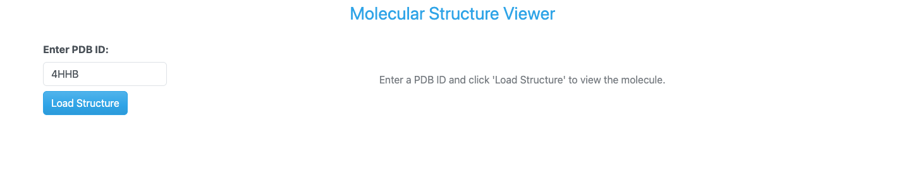
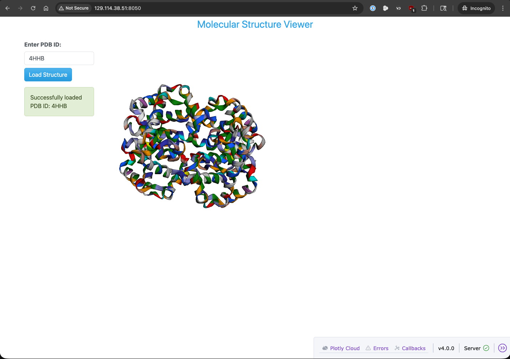

Building Real Dashboards with Plotly Dash
=========================================

Now that we have a good understanding of how Dash works and how to create visualizations with Plotly,
we can start building real dashboards using Plotly Dash. In this section, we will go through the process
of building a dashboard that interfaces with RCS PDB to grab a pdb file for the chosen ID and display
information from it including a 3D molecular view, header information, and a visualization showing the amino
acid distribution. We will go through this process step by step, from setting up the environment to deploying
the dashboard. By the end of this section, you should be able to:

- Create a Dash application that interfaces with an external API (`RCS PDB <https://www.rcsb.org/>`_).
- Display a 3D molecular viewer using a dash-bio component, **Molecule3dViewer**.
- Extract and display header information from PDB files using Biopython's **Bio.PDB** module.
- Visualize amino acid distribution using a histogram with Plotly.
- Deploy the dashboard in production (with `gunicorn <https://gunicorn.org/>`_) in a Docker container using Docker Compose.

Setting up the Environment
--------------------------

Before we start building our dashboard, we need to set up our environment. To get started, we will create
a new directory called ``pdb-dashboard`` in our mbs-337 directory on the Linux VM.

.. code-block:: console

    [mbs337-vm]$ mkdir pdb-dashboard
    [mbs337-vm]$ cd pdb-dashboard

Instead of using our ever-growing virtual environment, we will create a new one specifically for this project.
This will help us keep our dependencies organized and avoid conflicts with other projects.

.. code-block:: console

    [mbs337-vm]$ python3 -m venv .venv
    [mbs337-vm]$ source .venv/bin/activate
    [mbs337-vm]$ ls -la
    total 12
    drwxrwxr-x  3 ubuntu ubuntu 4096 Mar  9 18:05 .
    drwxrwxr-x 12 ubuntu ubuntu 4096 Mar  9 18:05 ..
    drwxrwxr-x  5 ubuntu ubuntu 4096 Mar  9 18:05 .venv

Next, we will install the necessary dependencies for our dashboard. To start, we will need Dash, Plotly,
Biopython, dash-bootstrap-components, and dash-bio. Instead of installing these packages one by one,
we will create a ``requirements.txt`` file that lists all of our dependencies. This way, we can easily install
them all at once and keep track of our dependencies.

.. code-block:: console

    (.venv) [mbs337-vm]$ touch requirements.txt
    (.venv) [mbs337-vm]$ echo "dash" >> requirements.txt
    (.venv) [mbs337-vm]$ echo "biopython" >> requirements.txt
    (.venv) [mbs337-vm]$ echo "dash-bootstrap-components" >> requirements.txt
    (.venv) [mbs337-vm]$ echo "dash-bio" >> requirements.txt
    (.venv) [mbs337-vm]$ cat requirements.txt
    dash
    biopython
    dash-bootstrap-components
    dash-bio

Now that we have our ``requirements.txt`` file, we can install all of our dependencies at once using pip.

.. code-block:: console
    :emphasize-lines: 6, 12-14, 33

    (.venv) [mbs337-vm]$ pip install -r requirements.txt
    (.venv) [mbs337-vm]$ pip list
    Package                   Version
    ------------------------- -----------
    attrs                     25.4.0
    biopython                 1.86
    blinker                   1.9.0
    certifi                   2026.2.25
    charset-normalizer        3.4.5
    click                     8.3.1
    colour                    0.1.5
    dash                      4.0.0
    dash_bio                  1.0.2
    dash-bootstrap-components 2.0.4
    Flask                     3.1.3
    GEOparse                  2.0.4
    idna                      3.11
    importlib_metadata        8.7.1
    itsdangerous              2.2.0
    Jinja2                    3.1.6
    joblib                    1.5.3
    jsonschema                4.26.0
    jsonschema-specifications 2025.9.1
    MarkupSafe                3.0.3
    narwhals                  2.17.0
    nest-asyncio              1.6.0
    numpy                     2.4.3
    packaging                 26.0
    pandas                    3.0.1
    ParmEd                    4.3.1
    periodictable             2.1.0
    pip                       24.0
    plotly                    6.6.0
    pyparsing                 3.3.2
    python-dateutil           2.9.0.post0
    referencing               0.37.0
    requests                  2.32.5
    retrying                  1.4.2
    rpds-py                   0.30.0
    scikit-learn              1.8.0
    scipy                     1.17.1
    setuptools                82.0.1
    six                       1.17.0
    threadpoolctl             3.6.0
    tqdm                      4.67.3
    typing_extensions         4.15.0
    urllib3                   2.6.3
    Werkzeug                  3.1.6
    zipp                      3.23.0

Building the Basic Dashboard
----------------------------

Now that we have our environment set up and our dependencies installed, we can start building our dashboard.
The idea for the initial version of our dashboard is to have a simple input field where the user can enter a
PDB ID, and when they submit the form by clicking a button, the dashboard will fetch the corresponding PDB file
from RCS PDB, and display a 3D molecular view of the structure.

    Basic PDB Dashboard app layout.

OK, now that we have the look of our dashboard in mind, let's start building it. We will start by creating
a new file called ``app.py`` in our ``pdb-dashboard`` directory. This file will contain the code for our
Dash application.

.. code-block:: console

    (.venv) [mbs337-vm]$ touch app.py
    (.venv) [mbs337-vm]$ ls -l
    total 44
    -rw-rw-r-- 1 ubuntu ubuntu     0 Mar 10 00:02 app.py
    -rw-rw-r-- 1 ubuntu ubuntu    50 Mar  9 18:13 requirements.txt

Imports
~~~~~~~

Next, we will start by importing the necessary libraries and setting up the basic structure of our Dash application.
We can take a look at the documentation for the Dash Bio library, specifically the
`Molecule3dViewer <https://dash.plotly.com/dash-bio/molecule3dviewer>`_ component,
to see how it functions and what kind of data it expects. We will also need to import the necessary components
from Dash, Dash Bootstrap Components, and Biopython to build our dashboard. Let's start by editing our ``app.py``
file and adding the necessary imports.

.. code-block:: python

    import os

    import dash_bio as dashbio
    import dash_bootstrap_components as dbc
    from Bio.PDB import PDBList
    from dash import Dash, Input, Output, State, callback, html
    from dash_bio.utils import PdbParser as DashPdbParser
    from dash_bio.utils import create_mol3d_style

Most of these imports should look familiar to you from previous sections, but there are a few new ones that
we haven't seen before. We import ``dash_bio`` as `dashbio` to access the Dash Bio library and its components.
We also import the `PdbParser` and `create_mol3d_style` utilities from ``dash_bio.utils`` to help us parse PDB
files and create styles for our molecular viewer. We'll talk more about these utilities later when we get to
the callback function that loads the molecule and updates the viewer.

App Initialization
~~~~~~~~~~~~~~~~~~

The next step is to initialize the application and set up its theme. We will use the `BOOTSTRAP_CERULEAN` theme
from Dash Bootstrap Components to give our dashboard a nice blue look.

.. code-block:: python

    # Initialize the Dash app
    external_stylesheets = [dbc.themes.CERULEAN]
    app = Dash(__name__, external_stylesheets=external_stylesheets)

Layout
~~~~~~

Now that we have our app initialized, we can start building the layout of our dashboard. We will use a
combination of Dash HTML components and Dash Bootstrap Components to create a simple and clean layout
for our dashboard. We will use a **dbc.Container** to hold all of our components, and inside that container,
we will have a **dbc.Row** for the title of our dashboard, another **dbc.Row** that will contain a **dbc.Col**
component for the input field, submit button, and status message, and a final **dbc.Col** for the 3D molecular
viewer. Let's add the layout code to our ``app.py`` file.

.. code-block:: python

    # App layout
    app.layout = dbc.Container([
        dbc.Row([
            html.Div("Molecular Structure Viewer", className="text-primary text-center fs-3 mb-4")
        ]),

        dbc.Row([
            dbc.Col([
                dbc.Label("Enter PDB ID:", className="fw-bold"),
                dbc.Input(
                    id='pdb-input',
                    type='text',
                    placeholder='e.g., 4HHB, 3AID, 2MRU, 4K8X',
                    value='4HHB',
                    className="mb-2"
                ),
                dbc.Button("Load Structure", id='load-button', color="primary"),
                html.Div(id='status-message', className="mt-3")
            ], width=2),

            dbc.Col([
                html.Div(id='molecule-viewer', children=[
                    html.Div("Enter a PDB ID and click 'Load Structure' to view the molecule.",
                            className="text-center text-muted mt-5")
                ])
            ], width=10),
        ]),
    ])

Note that all of our components have ids (**id=**) assigned to them. This is important because we will use
these ids to create a callback that will allow us to update the content of our dashboard based on user input.
The components also have some additional styling classes assigned to them using the **className** attribute.
These classes are provided by the Bootstrap theme we are using and help to give our dashboard a nice look and feel.
For example, the title has the classes **text-primary**, **text-center**, and **fs-3** to make it blue, centered,
and larger in size. The input field has the class **mb-2** to give it some margin at the bottom, and the status
message has the class **mt-3** to give it some margin at the top. The initial message in the molecule viewer has
the classes **text-center**, **text-muted**, and **mt-5** to center it, make it gray, and give it some margin at
the top. You can experiment with different Bootstrap classes to customize the look of your dashboard further.
For more information on available Bootstrap classes, you can refer to the
`Bootstrap Documentation <https://getbootstrap.com/docs/5.3/getting-started/introduction/>`_ or a site like
the `Bootstrap Cheat Sheet <https://bootstrap-cheatsheet.themeselection.com/>`_.

Callback Function
~~~~~~~~~~~~~~~~~

Now that we have our layout set up, we need to create a callback function that will allow us to update the
content of our dashboard based on user input. Specifically, we want to update the 3D molecular viewer
when the user enters a PDB ID and clicks the ``Load Structure`` button. To do this, we will create a callback
function that listens for clicks on the ``Load Structure`` button, and when it detects a click, it will fetch
the corresponding PDB file from RCSB Protein Data Bank. We will use Biopython's **PDBList** class to download
the PDB file, and then we will use Dash Bio's **PdbParser** to parse the PDB file and extract the necessary
information to create a 3D molecular viewer. Also, we will use a helper function called **create_mol3d_style**
from Dash Bio to create a style for our molecular viewer.

.. code-block:: python

    # create styles for visualization needed by Molecule3dViewer
    # atoms is a list of dictionaries obtained from parsing the PDB file with DashPdbParser
    # visualization_type can be 'cartoon', 'stick', 'sphere'
    # color_element can be 'residue', 'chain', 'element', 'partialCharge'
    create_mol3d_style(atoms, visualization_type='cartoon', color_element='residue')

Finally, we will update the content of the molecule viewer with
the new 3D visualization. Let's add the callback function to our ``app.py`` file.

.. code-block:: python

    # Callback to load and display molecule
    @callback(
        [Output('molecule-viewer', 'children'),
        Output('status-message', 'children')],
        Input('load-button', 'n_clicks'),
        State('pdb-input', 'value'),
        prevent_initial_call=True
    )
    def load_molecule(load_clicks, pdb_id):

        if not pdb_id:
            return (
                html.Div("Please enter a valid PDB ID.", className="text-center text-muted mt-5"),
                dbc.Alert("Please enter a PDB ID.", color="warning")
            )

        try:
            # Clean up PDB ID (remove whitespace, convert to lowercase)
            pdb_id = pdb_id.strip().lower()

            # Create PDB directory if it doesn't exist
            pdb_dir = './pdb_files'
            os.makedirs(pdb_dir, exist_ok=True)

            # Download PDB file using BioPython
            pdbl = PDBList()
            pdb_file = pdbl.retrieve_pdb_file(pdb_id, pdir=pdb_dir, file_format='pdb')

            # Read PDB file content for visualization
            dash_parser = DashPdbParser(pdb_file)
            pdb_data = dash_parser.mol3d_data()  # Get data in format suitable for Molecule3dViewer
            # create styles for visualization needed by Molecule3dViewer
            # atoms is a list of dictionaries obtained from parsing the PDB file with DashPdbParser
            # visualization_type can be 'cartoon', 'stick', 'sphere'
            # color_element can be 'residue', 'chain', 'element', 'partialCharge'
            styles = create_mol3d_style(
                pdb_data['atoms'], visualization_type='cartoon', color_element='residue'
            )

            # Create Molecule3dViewer component
            viewer = create_molecule_viewer(pdb_data, styles)

            status = dbc.Alert(
                f"Successfully loaded PDB ID: {pdb_id.upper()}",
                color="success"
            )

            return viewer, status

        except Exception as e:
            error_msg = dbc.Alert(
                f"Error loading PDB {pdb_id.upper()}: {str(e)}",
                color="danger"
            )
            empty_viewer = html.Div(
                "Failed to load molecule. Please check the PDB ID and try again.",
                className="text-center text-muted mt-5"
            )
            return empty_viewer, error_msg

OK, let's break down what this callback function is doing. We have two outputs: one for the content
of the molecule viewer and one for the status message. The input is the number of clicks on the
``Load Structure`` button, and we also have a state for the value of the PDB ID input field.
We set `prevent_initial_call=True` to prevent the callback from being triggered when the app first loads.

.. note:: **What is State in Dash?**

   In Dash, **State** is used to pass the current value of a component to a callback function without
   triggering the callback when that value changes. It allows you to access the current state of a
   component at the time the callback is triggered by an **Input**. This is useful for cases where you
   want to use the current value of an input field or other component without having the callback
   execute every time that value changes. See the
   `Dash documentation on Basic Callbacks <https://dash.plotly.com/basic-callbacks>`_ for more information.

The `load_molecule` function starts by checking if a PDB ID was entered. If not, it returns a message
asking the user to enter a valid PDB ID and a warning alert. If a PDB ID is provided, it proceeds to
clean up the input by stripping whitespace and converting it to lowercase. Then, it creates a directory
called `pdb_files` if it doesn't already exist to store the downloaded PDB files. Next, it uses Biopython's
`PDBList` class to download the PDB file corresponding to the entered PDB ID.

.. note:: **Downloading PDB Files with Biopython**

   Biopython's `PDBList.retrieve_pdb_file` method will first check if the requested PDB file already
   exists in the specified directory. If it does, it will return the path to the existing file without
   downloading it again.

After downloading the file, it uses Dash Bio's `PdbParser` to parse the PDB file and extract the necessary
data for visualization. It then creates styles for the molecular viewer using the `create_mol3d_style`
helper function described above. Finally, it creates a `Molecule3dViewer` component with the parsed data
and styles, and returns it along with a success status message. If any errors occur during this process
(e.g., invalid PDB ID, network issues), it catches the exception and returns an error message and an empty viewer.

Helper Function for Molecule Viewer
~~~~~~~~~~~~~~~~~~~~~~~~~~~~~~~~~~~

To keep our code organized and modular, we will create a helper function called `create_molecule_viewer`
that takes the parsed PDB data and styles as input and returns a `Molecule3dViewer` component. This will
help us keep our callback function clean and focused on the logic of loading the molecule, while the helper
function will handle the specifics of creating the viewer component. Let's add this helper function to
our ``app.py`` file.

.. code-block:: python

    def create_molecule_viewer(pdb_data, styles):
        """Create a Molecule3dViewer from PDB data"""
        return dashbio.Molecule3dViewer(
            id='molecule-3d',
            modelData=pdb_data,
            styles=styles,
            selectionType='atom',
            backgroundColor='#F0F0F0',
            height=600,
            width='100%'
        )

See the `Dash Bio documentation for Molecule3dViewer <https://dash.plotly.com/dash-bio/molecule3dviewer>`_
for more information on the available properties and customization options for the `Molecule3dViewer`
component.

Running the App
~~~~~~~~~~~~~~~

Now that we have our app set up with the layout and callback function, we can add the last bit of code to
run the app. At the bottom of our ``app.py`` file, we will add the following code to start the Dash server.

.. code-block:: python

    if __name__ == '__main__':
        app.run(host='0.0.0.0', port=8050, debug=True)

This is exactly the same code we used in the
`Introduction to Dash <intro_to_dash.html#our-first-dash-application>`_ section to run our app.

Finally, putting it all together, our complete ``app.py`` file should look like this:

.. code-block:: python
    :linenos:

    import os

    import dash_bio as dashbio
    import dash_bootstrap_components as dbc
    from Bio.PDB import PDBList
    from dash import Dash, Input, Output, State, callback, html
    from dash_bio.utils import PdbParser as DashPdbParser
    from dash_bio.utils import create_mol3d_style

    # Initialize the Dash app
    external_stylesheets = [dbc.themes.CERULEAN]
    app = Dash(__name__, external_stylesheets=external_stylesheets)

    # App layout
    app.layout = dbc.Container([
        dbc.Row([
            html.Div("Molecular Structure Viewer", className="text-primary text-center fs-3 mb-4")
        ]),

        dbc.Row([
            dbc.Col([
                dbc.Label("Enter PDB ID:", className="fw-bold"),
                dbc.Input(
                    id='pdb-input',
                    type='text',
                    placeholder='e.g., 4HHB, 3AID, 2MRU, 4K8X',
                    value='4HHB',
                    className="mb-2"
                ),
                dbc.Button("Load Structure", id='load-button', color="primary"),
                html.Div(id='status-message', className="mt-3")
            ], width=2),

            dbc.Col([
                html.Div(id='molecule-viewer', children=[
                    html.Div("Enter a PDB ID and click 'Load Structure' to view the molecule.",
                            className="text-center text-muted mt-5")
                ])
            ], width=10),
        ]),
    ])

    # Callback to load and display molecule
    @callback(
        [Output('molecule-viewer', 'children'),
        Output('status-message', 'children')],
        Input('load-button', 'n_clicks'),
        State('pdb-input', 'value'),
        prevent_initial_call=True
    )
    def load_molecule(load_clicks, pdb_id):

        if not pdb_id:
            return (
                html.Div("Please enter a valid PDB ID.", className="text-center text-muted mt-5"),
                dbc.Alert("Please enter a PDB ID.", color="warning")
            )

        try:
            # Clean up PDB ID (remove whitespace, convert to lowercase)
            pdb_id = pdb_id.strip().lower()

            # Create PDB directory if it doesn't exist
            pdb_dir = './pdb_files'
            os.makedirs(pdb_dir, exist_ok=True)

            # Download PDB file using BioPython
            pdbl = PDBList()
            pdb_file = pdbl.retrieve_pdb_file(pdb_id, pdir=pdb_dir, file_format='pdb')

            # Read PDB file content for visualization
            dash_parser = DashPdbParser(pdb_file)
            pdb_data = dash_parser.mol3d_data()  # Get data in format suitable for Molecule3dViewer
            # create styles for visualization needed by Molecule3dViewer
            # atoms is a list of dictionaries obtained from parsing the PDB file with DashPdbParser
            # visualization_type can be 'cartoon', 'stick', 'sphere'
            # color_element can be 'residue', 'chain', 'element', 'partialCharge'
            styles = create_mol3d_style(
                pdb_data['atoms'], visualization_type='cartoon', color_element='residue'
            )

            # Create Molecule3dViewer component
            viewer = create_molecule_viewer(pdb_data, styles)

            status = dbc.Alert(
                f"Successfully loaded PDB ID: {pdb_id.upper()}",
                color="success"
            )

            return viewer, status

        except Exception as e:
            error_msg = dbc.Alert(
                f"Error loading PDB {pdb_id.upper()}: {str(e)}",
                color="danger"
            )
            empty_viewer = html.Div(
                "Failed to load molecule. Please check the PDB ID and try again.",
                className="text-center text-muted mt-5"
            )
            return empty_viewer, error_msg

    def create_molecule_viewer(pdb_data, styles):
        """Create a Molecule3dViewer from PDB data"""
        return dashbio.Molecule3dViewer(
            id='molecule-3d',
            modelData=pdb_data,
            styles=styles,
            selectionType='atom',
            backgroundColor='#F0F0F0',
            height=600,
            width='100%'
        )

    # Run the app
    if __name__ == "__main__":
        app.run(host='0.0.0.0', port=8050, debug=True)

To run the app, simply execute the following command in your VS Code terminal:

.. code-block:: console

    (.venv) [mbs337-vm]$ curl ip.me
    129.114.38.51
    (.venv) [mbs337-vm]$ python app.py
    Dash is running on http://0.0.0.0:8050/

    * Serving Flask app 'app'
    * Debug mode: on

Now, we can open a web browser and navigate to ``http://<IP_ADDRESS>:8050/`` (replacing ``<IP_ADDRESS>``
with the actual IP address of your Linux VM) to see our PDB dashboard application in action.

    PDB dashboard application running in a web browser.

Additional Resources
--------------------

* `Dash Documentation <https://dash.plotly.com/>`_
* `Plotly Documentation <https://plotly.com/python/>`_
* `Dash Bootstrap Components Documentation <https://www.dash-bootstrap-components.com/>`_
* `Dash Bio Documentation <https://dash.plotly.com/dash-bio>`_
* `Biopython Documentation <https://biopython.org/wiki/Documentation>`_
* `Bootstrap Documentation <https://getbootstrap.com/docs/5.3/getting-started/introduction/>`_
* `Bootstrap Cheat Sheet <https://bootstrap-cheatsheet.themeselection.com/>`_
