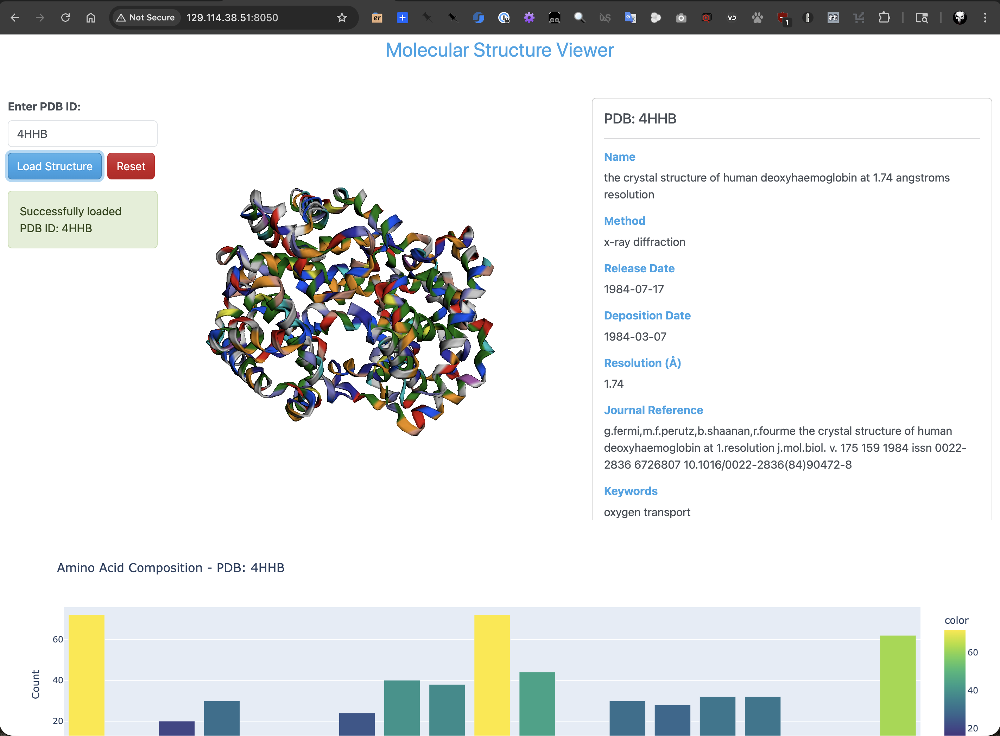

Running a Production Dash App
=============================

We have been running our Dash apps in development mode, which is great for testing and debugging.
However, when we want to deploy our app to production, we need to use a different approach. In production,
we want to use a web server that can handle multiple requests and provide better performance. In this section,
we will learn how to run a Dash app in production using Gunicorn, a popular Python WSGI HTTP server. We will
also run our Dash app in a Docker container, which makes it easier to deploy and manage our application, and
run it with Docker Compose, which allows us to define and run multi-container Docker applications. By the
end of this section, students should be able to:

- Run our Dash app in production using Gunicorn.
- Run our Dash app in a Docker container.
- Run our Dash app with Docker Compose.

What is Gunicorn?
-----------------

`Gunicorn (Green Unicorn) <https://gunicorn.org/>`_ is a Python WSGI HTTP server for UNIX. WSGI stands
for Web Server Gateway Interface, which is a specification that describes how a web server communicates
with web applications. Gunicorn also uses a pre-fork worker model, which means that it forks multiple worker
processes to handle requests. This allows it to handle multiple requests simultaneously, providing better
performance and scalability for web applications. Gunicorn is compatible with various web frameworks,
including Flask, Django, and FastAPI.  It is easy to use and can be configured with various options to
optimize performance and resource usage.

Running our Dash App with Gunicorn
----------------------------------

To run a Dash app with Gunicorn, we need to set up a few things. First of all, we need to install Gunicorn.
Let's first add it to our project dependencies by adding it to our ``requirements.txt`` file:

.. code-block:: console

    [mbs337-vm]$ cd pdb-dashboard
    [mbs337-vm]$ echo "gunicorn" >> requirements.txt
    [mbs337-vm]$ cat requirements.txt
    dash
    biopython
    dash-bootstrap-components
    dash-bio
    gunicorn

Then, let's activate our virtual environment and install the dependencies:

    .. code-block:: console
    
        [mbs337-vm]$ source .venv/bin/activate
        (.venv) [mbs337-vm]$ pip install -r requirements.txt
        (.venv) [mbs337-vm]$ pip list | grep gunicorn
        gunicorn                  25.1.0

The next step is to create a Gunicorn configuration file. This file will specify the settings for our
application, such as the number of worker processes and the port to bind to. We can create a file named
``gunicorn_config.py`` with the following content:

.. code-block:: python

    workers = 2
    bind = "0.0.0.0:8050"
    loglevel = "info"

In this configuration, we are specifying that we want to use 2 worker processes to handle requests,
and we are binding Gunicorn to all available IP addresses on port 8050, which is the default port for Dash
apps. We are also setting the log level to "info" to get the base level of detail in our logs from Gunicorn.

Next, we need to make sure that our Dash app is set up to be run by Gunicorn. In our ``app.py`` file, we need
to make sure that we are creating a Flask server instance that Gunicorn can use. We can do this by initializing
our Dash app with the Flask server instance. Let's modify our ``app.py`` file to include the following code:

.. code-block:: python
    :emphasize-lines: 4

    # Initialize the Dash app
    external_stylesheets = [dbc.themes.CERULEAN]
    app = Dash(__name__, external_stylesheets=external_stylesheets)
    server = app.server  # Expose the server instance for Gunicorn

Finally, we can run the Gunicorn server by executing the following command in our terminal:

    .. code-block:: console
    
        (.venv) [mbs337-vm]$ gunicorn -c gunicorn_config.py app:server
        [2026-03-11 17:05:26 +0000] [18376] [INFO] Starting gunicorn 25.1.0
        [2026-03-11 17:05:26 +0000] [18376] [INFO] Listening at: http://0.0.0.0:8050 (18376)
        [2026-03-11 17:05:26 +0000] [18376] [INFO] Using worker: sync
        [2026-03-11 17:05:26 +0000] [18376] [INFO] Control socket listening at /home/ubuntu/mbs-337/pdb-dash/gunicorn.ctl
        [2026-03-11 17:05:26 +0000] [18379] [INFO] Booting worker with pid: 18379
    
In this command, we are telling Gunicorn to use the configuration file we created and to run the application
defined in the ``app.py`` file. The ``app:server`` part specifies that we want to run the Dash app defined
in the ``app.py`` file, and we want to use the Flask server instance that is created when we initialize our
Dash app.

Containerizing our Dash App with Docker
---------------------------------------

Now that we have our Dash app running in production with Gunicorn, we can take it a step further and containerize
it using Docker. Containerization allows us to package our application and its dependencies into a single
container, which can be easily deployed and run on any platform that supports Docker. This makes it easier
to manage our application and ensures that it runs consistently across different environments. Here is what
our current directory structure looks like:

.. code-block:: console

    [mbs337-vm]$ cd pdb-dashboard
    [mbs337-vm]$ ls
    app.py	gunicorn_config.py  requirements.txt

If you remember from Unit 5, the first step in containerizing our Dash app is to create a Dockerfile.
A Dockerfile is a text file that contains instructions for building a Docker image. Let's create a
Dockerfile in our current directory:

.. code-block:: console

    [mbs337-vm]$ touch Dockerfile
    [mbs337-vm]$ ls
    Dockerfile  app.py  gunicorn_config.py	requirements.txt

The important first step in our Dockerfile is to specify the base image we want to use.
In this case, we will use the official Python runtime image, which is a lightweight image
that includes Python and pip.

.. code-block:: dockerfile

    # Use an official Python runtime as a parent image
    FROM python:3.12.13

We will also set the working directory in the container to /app. This is where our application files
will be located in the container.

.. code-block:: dockerfile

    # Set the working directory in the container
    WORKDIR /app

Next, we need to copy our application files into the container. We can use the COPY instruction to copy
all the files from our current directory into the /app directory in the container.

.. code-block:: dockerfile

    # Copy the needed files into the container at /app
    COPY app.py gunicorn_config.py requirements.txt /app/

With our application files in place, we need to install the dependencies for our Dash app. We can use
the RUN instruction to execute a command in the container. In this case, we will use pip to install
the dependencies from our requirements.txt file.

.. code-block:: dockerfile

    # Install any needed packages specified in requirements.txt
    RUN pip install --no-cache-dir -r requirements.txt

Because our Dash app runs on port 8050, we need to expose this port in our Dockerfile. This allows us to access
the Dash app from outside the container. We can use the EXPOSE instruction to specify that our application
will listen on port 8050.

.. code-block:: dockerfile

    # Make port 8050 available to the world outside this container
    EXPOSE 8050

Finally, we need to specify the command to run our Dash app when the container starts. We will use the
CMD instruction to specify the command to run Gunicorn with our application. The command will tell Gunicorn
to use the configuration file we created and to run the application defined in the app.py file.

.. code-block:: dockerfile

    # Run app.py when the container launches
    CMD ["gunicorn", "-c", "gunicorn_config.py", "app:server"]

Putting it all together, our complete Dockerfile should look like this:

.. code-block:: dockerfile

    # Use an official Python runtime as a parent image
    FROM python:3.12.13

    # Set the working directory in the container
    WORKDIR /app

    # Copy the needed files into the container at /app
    COPY app.py gunicorn_config.py requirements.txt /app/

    # Install any needed packages specified in requirements.txt
    RUN pip install --no-cache-dir -r requirements.txt

    # Make port 8050 available to the world outside this container
    EXPOSE 8050

    # Run app.py when the container launches
    CMD ["gunicorn", "-c", "gunicorn_config.py", "app:server"]

Now that we have our Dockerfile ready, we can build our Docker image. We can use the ``docker build`` command to
build the image from our Dockerfile. We will tag the image with an owner, <username>, a name, such as
"pdb-dashboard", and version, "1.0". Here is the command to build the Docker image:

    .. code-block:: console
    
        [mbs337-vm]$ docker build -t <username>/pdb-dashboard:1.0 .
        Sending build context to Docker daemon  17.92kB
        Step 1/6 : FROM python:3.12.13
        ...
        Successfully built d65ae3a6f707
        Successfully tagged <username>/pdb-dashboard:1.0

Using Docker Compose to Run our Dash App
----------------------------------------

Now that we have our Dash app running in a Docker container, we can take it a step further and use Docker Compose
to manage our application. Remember from Unit 5, Docker Compose is a tool that allows us to define and run
multi-container Docker applications. With Docker Compose, we can define our application services, networks,
and volumes in a single YAML file, and then use a single command to start and stop our application. This makes
it easier to manage our application and ensures that all the components of our application are running together.
This even makes sense for our simple, single-container Dash app, as it simplifies deployment and allows us to
easily scale our application in the future if needed. Let's create a Docker Compose file named
``docker-compose.yml`` in our current directory:

.. code-block:: console

    [mbs337-vm]$ touch docker-compose.yml
    [mbs337-vm]$ ls
    Dockerfile  app.py  docker-compose.yml  gunicorn_config.py  requirements.txt

In our Docker Compose file, we will define a service for our Dash app. We will specify that we want to
build the image for the service, which is the Docker image we built earlier, and give the container a name.

.. code-block:: yaml

    ---
    services:
      dash-app:
        build:
          context: .
          dockerfile: Dockerfile
        container_name: dash-app

We will also specify the ports to expose for the service, which will allow us to access our Dash app from
outside the container.

.. code-block:: yaml
    :emphasize-lines: 8-9

    ---
    services:
      dash-app:
        build:
          context: .
          dockerfile: Dockerfile
        container_name: dash-app
        ports:
          - "8050:8050"

In addition, we will specify a volume to save our downloaded PDB files, which will
allow us to persist our data even if the container is stopped or removed.

.. code-block:: yaml
    :emphasize-lines: 10-11

    ---
    services:
      dash-app:
        build:
          context: .
          dockerfile: Dockerfile
        container_name: dash-app
        ports:
          - "8050:8050"
        volumes:
          - ./pdb_files:/app/pdb_files

The final thing we need to do is to specify a restart policy for our service, which will ensure that our
Dash app is automatically restarted if it crashes or the server is restarted. The preferred restart
policy for our Dash app is "unless-stopped", which means that the container will be restarted unless
it is explicitly stopped by the user.

.. code-block:: yaml
    :emphasize-lines: 12

    ---
    services:
      dash-app:
        build:
          context: .
          dockerfile: Dockerfile
        container_name: dash-app
        ports:
          - "8050:8050"
        volumes:
          - ./pdb_files:/app/pdb_files
        restart: unless-stopped

With our Docker Compose file ready, we can start our application by running the following command
in our terminal:

    .. code-block:: console
    
        [mbs337-vm]$ docker-compose up -d
        [+] Building 0.2s (10/10) FINISHED                                                                                      docker:default
         => [dash-app internal] load build definition from Dockerfile                                                                     0.0s
         => => transferring dockerfile: 578B                                                                                              0.0s
         => [dash-app internal] load metadata for docker.io/library/python:3.12.13                                                        0.0s
         => [dash-app internal] load .dockerignore                                                                                        0.0s
         => => transferring context: 46B                                                                                                  0.0s
         => [dash-app 1/4] FROM docker.io/library/python:3.12.13                                                                          0.0s
         => [dash-app internal] load build context                                                                                        0.0s
         => => transferring context: 100B                                                                                                 0.0s
         => CACHED [dash-app 2/4] WORKDIR /app                                                                                            0.0s
         => CACHED [dash-app 3/4] COPY app.py gunicorn_config.py requirements.txt /app/                                                   0.0s
         => CACHED [dash-app 4/4] RUN pip install --no-cache-dir -r requirements.txt                                                      0.0s
         => [dash-app] exporting to image                                                                                                 0.0s
         => => exporting layers                                                                                                           0.0s
         => => writing image sha256:94b701c46a07be886964b91430531c8ce44eec183b4abe6aa4087236a2d00c5f                                      0.0s
         => => naming to docker.io/library/pdb-dash-dash-app                                                                              0.0s
         => [dash-app] resolving provenance for metadata file                                                                             0.0s
        [+] Running 3/3
         ✔ dash-app                  Built                                                                                                0.0s
         ✔ Network pdb-dash_default  Created                                                                                              0.3s
         ✔ Container dash-app        Started

And verify that our Dash app is running by running the following command:

    .. code-block:: console
    
        [mbs337-vm]$ docker compose ps
        NAME       IMAGE               COMMAND                  SERVICE    CREATED         STATUS         PORTS
        dash-app   pdb-dash-dash-app   "gunicorn -c gunicor…"   dash-app   2 minutes ago   Up 2 minutes   0.0.0.0:8050->8050/tcp, [::]:8050->8050/tcp

Now we can navigate to ``http://<IP_ADDRESS>:8050/`` in our web browser to see our Dash app running in
production!

    PDB dashboard application running in production with Gunicorn and Docker Compose.

And to stop our application, run the following command:

    .. code-block:: console
    
        [mbs337-vm]$ docker-compose down
        [+] Running 2/2
         ✔ Container dash-app        Removed                                                                                              0.8s
         ✔ Network pdb-dash_default  Removed

Additional Resources
--------------------

* `Gunicorn Documentation <https://gunicorn.org/>`_
* `Docker Documentation <https://docs.docker.com/>`_
* `Best practices for writing Dockerfiles <https://docs.docker.com/develop/develop-images/dockerfile_best-practices/>`_
* `Docker Compose Documentation <https://docs.docker.com/compose/>`_
