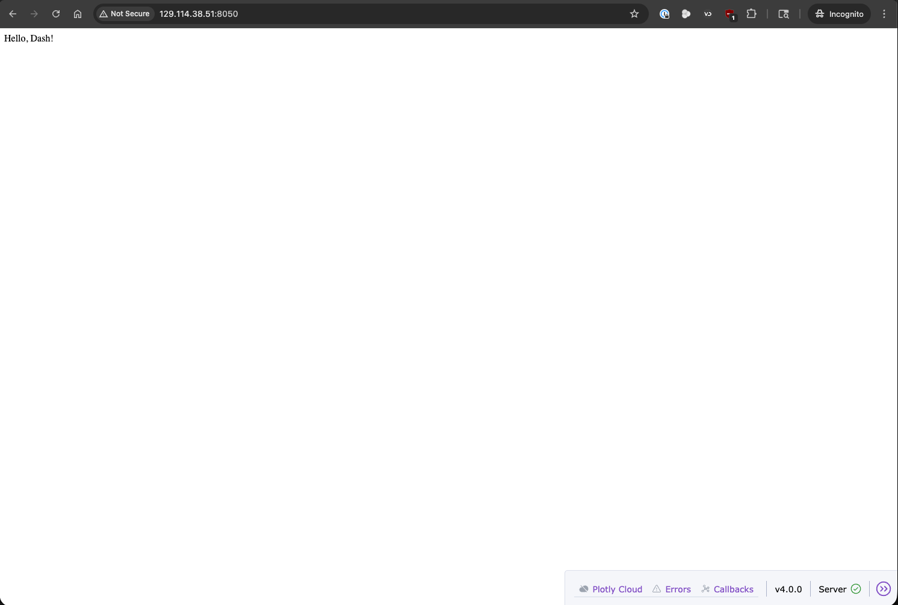
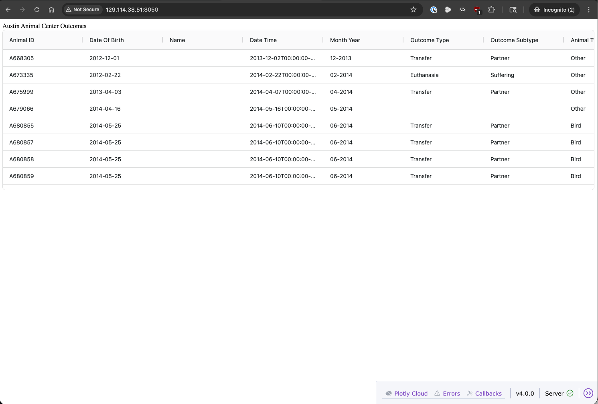
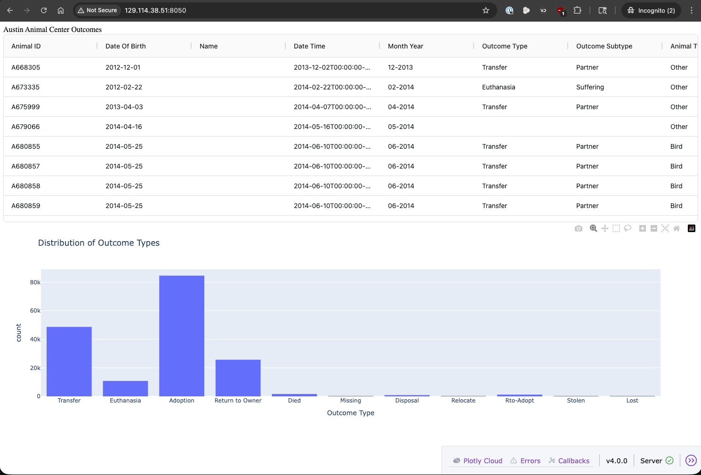
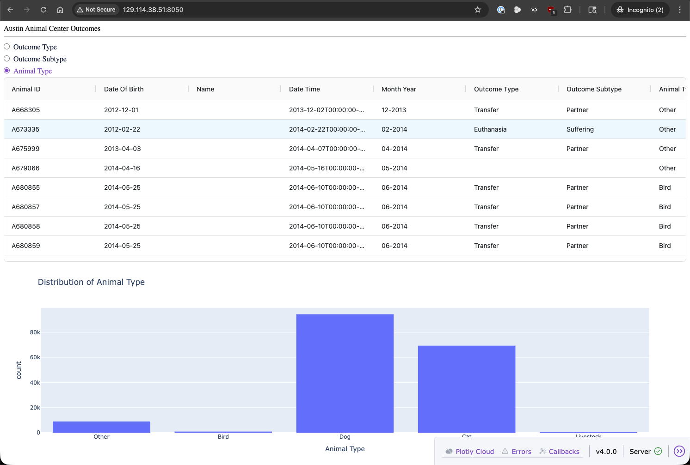
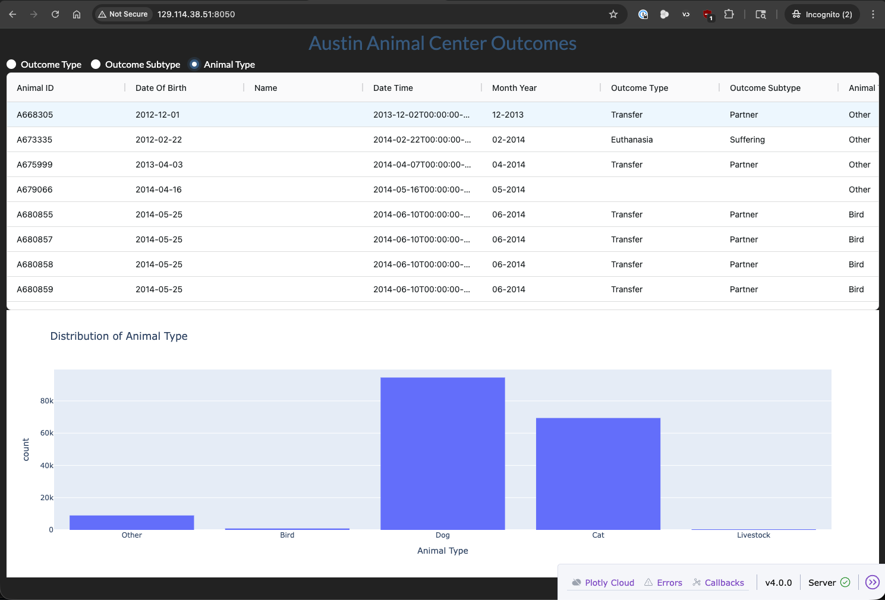

Introduction to Plotly Dash
===========================

In this module, we will learn how to build interactive dashboards using Plotly Dash. We will cover the basics
of creating a Dash application, including how to set up the layout and callbacks to create interactive components.
We will also explore some of the advanced features of Dash, such as integrating with other libraries and
deploying our applications. After completing this module, students should be able to:

* Create a basic Dash application with interactive components
* Customize the layout and styling of their Dash applications
* Use callbacks to create dynamic and responsive dashboards
* Integrate Dash with other libraries and tools for data visualization and analysis
* Deploy their Dash applications to the web for sharing and collaboration

What is Plotly Dash?
--------------------

`Plotly Dash <https://dash.plotly.com/>`_ is a Python framework for building interactive web applications
and dashboards. The tool was developed by the company `Plotly <https://plotly.com/>`_, which is known for
its powerful data visualization libraries, and released in 2017. It is built on top of the `Plotly.js library
<https://plotly.com/javascript/>`_ for data visualization and the `React.js library <https://react.dev/>`_ for
building user interfaces. Dash allows developers to create complex and interactive applications using only
Python, without needing to write any JavaScript, CSS, or HTML. Dash applications can be easily deployed to the web,
making it a powerful tool for sharing data visualizations and insights with others for data-driven analysis.

Getting Started with Dash
-------------------------

Installation
~~~~~~~~~~~~

To get started, let's install Dash in our virtual environment on our Linux VM. You can do this using pip:

.. code-block:: console
    :emphasize-lines: 29, 35, 100

    [mbs337-vm]$ cd $HOME/mbs-337
    [mbs337-vm]$ source .venv/bin/activate
    (.venv) [mbs337-vm]$ pip3 install dash
    (.venv) [mbs337-vm]$ pip3 list
    Package                   Version
    ------------------------- -----------
    annotated-types           0.7.0
    anyio                     4.12.1
    argon2-cffi               25.1.0
    argon2-cffi-bindings      25.1.0
    arrow                     1.4.0
    asttokens                 3.0.1
    async-lru                 2.2.0
    attrs                     25.4.0
    babel                     2.18.0
    beautifulsoup4            4.14.3
    biopython                 1.86
    bleach                    6.3.0
    blinker                   1.9.0
    cattrs                    26.1.0
    certifi                   2026.1.4
    cffi                      2.0.0
    charset-normalizer        3.4.4
    click                     8.3.1
    comm                      0.2.3
    contourpy                 1.3.3
    cryptography              46.0.5
    cycler                    0.12.1
    dash                      4.0.0
    debugpy                   1.8.20
    decorator                 5.2.1
    defusedxml                0.7.1
    executing                 2.2.1
    fastjsonschema            2.21.2
    Flask                     3.1.3
    fonttools                 4.61.1
    fqdn                      1.5.1
    graphql-core              3.2.7
    h11                       0.16.0
    httpcore                  1.0.9
    httpx                     0.28.1
    idna                      3.11
    importlib_metadata        8.7.1
    iniconfig                 2.3.0
    ipykernel                 7.2.0
    ipython                   9.10.0
    ipython_pygments_lexers   1.1.1
    ipywidgets                8.1.8
    isoduration               20.11.0
    itsdangerous              2.2.0
    jaraco.classes            3.4.0
    jaraco.context            6.1.0
    jaraco.functools          4.4.0
    jedi                      0.19.2
    jeepney                   0.9.0
    Jinja2                    3.1.6
    json5                     0.13.0
    jsonpointer               3.0.0
    jsonschema                4.26.0
    jsonschema-specifications 2025.9.1
    jupyter                   1.1.1
    jupyter_client            8.8.0
    jupyter-console           6.6.3
    jupyter_core              5.9.1
    jupyter-events            0.12.0
    jupyter-lsp               2.3.0
    jupyter_server            2.17.0
    jupyter_server_terminals  0.5.4
    jupyterlab                4.5.5
    jupyterlab_pygments       0.3.0
    jupyterlab_server         2.28.0
    jupyterlab_widgets        3.0.16
    keyring                   25.7.0
    kiwisolver                1.4.9
    lark                      1.3.1
    lxml                      6.0.2
    markdown-it-py            4.0.0
    MarkupSafe                3.0.3
    matplotlib                3.10.8
    matplotlib-inline         0.2.1
    mdurl                     0.1.2
    mistune                   3.2.0
    more-itertools            10.8.0
    narwhals                  2.17.0
    nbclient                  0.10.4
    nbconvert                 7.17.0
    nbformat                  5.10.4
    nest-asyncio              1.6.0
    notebook                  7.5.4
    notebook_shim             0.2.4
    numpy                     2.4.1
    packaging                 26.0
    pandas                    3.0.1
    pandocfilters             1.5.1
    parso                     0.8.6
    pexpect                   4.9.0
    pillow                    12.1.1
    pip                       26.0.1
    platformdirs              4.9.2
    plotly                    6.6.0
    pluggy                    1.6.0
    plumbum                   1.10.0
    ply                       3.11
    prometheus_client         0.24.1
    prompt_toolkit            3.0.52
    psutil                    7.2.2
    ptyprocess                0.7.0
    pure_eval                 0.2.3
    pycparser                 3.0
    pydantic                  2.12.5
    pydantic_core             2.41.5
    Pygments                  2.19.2
    pyinaturalist             0.21.1
    pyparsing                 3.3.2
    pyrate-limiter            2.10.0
    pytest                    9.0.2
    python-dateutil           2.9.0.post0
    python-json-logger        4.0.0
    PyYAML                    6.0.3
    pyzmq                     27.1.0
    rcsb-api                  1.5.0
    redis                     7.2.0
    referencing               0.37.0
    requests                  2.32.5
    requests-cache            1.3.0
    requests-ratelimiter      0.8.0
    retrying                  1.4.2
    rfc3339-validator         0.1.4
    rfc3986-validator         0.1.1
    rfc3987-syntax            1.1.0
    rich                      14.3.3
    rpds-py                   0.30.0
    rustworkx                 0.17.1
    seaborn                   0.13.2
    SecretStorage             3.5.0
    Send2Trash                2.1.0
    setuptools                82.0.0
    six                       1.17.0
    soupsieve                 2.8.3
    stack-data                0.6.3
    terminado                 0.18.1
    tinycss2                  1.4.0
    tornado                   6.5.4
    tqdm                      4.67.3
    traitlets                 5.14.3
    typing_extensions         4.15.0
    typing-inspection         0.4.2
    tzdata                    2025.3
    uri-template              1.3.0
    url-normalize             2.2.1
    urllib3                   2.6.3
    wcwidth                   0.6.0
    webcolors                 25.10.0
    webencodings              0.5.1
    websocket-client          1.9.0
    Werkzeug                  3.1.6
    widgetsnbextension        4.0.15
    zipp                      3.23.0

Notice that not only was Dash installed, but also its dependencies, including
`Flask <https://flask.palletsprojects.com/>`_ and Plotly. Flask is a lightweight web framework
that Dash uses to serve the application, while Plotly is the library that provides
the data visualization capabilities for Dash applications.

Our First Dash Application
~~~~~~~~~~~~~~~~~~~~~~~~~~

To start, we're going to create the simplest possible Dash application, the infamous "Hello, Dash!" app.
First, let's create a new directory called ``dash_app`` in our mbs-337 directory on the Linux VM, and then
create a new Python file called ``app.py`` inside that directory:

.. code-block:: console

    (.venv) [mbs337-vm]$ mkdir dash_app
    (.venv) [mbs337-vm]$ cd dash_app
    (.venv) [mbs337-vm]$ touch app.py
    (.venv) [mbs337-vm]$ ls -l
    total 0
    -rw-rw-r-- 1 ubuntu ubuntu 0 Mar  8 18:45 app.py

Next, let's open the ``app.py`` file in our VS Code editor and add the following code:

.. code-block:: python
    :linenos:
    :emphasize-lines: 3, 5, 8

    from dash import Dash, html

    app = Dash()

    app.layout = [html.Div(children='Hello, Dash!')]

    if __name__ == '__main__':
        app.run(host='0.0.0.0', port=8050, debug=True)

This code creates a simple Dash application that displays the text "Hello, Dash!" on the page. The
important lines to note are line 3, where we initialize the Dash application, line 5, where we define
the layout of the application, and line 8, where we run the application. The application is set to run
on all available network interfaces (``0.0.0.0``) on port 8050, which
allows it to be accessed from other devices on the same network. The ``debug=True`` argument is used
to enable debug mode, which provides helpful error messages and automatically reloads the application
when changes are made to the code. This is useful during development, but should be set to ``False`` in
production environments for security reasons.

.. note:: What are Network Ports?

   A network port is a communication endpoint that allows different applications and services to
   communicate with each other over a network. Each port is identified by a unique number, which
   ranges from 0 to 65535. Ports below 1024 are considered well-known ports and are typically reserved
   for system or well-known services and require superuser/root privileges to bind to. Ports are used to
   route network traffic to the correct application or service on a server. For example, HTTP traffic
   typically uses port 80, while HTTPS traffic uses port 443. In our Dash application, we are using port
   8050, which is commonly used for development servers and is not reserved for any specific service.

   Commonly used ports include:
    * 21: FTP (File Transfer Protocol) Data Transfer
    * 22: SSH (Secure Shell)
    * 80: HTTP (Hypertext Transfer Protocol)
    * 443: HTTPS (HTTP Secure)
    * 6379: Redis Database
    * 8888: Jupyter Notebook Server

To run the application, we can use the following command in our VS Code terminal:

.. code-block:: console

    (.venv) [mbs337-vm]$ curl ip.me
    129.114.38.51
    (.venv) [mbs337-vm]$ python app.py
    Dash is running on http://0.0.0.0:8050/

     * Serving Flask app 'app'
     * Debug mode: on

Now, we can open a web browser and navigate to ``http://<IP_ADDRESS>:8050/`` (replacing ``<IP_ADDRESS>``
with the actual IP address of your Linux VM) to see our Dash application in action. You should see a page
that says "Hello, Dash!" displayed in the upper left.

    "Hello, Dash!" application running in a web browser.

Adding Data and a Basic Table
~~~~~~~~~~~~~~~~~~~~~~~~~~~~~

Most dashboards are used to display data, so let's add some data to our Dash application. We will use the
``pandas`` library to create a simple DataFrame and then display it in our Dash application using the
``dash-ag-grid`` component. We will pull in the same `Austin Animal Center Outcomes` dataset that we used
in Unit 7 for our Exploratory Data Analysis. In our VS Code terminal, we can use the following command to
download the dataset:

.. code-block:: console

    (.venv) [mbs337-vm]$ wget https://raw.githubusercontent.com/tacc/mbs-337-sp26/main/docs/unit07/sample-data/Austin_Animal_Center_Outcomes.zip
    (.venv) [mbs337-vm]$ unzip Austin_Animal_Center_Outcomes.zip
    Archive:  Austin_Animal_Center_Outcomes.zip
      inflating: Austin_Animal_Center_Outcomes.csv
    (.venv) [mbs337-vm]$ rm Austin_Animal_Center_Outcomes.zip
    (.venv) [mbs337-vm]$ ls -l
    total 20844
    -rw-rw-r-- 1 ubuntu ubuntu 21338783 May  7  2025 Austin_Animal_Center_Outcomes.csv
    -rw-rw-r-- 1 ubuntu ubuntu      171 Mar  8 19:18 app.py

We also need to install the ``dash-ag-grid`` component, which we can do using pip:

.. code-block:: console

    (.venv) [mbs337-vm]$ pip3 install dash-ag-grid
    (.venv) [mbs337-vm]$ pip3 list | grep dash_ag_grid
    dash_ag_grid              33.3.3

Now, we can modify our ``app.py`` file to read in the dataset with ``pandas`` into a DataFrame and display
it in a table. We will use the ``dash_ag_grid`` component to create an interactive table that allows us to
sort and filter the data. Here is the modified code for our Dash application:

.. code-block:: python
    :linenos:
    :emphasize-lines: 1, 2, 5, 9-15

    import dash_ag_grid as dag
    import pandas as pd
    from dash import Dash, html

    df = pd.read_csv('Austin_Animal_Center_Outcomes.csv')

    app = Dash()

    app.layout = [
        html.Div(children='Austin Animal Center Outcomes'),
        dag.AgGrid(
            rowData=df.to_dict('records'),
            columnDefs=[{'field': col} for col in df.columns]
        )
    ]

    if __name__ == '__main__':
        app.run(host='0.0.0.0', port=8050, debug=True)

Again, to run the application, we can use the following command in our VS Code terminal:

.. code-block:: console

    (.venv) [mbs337-vm]$ python app.py
    Dash is running on http://0.0.0.0:8050/

     * Serving Flask app 'app'
     * Debug mode: on

And then we can refresh our web browser to see the updated application with the data table displayed.

    Dash app with data table running in a web browser.

Adding a Visualization
~~~~~~~~~~~~~~~~~~~~~~

To add some more visual flair to our dashboard, let's add a visualization using the Plotly library.
We will have to import the common components from Dash (``dcc``), as well as the Plotly Express library
(``plotly.express``) to get access to the plotting functions. We can create a simple histogram to show
the distribution of outcomes in the dataset. We will use the ``dcc.Graph`` component from Dash to display
the Plotly graph (``px.histogram``) in our application. Here is the modified code for our Dash application
with the histogram added:

.. code-block:: python
    :linenos:
    :emphasize-lines: 3, 4, 16

    import dash_ag_grid as dag
    import pandas as pd
    import plotly.express as px
    from dash import Dash, html, dcc

    df = pd.read_csv('Austin_Animal_Center_Outcomes.csv')

    app = Dash()

    app.layout = [
        html.Div(children='Austin Animal Center Outcomes'),
        dag.AgGrid(
            rowData=df.to_dict('records'),
            columnDefs=[{"field": col} for col in df.columns]
        ),
        dcc.Graph(figure=px.histogram(df, x='Outcome Type', title='Distribution of Outcome Types')
        )
    ]

    if __name__ == '__main__':
        app.run(host='0.0.0.0', port=8050, debug=True)

Hopefully, our Dash app is still running in our terminal, but if not, we can restart it with the same command
as before (``python app.py``). After refreshing our web browser, we should now see a histogram displayed below
the data table that shows the distribution of outcome types in the dataset.

    Dash app with data table and histogram running in a web browser.

Adding Interactivity with Callbacks
~~~~~~~~~~~~~~~~~~~~~~~~~~~~~~~~~~~

Our application is starting to look like a real dashboard, but it is still not very interactive.
To add some interactivity, we can use Dash's callback system to create dynamic components that
respond to user input. For example, we can create some controls that allow us to pick what column
to use for the histogram, and then update the graph based on the user's selection. We will achieve this
by adding a set of radio buttons to the layout that allow the user to select a column from the dataset,
and then we will use a callback function to update the histogram based on the selected column. We will
have to import the ``callback`` decorator from Dash to define our callback function and the ``Input`` and
``Output`` classes to specify the inputs and outputs of the callback. Our dash import statement will now
look like this:

.. code-block:: python

    from dash import Dash, Input, Output, callback, dcc, html

Now we need to update our layout to include the radio buttons for selecting the column to use for the
histogram and give it an ``id`` so that we can reference it in our callback function. We will also give the
``dcc.Graph`` component an ``id`` so that we can update it in the callback. Here is the modified layout:

.. code-block:: python

    app.layout = [
        html.Div(children='Austin Animal Center Outcomes'),
        html.Hr(),
        dcc.RadioItems(options=['Outcome Type', 'Outcome Subtype', 'Animal Type'], value='Outcome Type', id='radio-items'),
        dag.AgGrid(
            rowData=df.to_dict('records'),
            columnDefs=[{"field": col} for col in df.columns]
        ),
        dcc.Graph(figure={}, id='outcome-graph')
    ]

Next, we need to define our callback function that will update the histogram based on the selected column.
We will use the ``@callback`` decorator to specify that this function is a callback, and we will use the
``Input`` and ``Output`` classes to specify that the input to the callback is the value of the radio buttons
and the output is the figure of the graph. Here is the code for our callback function:

.. code-block:: python

    @callback(
        Output('outcome-graph', 'figure'),
        Input('radio-items', 'value')
    )
    def update_graph(value):
        fig = px.histogram(df, x=value, title=f'Distribution of {value}')
        return fig

Finally, putting it all together, here is the complete code for our Dash application with the interactive histogram:

.. code-block:: python
    :linenos:
    :emphasize-lines: 4, 12, 13, 18, 21-27

    import dash_ag_grid as dag
    import pandas as pd
    import plotly.express as px
    from dash import Dash, Input, Output, callback, dcc, html

    df = pd.read_csv('Austin_Animal_Center_Outcomes.csv')

    app = Dash()

    app.layout = [
        html.Div(children='Austin Animal Center Outcomes'),
        html.Hr(),
        dcc.RadioItems(options=['Outcome Type', 'Outcome Subtype', 'Animal Type'], value='Outcome Type', id='radio-items'),
        dag.AgGrid(
            rowData=df.to_dict('records'),
            columnDefs=[{"field": col} for col in df.columns]
        ),
        dcc.Graph(figure={}, id='outcome-graph')
    ]

    @callback(
        Output('outcome-graph', 'figure'),
        Input('radio-items', 'value')
    )
    def update_graph(value):
        fig = px.histogram(df, x=value, title=f'Distribution of {value}')
        return fig

    if __name__ == '__main__':
        app.run(host='0.0.0.0', port=8050, debug=True)

Now, when we run our Dash application and refresh the web browser, we should see the radio buttons
above the data table. When we select a different option from the radio buttons, the histogram should
update to show the distribution of the selected column. This is the power of Dash's callback system,
which allows us to quickly and easily add interactivity to our dashboards.

    Dash app with data table and interactive histogram running in a web browser.

Styling and Customization
~~~~~~~~~~~~~~~~~~~~~~~~~

Our application is functional, but it could use some styling and customization to make it look nicer.
Dash provides a lot of options for styling and customizing the appearance of our applications, including
built-in themes, CSS styling, the Dash Design Kit (Dash Enterprise only), Dash Bootstrap and Mantine components,
and the ability to create custom components. We will use the ``dash-bootstrap-components`` library to add
some Bootstrap styling to our application. `Dash Bootstrap Components <https://www.dash-bootstrap-components.com/>`_
is a library built off of the popular `Bootstrap <https://getbootstrap.com/>`_ framework that can be easily
integrated into Dash applications to provide a clean and responsive design. We can install it using pip:

.. code-block:: console

    (.venv) [mbs337-vm]$ pip3 install dash-bootstrap-components
    (.venv) [mbs337-vm]$ pip3 list | grep dash_bootstrap_components
    dash-bootstrap-components 2.0.4

Now we can modify our Dash application to use some Bootstrap components and styling. We will import the
``dash_bootstrap_components`` library.

.. code-block:: python

    import dash_bootstrap_components as dbc

First, we will add a Bootstrap theme called "DARKLY" to our application by passing the URL for the theme CSS file to
the ``external_stylesheets`` argument when initializing the Dash app.

.. code-block:: python

    external_stylesheets = [dbc.themes.DARKLY]
    app = Dash(__name__, external_stylesheets=external_stylesheets)

Then we can update our layout to use some Bootstrap components, such as the ``dbc.Container`` and ``dbc.Row``
components to create a responsive layout for our dashboard.

.. code-block:: python

    app.layout = dbc.Container([
        dbc.Row([
            html.Div("Austin Animal Center Outcomes", className="text-primary text-center fs-3")
        ]),
        dbc.Row([
            dbc.RadioItems(options=['Outcome Type', 'Outcome Subtype', 'Animal Type'],
                        value='Outcome Type', id='radio-items', inline=True)
        ]),
        dbc.Row([
            dag.AgGrid(
                rowData=df.to_dict('records'),
                columnDefs=[{"field": col} for col in df.columns]
            )
        ]),
        dbc.Row([
            dcc.Graph(figure={}, id='outcome-graph')
        ])
    ], fluid=True)

Finally, putting it all together, here is the complete code for our Dash application with Bootstrap styling:

.. code-block:: python
    :linenos:
    :emphasize-lines: 2, 9, 10, 12-29

    import dash_ag_grid as dag
    import dash_bootstrap_components as dbc
    import pandas as pd
    import plotly.express as px
    from dash import Dash, Input, Output, callback, dcc, html

    df = pd.read_csv('Austin_Animal_Center_Outcomes.csv')

    external_stylesheets = [dbc.themes.DARKLY]
    app = Dash(__name__, external_stylesheets=external_stylesheets)

    app.layout = dbc.Container([
        dbc.Row([
            html.Div("Austin Animal Center Outcomes", className="text-primary text-center fs-3")
        ]),
        dbc.Row([
            dbc.RadioItems(options=['Outcome Type', 'Outcome Subtype', 'Animal Type'],
                        value='Outcome Type', id='radio-items', inline=True)
        ]),
        dbc.Row([
            dag.AgGrid(
                rowData=df.to_dict('records'),
                columnDefs=[{"field": col} for col in df.columns]
            )
        ]),
        dbc.Row([
            dcc.Graph(figure={}, id='outcome-graph')
        ])
    ], fluid=True)

    @callback(
        Output('outcome-graph', 'figure'),
        Input('radio-items', 'value')
    )
    def update_graph(value):
        fig = px.histogram(df, x=value, title=f'Distribution of {value}')
        return fig

    if __name__ == '__main__':
        app.run(host='0.0.0.0', port=8050, debug=True)

Now, when we run our Dash application and refresh the web browser, we should see a nicely styled dashboard
with a dark theme, a centered title, and inline radio buttons for selecting the column to use for the histogram.
The data table and histogram should still be functional and interactive as before.

    Dash app with styling and customization running in a web browser.

Deploying Dash Applications
~~~~~~~~~~~~~~~~~~~~~~~~~~~

In essence, our Dash application is already "deployed" in the sense that it is running on our Linux VM and can
be accessed publicly (because the VM is configured to allow incoming connections on port 8050).

If you don't have access to a server or VM to deploy your Dash application, there are several options for
deploying Dash applications, including using Dash Enterprise (a commercial platform for deploying Dash apps),
`Plotly Cloud <https://cloud.plotly.com/>`_ (a cloud hosting service for Plotly and Dash applications), or
general purpose hosting services like `Heroku <https://www.heroku.com/>`_, `AWS <https://aws.amazon.com/>`_,
or `PythonAnywhere <https://www.pythonanywhere.com/>`_.

Additional Resources
--------------------

* `Dash Documentation <https://dash.plotly.com/>`_
* `Plotly Documentation <https://plotly.com/python/>`_
* `Dash Bootstrap Components Documentation <https://www.dash-bootstrap-components.com/>`_
* `What are Network Ports? Understanding and Managing Ports in Linux <https://infosecwriteups.com/what-are-network-ports-understanding-and-managing-ports-in-linux-1f470cabbae1>`_
