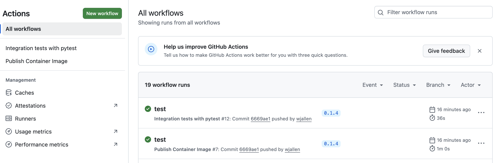

Continuous Deployment
=====================

*Continuous Deployment* is the practice of automatically releasing your code or project to the end
users, provided that it passes all tests. As mentioned, normally it is a good idea to deploy to a 
staging environment (e.g. port 8051) before deploying to production, so that a human in the loop can
do one final check that everything is working as expected. However the key point of this process is
to help ensure the latest components are available to other users in production as quickly as
possible and in an automated way to reduce errors.

After going through this module, students should be able to:

* Set up a GitHub Action for building and pushing a Docker image to the GitHub Container Registry
* Trigger the GitHub Action by pushing a new tag to GitHub
* Use Ansible to deploy a version of the application on a remote server independent of the code base

Build an Image for the GitHub Container Registry
-------------------------------------------------

Rather than commit to GitHub AND push to a container registry like Docker Hub each time you want to
release a new version of code, you can set up an integration between the two services that automates
it. The key benefit is you only have to commit to one place (GitHub), and you can be sure the image
in your container registry will always be in sync.

.. note::

   The content below works similarly on Docker Hub, or the GitHub Container Registry. If setting up
   this integration for Docker Hub, you will need to add a step to inject Docker Hub credentials 
   into the workflow via secrets. For example, see `this link <http://github.com/docker/login-action>`_.

Consider the following workflow, which may be written to ``.github/workflows/push-to-registry.yml``:

.. code-block:: yaml
   :linenos:

   name: Publish Container Image
   
   on:
     push:
       tags:
         - "*"
   
   jobs:
     push-to-registry:
       runs-on: ubuntu-latest
       permissions:
         contents: read
         packages: write
         attestations: write
         id-token: write
   
       steps:
         - name: Check out the repo
           uses: actions/checkout@v4
   
         - name: Log in to the Container registry
           uses: docker/login-action@v4
           with:
             registry: ghcr.io
             username: ${{ github.actor }}
             password: ${{ secrets.GITHUB_TOKEN }}
   
         - name: Extract metadata (tags, labels) for container
           id: meta-data
           uses: docker/metadata-action@v5
           with:
             images: ghcr.io/${{ github.repository }}
   
         - name: Build and push image
           uses: docker/build-push-action@v5
           with:
             context: .
             push: true
             file: ./Dockerfile
             tags: ${{ steps.meta-data.outputs.tags }}
             labels: ${{ steps.meta-data.outputs.labels }}

      

This workflow is triggered when a new tag is pushed (``tags: - '*'``). In contrast to testing on
every push, it makes sense to build and tag containers more selectively, because we would prefer if
tagged containers can be traced back to specific tagged versions of code.

This workflow sets a few permissions near the beginning which are required for building an image. 
As in the previous workflow, this one also runs on an ``ubuntu-latest`` environment.

Then, among the fours steps, it uses the ``docker/login-action`` to log in to GitHub Container
Registry (GHCR) Hub on the command line. The username and password are taken out of the environment.
Certain variables, including ``secrets.GITHUB_TOKEN`` are automatically part of the environment for
every GitHub Action Workflow.

Finally, the workflow uses the ``docker/metadata-action`` to extract tags and the repository name to
assign to the name of the container image, and uses ``docker/build-push-action`` to build and push
the container to the GHCR.

.. tip::

   Don't re-invent the wheel when performing GitHub Actions. There is likely an
   existing action that already does what you're trying to do.

Trigger the Integration
~~~~~~~~~~~~~~~~~~~~~~~

To trigger the build in a real-world scenario, make some changes to your source
code, push your modified code to GitHub and tag the release as ``X.Y.Z`` (whatever
new tag is appropriate) to trigger another automated build:

.. code-block:: console

   [coe332-vm]$ git add *
   [coe332-vm]$ git commit -m "added a new feature to do something"
   [coe332-vm]$ git push
   [coe332-vm]$ git tag -a 0.1.1 -m "release version 0.1.1"
   [coe332-vm]$ git push origin 0.1.1

By default, the git push command does not transfer tags, so we are explicitly
telling git to push the tag we created (0.1.1) to GitHub (origin).

Now, check the online GitHub repo to make sure your change / tag is there, and check the Actions
tab to monitor the status of your build.

   New tag automatically pushed.

If successful, the resulting container images can be found by navigating to your GitHub Profile and
clicking the **Packages** tab near the top center. That image can be pulled using the Docker
commandline interface:

.. code:: console

   [mbs337-vm]$ docker pull ghcr.io/USERNAME/IMAGE:TAG
   # e.g.:
   [mbs337-vm]$ docker pull ghcr.io/wjallen/dash-test:0.1.0

With container images stored in a web-accessible container registry, you can now deploy code and
projects independent of the codebase itself. This is great for arbitrary cloud deployments orchestrated
with tools like Kubernetes or Ansible.

Ansible
-------

Ansible is a great tool for automating complex or repetetive tasks anywhere - even on remote virtual
machines. For example, imagine you have a web dashboard consisting of multiple containerized
components. Docker compose is great for orchestrating the containers - but there are many other
considerations when working
in a brand new virtual machine. How will you make sure Docker is even installed? And the necessary 
containers or source code are available to the machine? And the ports are correctly proxied so that
the dashboard is visible to the outside world? And all of the other latest versions of packages
and security updates are installed so your virtual machine is secure?

Ansible enables us to write a "playbook" for launching our web apps from start to finish. It runs
consistently everywhere, can very easily be set up to support staging and production environments,
and it is self-documenting, much like a Dockerfile.

Install Ansible
~~~~~~~~~~~~~~~

Simply:

.. code-block:: console

   [mbs337-vm]$ pip3 install ansible

Consider that ansible is *agentless*, meaning it can communicate and perform actions on remote 
virtual machines without having to install any applications or services. So in practice, you may find
that you ultimately install ansible on your own laptop, and manage your virtualized dashboards on
remote VMs from there.

.. code-block:: console

   [local]$ pip3 install ansible

The next steps will assume you are running ansible from your local laptop, and your class virtual
machine is the remote host (you need to know the IP).

Create an Inventory
~~~~~~~~~~~~~~~~~~~

The inventory is a list of hosts - typically IP addresses - for virtual machines that you have 
provisioned and you have access to. You should have prepared:

1. The IP address of the host
2. The username you use to log in to the host
3. SSH key authentication for logging in to the host

Write the inventory into a ``inventory.ini`` file:

.. code-block:: text

   [myhosts]
   129.114.123.456

Then try using the ansible CLI to ping the hosts in your inventory:

.. code-block:: console

   [local]$ ansible -m ping -i inventory.ini -u ubuntu --key-file ~/.ssh/id_ed25519 myhosts
   129.114.123.456 | SUCCESS => {
       "ansible_facts": {
           "discovered_interpreter_python": "/usr/bin/python3.12"
       },
       "changed": false,
       "ping": "pong"
   }

The command line options are:

* ``ansible -m ping``: run the ansible ping module
* ``-i inventory.ini``: a pointer to your local inventory file
* ``-u ubuntu``: the username you use to log in to your host
* ``--key-file ~/.ssh/id_ed25519``: the private key you use to log in to your host
* ``myhosts``: the group name from your inventory file

A SUCCESS message above means ansible is able to reach your host and will be able to manage it.

Write a Playbook
~~~~~~~~~~~~~~~~

A very simple first playbook from the
`ansible documentation <https://docs.ansible.com/projects/ansible/latest/getting_started/get_started_playbook.html>`_
is as follows:

.. code-block:: yaml

    - name: My first play
    hosts: myhosts
    tasks:
     - name: Ping my hosts
       ansible.builtin.ping:
    
     - name: Print message
       ansible.builtin.debug:
         msg: Hello world

Save the above into a file called "playbook.yaml". It performs two steps on your hosts labeled
"myhosts" in your inventory. Step one is a ping (as we saw previously), and step two is to echo 
a message to standard out - "Hello world". Ansible uses builtin macros for almost every function
or command one could imagine - from making a folder to cloning a git repo to starting containers and
anything in between. The Ansible documentation has an extensive library of macros.

To run the playbook, execute:

.. code-block:: console

   [localhost]$ ansible-playbook -i inventory.ini -u ubuntu --key-file ~/.ssh/id_ed25519 playbook.yaml

Another key concept of ansible is *idempotence*. In computer science, this is the property whereby
an action can be applied multiple times (e.g. an ansible playbook), but it won't have any additional
effect on the system beyond the first time. In other words, you can play a playbook with ansible
to start your containers the first time. If you call the exact same playbook again, it will see that
the containers are already started and will make no change. In this way, ansible can be used not only
to manage your services, but to verify that they are working as expected.

Next Steps
~~~~~~~~~~

1. Update the playbook to clone your Git repository and use docker compose to start your dashboard
   container(s)
2. Modify the scheme to support staging and production environments

Additional Resources
--------------------

* `GitHub Actions Docs <https://docs.github.com/en/actions>`_
* `Ansible Docs <https://docs.ansible.com/projects/ansible/latest/index.html>`_