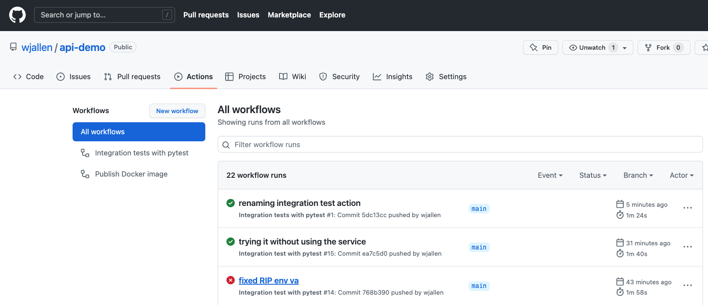

Continuous Integration
======================

In a multi-developer environment, typically no one person has complete knowledge
of the entire system, and multiple changes can be happening at the same time. Even
if the changes are made in different components, it is possible for something to
break when they are integrated.
The primary goal of Continuous Integration (CI) is to help 
ensure that your software continues to work as you add new components.
This also allows multiple people to collaborate on the same code base while ensuring the quality
of the final product.
After going through this module, students should be able to:

* Identify the importance of CI to a large software projects
* Choose a CI service that meets the needs of their software project
* Use the Python requests library to interact with the API of your software system
* Write and execute useful integration tests using ``pytest`` and ``assert`` statements
* Perform a integration testing CI workflow with GitHub Actions

An Example CI Workflow
----------------------

An "integration server" (or "build server") is a dedicated server (or VM) that
prepares software for release. The server automates common tasks, including:

* Building software binaries from source code (for compiled languages)
* Running tests
* Creating images, installers, or other artifacts
* Deploying/installing the software

We are ultimately aiming for the following "Continuous Integration" work flow or
process; this mirrors the process used by a number of teams working on "large"
software systems, both in academia and industry:

* Developers (i.e., you) check out code onto a machine where they will do their
  work. This could be a VM somewhere or their local laptop.
* They make changes to the code to add a feature or fix a bug.
* Once their work is done they add any additional tests as needed and then run
  all unit tests "locally" (i.e., on the same machine).
* Assuming the tests pass, the developer commits their changes and pushes to the
  origin (in this case, GitHub).
* A pre-established build server gets a message from the origin that a new commit
  was pushed.
* The build server:

  * Checks out the latest version
  * Executes any build steps to create the software
  * Runs unit tests
  * Starts an instance of the system
  * Runs integration tests
  * Deploys the software to a staging environment

If any one of the steps above fails, the process stops. In such a situation, the
code defect should be addressed as soon as possible.

Popular Automated CI Services
------------------------------

**Jenkins** is one of the most popular free open-source CI services. It is
server-based, and it requires a web server to operate on.

* Local application
* Completely free
* Deep workflow customization
* Intuitive web interface management
* Can be distributed across multiple machines / VMs
* Rich in features and plugins
* Easy installation thanks to the pre-installed OS X, Unix and Windows packages
* A well-established product with an excellent reputation

**TravisCI** is another CI service with limited features in the free tier, and a
comprehensive paid tier. It is a cloud-hosted service, so there is no need for
you to host your own server.

* Quick setup
* Live build views
* Pull request support
* Multiple languages and platforms support
* Pre-installed database services
* Auto deployments on passing builds
* Parallel testing (paid tier)
* Scaling capacity on demand (paid tier)
* Clean VMs for every build
* Mac, Linux, and iOS support
* Connect with Github, Bitbucket and more

**GitHub Actions** is emerging as the most accessible and most useful CI service used to automate,
customize, and execute software development workflows right in your GitHub repository.

* One interface for both your source code repositories and your CI/CD pipelines
* Catalog of available Actions you can utilize without reinventing the wheel
* Hosted services are subject to usage limits, although the free-tier limits are
  `fairly generous <https://docs.github.com/en/actions/concepts/billing-and-usage>`_
  (for now)
* Simple YAML descriptions of workflows, many templates and examples available

What Will We Do With CI?
------------------------

The first obvious and useful form of CI we can incorporate into the development of our
final projects with GitHub Actions is to: **Automatically run our integration tests (with pytest)
each time new code is pushed to GitHub.** This will ensure whatever code tests we made do not break
some other component of the system that we forgot to check.

But it is worth noting, the options with GitHub Actions are almost limitless. In bioinformatics, we
could envision using automated CI for a number of things, including:

1. Automated integration testing (as seen below)
2. Test Snakemake/Nextflow pipelines on small synthetic datasets
3. Automatically run a pipeline on test data when new code is pushed
4. Containerize your code and push the image to Docker Hub
5. Build and deploy documentation
6. Run some quality control check every time new data drops

In short, any process that you find yourself doing over and over again can likely be automated with
clever CI.

Integration Testing
-------------------

Unlike unit tests, integration tests exercise multiple components, functions, or
units of a software system at once. Some properties of integration tests include:

* Each test targets a higher-level capability, requirement or behavior of the
  system, and exercises multiple components of the system working together.
* Broader scope means fewer tests are required to cover the entire application/system.
* A given test failure provides more limited information as to the root cause.

It's worth pointing out that our definition of integration test leaves some
ambiguity. You will also see the term "functional tests" used for tests that
exercise entire aspects of a software system.

Challenges When Writing Integration Tests
~~~~~~~~~~~~~~~~~~~~~~~~~~~~~~~~~~~~~~~~~

Integration tests against large, distributed systems with lots of components
that interact face some challenges.

* We want to keep tests independent so that a single test can be run without its
  result depending on other tests.
* Most interesting applications change "state" in some way over time; e.g., files
  are saved/updated, database records are written, queue systems updated. In order
  to properly test the system, specific state must be established before and after
  a test (for example, inserting a record into a database before testing the
  "update" function).
* Some components have external interactions, such as an email server,
  a component that makes an update in an external system (e.g. GitHub) etc. A
  decision has to be made about whether or not this functionality will be
  validated in the test and if so, how.

Initial Integration Tests for Our Dashboard
-------------------------------------------

For our first integration test, we'll use the following strategy:

* Start Dashboard (and, if applicable, database) services using Docker Compose
* Use the ``requests`` library in our test scripts to make requests directly to
  the running dashboard server
* Check various aspects of the response; each check can be done with a simple
  ``assert`` statement

.. note::

   In large software projects you may see unit tests and integration tests
   separated into different tests scripts. The projects in this class are 
   small enough and the tests will run quickly enough that it is generally
   fine to just keep everything together.

Automate Testing with Pytest
~~~~~~~~~~~~~~~~~~~~~~~~~~~~

Pytest is an excellent framework for small unit tests and for large functional
tests. Load your virtual environment and install pytest with pip3. Also, add pytest
to the requirements.txt file. You can verify the installation worked
and there is an executable called ``pytest`` in your PATH:

.. code-block:: console

   [mbs337-vm]$ pip3 install pytest
   ...
   [mbs337-vm]$ pytest --version
   pytest 9.0.2

By convention, we typically
name any files that contain tests as "``test_``" plus the name of the function we are testing.
Pytest will automatically look in our working tree for files that start with the
``test_`` prefix, and execute the test functions within.

.. code-block:: text

   dna-seq-classifier/
   ├── .gitignore
   ├── Dockerfile
   ├── README.md
   ├── app.py
   ├── docker-compose.yml
   ├── model/
   │   ├── svm_linear_model.pkl
   │   ├── svml_predict.py
   │   ├── svml_train_model.py
   │   └── train_cols.pkl
   ├── redis-data/
   │   └── dump.rdb
   ├── requirements.txt
   └── test
       └── test_app.py

If you call the ``pytest`` executable in your top directory, it will find your test
function in your test script, run that function, and finally print some
informative output.

A Simple Pytest Example
~~~~~~~~~~~~~~~~~~~~~~~

Assume you have a dashboard app running on the localhost and on port 8050. The simplest test we could
envision is to check the URL, localhost:8050/, to see if it returns a successful status code (200).

For example on the command line we could use curl to check the status code:

.. code-block:: console

   [mbs337-vm]$ curl -I http://localhost:8050/
   HTTP/1.1 200 OK
   ...

From within a Python script, we could use the requests library to do the same thing:

.. code-block:: python3

   import requests

   response = requests.get('http://localhost:8050/')
   print(response.status_code)

A small modification to the above code would allow us to check the status code with an assert statement,
and put it into a test function which can be run with pytest:

.. code-block:: python3
   :emphasize-lines: 4-5

   import requests

   response = requests.get('http://localhost:8050/')
   def test_dashboard():
       assert response.status_code == 200

When we run this test with pytest, we get the following output:

.. code-block:: console

   [mbs337-vm]$ pytest test/test_app.py
   ============================= test session starts ==============================
   platform linux -- Python 3.12.3, pytest-9.0.2, pluggy-1.4.0
   rootdir: /app
   collected 1 item

   test/test_app.py .                                                   [100%]

   ============================== 1 passed in 0.20s ===============================

For good integration tests, all of your services should be running and as much as possible, tests
should be exercising the end-to-end functionality of your entire app.

QUESTIONS
~~~~~~~~~

* What are some other ways we could be testing the dashboard app?
* What clean up steps should we be doing after the tests are done?

Integration Testing with GitHub Actions
---------------------------------------

Integration testing is most useful when it is automated. In other words, we want to be able to run our
integration tests every time we make a change to our code. This way, we can be sure
that our changes do not break some other part of the system that we forgot to check. GitHub Actions
is a great tool for automating our integration testing every time we push code changes to GitHub
To set up GitHub Actions in an existing repository, create a new folder as follows:

.. code-block:: console

   [mbs337-vm]$ mkdir -p .github/workflows/

Within that folder we will put YAML files describing when, how, and what workflows
should be triggered. For instance, create a new YAML file (``.github/workflows/integration-test.yml``)
to perform our integration testing with the following contents:

.. code-block:: yaml

   name: Integration tests with pytest
   on: [push]
   
   jobs:
     integration-tests-with-pytest:
       runs-on: ubuntu-latest
   
       steps:
       - name: Check out repo
         uses: actions/checkout@v3
   
       - name: Start containers
         run: docker compose up --build -d
   
       - name: Set up Python 
         uses: actions/setup-python@v4
         with:
           python-version: "3.12"
   
       - name: Install dependencies
         run: pip3 install pytest==9.0.* requests==2.*
   
       - name: Run pytest
         run: pytest 
   
       - name: Stop images and clean up
         run: docker compose down

The workflow above runs our integration tests, and it is triggered on every push
(``on: [push]``). This particular workflow will run in an ``ubuntu-latest`` VM,
and it has 6 total ``steps``.

Some steps contain a ``uses`` keyword, which utilizes a pre-canned action from the
catalog of GitHub Actions. For example, the pre-canned actions might be used to
clone your whole repository or install Python3. The other stops contain a ``run``
keyword which are the commands to run on the VM. In the above example, commands are
run to stage the data, set up containers, and run pytest.

QUESTIONS
~~~~~~~~~

In the above example, Python v3.12 and external libraries (pytest, requests) are
installed in different steps. Can this be done in one step? Is there a better way
to do it?

Thinking back to Semantic Versioning, why do you think we specified the version of pytest and
requests with a wildcard (e.g. "pytest==9.0.*") instead of just "pytest" or "pytest==9.0.2"? What
are the pros and cons of each approach?

Trigger the Integration
~~~~~~~~~~~~~~~~~~~~~~~

To trigger this integration, simply edit some source code, commit the changes,
and push to GitHub.

.. code-block:: console

   [mbs337-vm]$ git add *
   [mbs337-vm]$ git commit -m "added a new route to do something"
   [mbs337-vm]$ git push

Then navigate to the repo on GitHub and click the 'Actions' tab to watch the
progress of the Action. You can click on your saved workflows to narrow the view,
or click on a specific instance of a workflow (a "run") to see the logs.

   History of all workflow runs.

By looking through the history of recent workflow runs, you can see that each is
assigned to a specific commit and commit message. That way, you know
who to credit or blame for successful or errant runs.

Additional Resources
--------------------

* `CI with GitHub Actions <https://docs.github.com/en/actions>`_
* `Pytest Documentation <https://docs.pytest.org/en/9.0.x/>`_
* `Semantic Versioning <https://semver.org/>`_
