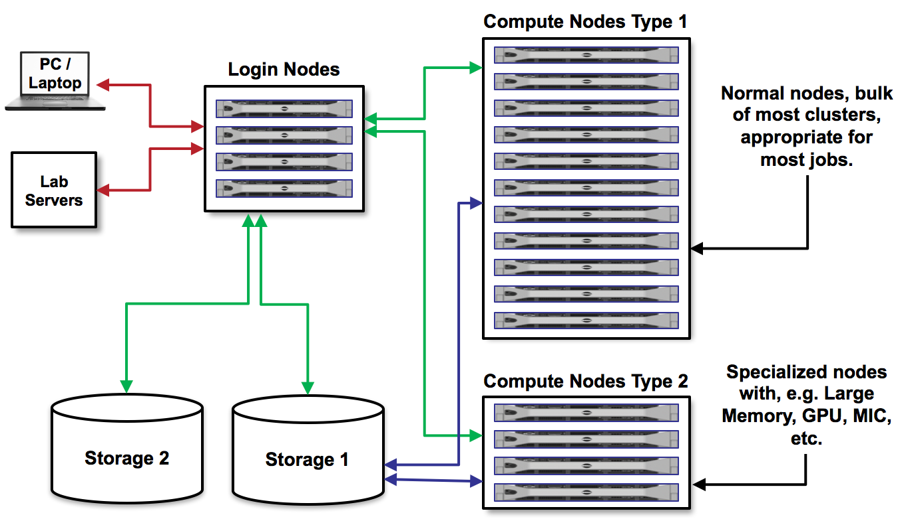
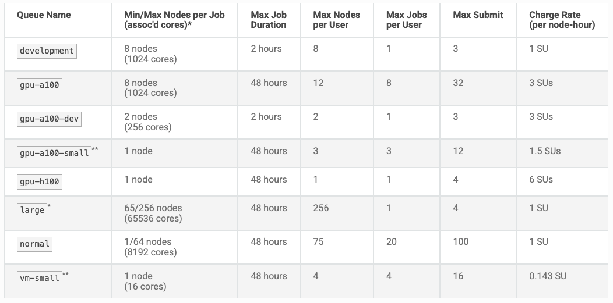
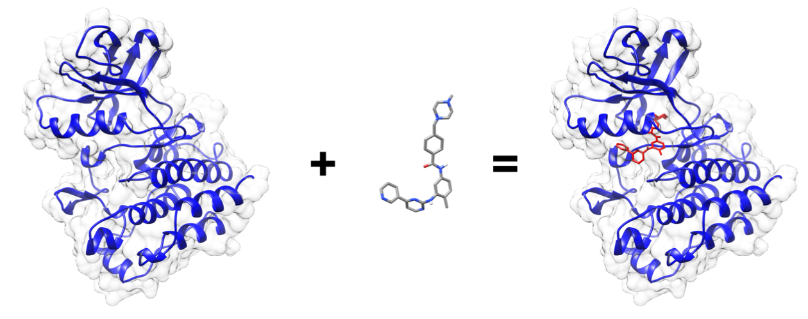

Batch Job Submission
====================

As we discussed before, on Lonestar6 there are login nodes and compute nodes.

We cannot run the applications we need for our research on the login nodes because they require too 
many resources and will interrupt the work of others. Instead, we must write a short text file
containing a list of the resources we need, and containing the command(s) for running the 
application. Then, we submit that text file to a queue to run on compute nodes. This process is
called **batch job submission**.

After going through this module, students should be able to:

* Find and assemble input data needed for a docking calculation
* Load the appropriate docking software into your PATH
* Assemble a SLURM batch submission script
* Submit a job, monitor the job progress, and find the job outputs

Lonestar6 Queues
----------------

There are several queues available on Lonestar6. It is important to understand the queue limitations
and pick a queue that is appropriate for your job. Documentation can be found
`here <https://docs.tacc.utexas.edu/hpc/lonestar6/#table5>`_. Today, we will be using the
``development`` queue which has a max runtime of 2 hours, and users can only submit one job at a time.

Assemble Job Inputs
-------------------

Our objective is to perform a molecular docking calculation. This is a computational technique used
to predict the binding orientation and energetics of (typically) a small molecule ligand within a
protein binding site. We will be using the software package called ``autodock_vina`` to perform this
calculation. As inputs, we need a structure file containing the protein, a structure file containing
the ligand, and a configuration file with parameters for the docking calculation. Finally, we also
need a SLURM batch submission script to tell the compute node how to run the job.

First, navigate to your $WORK directory where we can organize everything we need for a new job.

.. code-block:: console

   # Navigate to $WORK, make new directory to organize this example
   [ls6]$ cdw
   [ls6]$ mkdir docking-example && cd docking-example

   # Copy some prepared files
   [ls6]$ cp /work/03439/wallen/public/autodock_vina_example/data/protein.pdbqt ./
   [ls6]$ cp /work/03439/wallen/public/autodock_vina_example/data/ligand.pdbqt ./
   [ls6]$ cp /work/03439/wallen/public/autodock_vina_example/data/configuration_file.txt ./

   # Create a new file for the SLURM script and add the template below
   [ls6]$ touch job.slurm

Open ``job.slurm`` with your favorite Linux text editor and add the content below:

.. code-block:: text 

   #!/bin/bash
   #----------------------------------------------------
   # Example SLURM job script to run applications on
   # TACCs Lonestar6 system.
   #----------------------------------------------------
   #SBATCH -J                # Job name
   #SBATCH -o                # Name of stdout output file
   #SBATCH -e                # Name of stderr error file
   #SBATCH -p                # Queue (partition) name
   #SBATCH -N                # Total # of nodes (must be 1 for serial)
   #SBATCH -n                # Total # of mpi tasks (should be 1 for serial)
   #SBATCH -t                # Run time (hh:mm:ss)
   #SBATCH -A                # Project/Allocation name (req'd if you have more than 1)

   # Everything below here should be Linux commands

.. note:: 

   The template job.slurm file above is incomplete. It will not work without filling in values for
   each of the SLURM directives.

EXERCISE
~~~~~~~~

Spend some time examining the content of each file. How do you think these inputs were prepared?
What considerations go into choosing the right queue and the wall-clock time? What else is missing 
from above before we can run the job? 

Write the SLURM Script 
~~~~~~~~~~~~~~~~~~~~~~

Next, we need to fill out ``job.slurm`` to request the necessary resources. If you have some prior
experience with ``autodock_vina``, you may be able to reasonably predict how much time and resources
we will need. When running your first jobs with your applications, it will take some trial and
error, and reading online documentation, to get a feel for how many resources you should use.
Open ``job.slurm`` with your preferred text editor and fill out the following information:

.. code-block:: console

   #SBATCH -J vina_job      # Job name
   #SBATCH -o vina_job.o%j  # Name of stdout output file (%j expands to jobId)
   #SBATCH -o vina_job.e%j  # Name of stderr error file (%j expands to jobId)
   #SBATCH -p development   # Queue (partition) name
   #SBATCH -N 1             # Total # of nodes (must be 1 for serial)
   #SBATCH -n 1             # Total # of mpi tasks (should be 1 for serial)
   #SBATCH -t 00:10:00      # Run time (hh:mm:ss)
   #SBATCH -A OTH24028      # Project/Allocation name (req'd if you have more than 1)

Now, we need to provide instructions to the compute node on how to run ``autodock_vina``. This
information would come from the ``autodock_vina`` instruction manual. Continue editing ``job.slurm``
and add this to the bottom:

.. code-block:: console

   # Everything below here should be Linux commands

   echo "starting at:"
   date

   module list
   module use /work/03439/wallen/public/modulefiles
   module load autodock_vina/1.2.3
   module list

   cd data/
   vina --config configuration_file.txt --out output_ligands.pdbqt

   echo "ending at:"
   date

The way this job is configured, it will print a starting date and time, load the appropriate
modules, run ``autodock_vina``, write output to the same directory, then print the ending date and
time. Keep an eye on the current directory for output. Once you have filled in the job description,
save and quit the file.

Submit a Job
------------

Submit the job to the queue using the ``sbatch`` command`:

.. code-block:: console

   [ls6]$ sbatch job.slurm

To view the jobs you have currently in the queue, use the ``showq`` or ``squeue`` commands:

.. code-block:: console

   [ls6]$ showq -u
   [ls6]$ showq        # shows all jobs by all users
   [ls6]$ squeue -u $USERNAME
   [ls6]$ squeue       # shows all jobs by all users

If for any reason you need to cancel a job, use the ``scancel`` command with the 6- or 7-digit jobid:

.. code-block:: console

   [ls6]$ scancel jobid

For more example scripts, see this directory on Lonestar6:

.. code-block:: console

   [ls6]$ ls /share/doc/slurm/

If everything went well, you should have an output file named something similar to
``vina_job.o864828`` in the same directory as the ``job.slurm`` script. And, you should have some
output:

.. code-block:: console

   [ls6]$ cat vina_job.o864828
   # closely examine output

   [ls6]$ ls output_ligands.pdbqt
   output_ligands.pdbqt

   [ls6]$ cat output_ligands.pdbqt
   # closely examine output

Examine all output to make sure you understand what it represents and if everything was a success.

EXERCISE
~~~~~~~~

1. Create a new directory for a new job. (Staying organized is key!)
2. Copy over inputs from second autodock vina example:

.. code-block:: console

   [ls6]$ cp -r /work/03439/wallen/public/autodock_vina_example_2/* ./

3. Browse the copied files to make sure you understand what is present.
4. Write a new SLURM batch submission script to dock all ligands to the new receptor. I suggest
   using the appropriate flag to make vina write output to a sub folder to stay organized.
5. Given what you know about the timing of one job, consider how long you will need for this job.
6. Submit the job and monitor the output to make sure you get all the results.
7. Question: Which molecule does autodock vina predict binds the strongest to the target protein?

.. tip::

   Refer to the `AutoDock Vina ReadTheDocs <https://autodock-vina.readthedocs.io/en/latest/>` for
   tips on using the command, or run ``vina --help``.

.. tip::

   Consider playing around with the parameters in the configuration file to see how you can speed
   up the calculation. In particular the ``cpu``

Additional Resources
--------------------

* `TACC Docs <https://docs.tacc.utexas.edu/>`_
* `Lonestar6 Docs <https://docs.tacc.utexas.edu/hpc/lonestar6/>`_
* `AutoDock-Vina <https://github.com/ccsb-scripps/AutoDock-Vina>`_